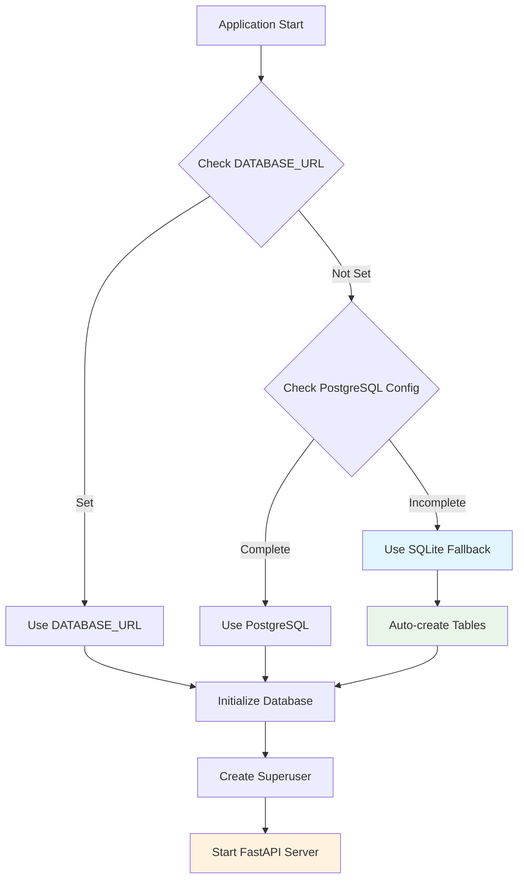

# FastAPI CRUD Application Documentation

Welcome to the comprehensive documentation for this FastAPI CRUD application! This documentation covers the complete setup, configuration, and architecture of a production-ready FastAPI application with SQLite fallback.

## 📚 Documentation Structure

- **[Getting Started](./getting-started.md)** - Initial setup and running the application
- **[Database Configuration](./database-configuration.md)** - Database setup with SQLite fallback
- **[Architecture Overview](./architecture.md)** - Application structure and design patterns
- **[Environment Configuration](./environment.md)** - Environment variables and configuration management
- **[Development Workflow](./development.md)** - Development practices and tools
- **[Deployment](./deployment.md)** - Production deployment considerations
- **[API Documentation](./api.md)** - API endpoints and usage examples
- **[Troubleshooting](./troubleshooting.md)** - Common issues and solutions

## 🚀 Quick Start

```bash
# Clone and navigate to project
cd /path/to/fastapi-crud

# Install dependencies
uv sync

# Run the application with SQLite fallback
./run_dev.sh
```

The application will be available at:
- **API**: http://localhost:8001
- **Interactive Docs**: http://localhost:8001/docs
- **Alternative Docs**: http://localhost:8001/redoc

## 🎯 Key Features

- ✅ **SQLite Fallback**: Automatic fallback to SQLite when PostgreSQL is not configured
- ✅ **Environment-based Configuration**: Flexible configuration via environment variables
- ✅ **Auto-migration**: Automatic table creation for SQLite databases
- ✅ **Production Ready**: CORS, security, and monitoring configured
- ✅ **User Management**: Built-in user authentication and authorization
- ✅ **API Documentation**: Auto-generated OpenAPI/Swagger documentation
- ✅ **Testing Suite**: Comprehensive test coverage
- ✅ **Development Tools**: Pre-commit hooks, linting, and formatting

## 🏗️ Project Origin

This project is based on the [FastAPI Full Stack Template](https://github.com/fastapi/full-stack-fastapi-template) with significant enhancements:

### Custom Modifications Made

1. **SQLite Fallback Implementation**: Added automatic fallback to SQLite when PostgreSQL is not available
2. **Enhanced Configuration**: Improved environment variable handling and validation
3. **Simplified Development Setup**: Created easy-to-use development scripts
4. **Better Documentation**: Comprehensive documentation with diagrams
5. **Database Location**: SQLite database placed in `app/` folder following Django conventions

## 🔄 Application Flow



## 📋 Prerequisites

- Python 3.10+
- [uv](https://docs.astral.sh/uv/) for dependency management
- Git

## 🛠️ Technology Stack

- **Framework**: FastAPI
- **Database**: SQLAlchemy with SQLModel
- **Database Options**: PostgreSQL (production) / SQLite (development)
- **Authentication**: JWT tokens with bcrypt
- **Validation**: Pydantic
- **Migration**: Alembic (PostgreSQL)
- **Testing**: Pytest
- **Package Management**: uv
- **Code Quality**: Ruff, MyPy, Pre-commit

---

**Next**: Start with [Getting Started](./getting-started.md) to set up your development environment.
