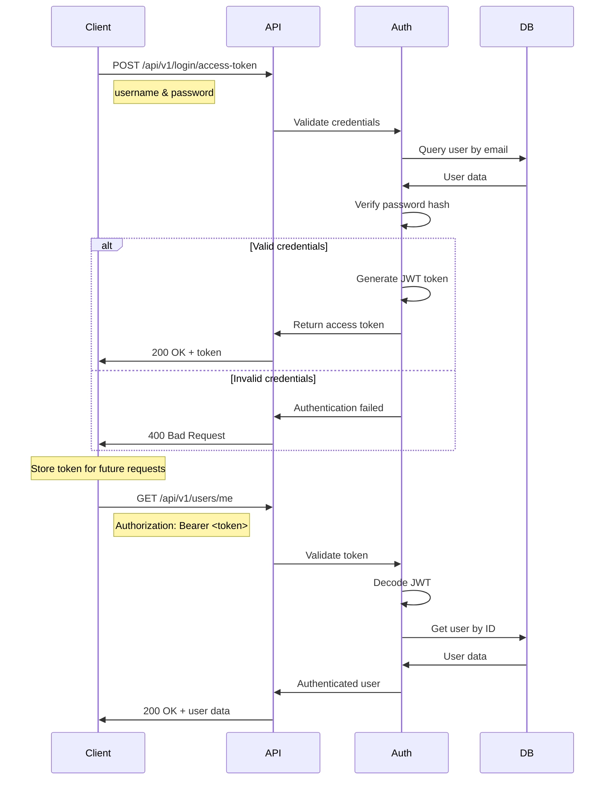

# API Documentation

Complete documentation for the FastAPI CRUD application API endpoints, authentication, and usage examples.

## 🚀 API Overview

The FastAPI CRUD application provides a RESTful API with the following features:

- **Authentication**: JWT-based authentication system
- **User Management**: Complete user CRUD operations
- **Item Management**: Item creation, retrieval, updating, and deletion
- **Admin Operations**: Administrative functions for superusers
- **Interactive Documentation**: Auto-generated Swagger UI and ReDoc

### Base Information

| Property | Value |
|----------|-------|
| **Base URL** | `http://localhost:8001` |
| **API Version** | `v1` |
| **API Prefix** | `/api/v1` |
| **Documentation** | `/docs` (Swagger), `/redoc` (ReDoc) |
| **OpenAPI Schema** | `/api/v1/openapi.json` |

## 🔐 Authentication

### Authentication Flow



### Login Endpoint

**POST** `/api/v1/login/access-token`

Get an access token for future requests.

**Request Body** (Form Data):
```json
{
  "username": "admin@example.com",
  "password": "changethis"
}
```

**Response**:
```json
{
  "access_token": "eyJhbGciOiJIUzI1NiIsInR5cCI6IkpXVCJ9...",
  "token_type": "bearer"
}
```

**Example Usage**:
```bash
curl -X POST "http://localhost:8001/api/v1/login/access-token" \
     -H "Content-Type: application/x-www-form-urlencoded" \
     -d "username=admin@example.com&password=changethis"
```

### Using Authentication Token

Include the token in the Authorization header for protected endpoints:

```bash
curl -X GET "http://localhost:8001/api/v1/users/me" \
     -H "Authorization: Bearer <your-token-here>"
```

## 👥 User Management API

### User Model

```json
{
  "id": 1,
  "email": "user@example.com",
  "is_active": true,
  "is_superuser": false,
  "full_name": "John Doe",
  "created_at": "2023-01-01T12:00:00",
  "updated_at": "2023-01-01T12:00:00"
}
```

### User Endpoints

#### Create User

**POST** `/api/v1/users/`

Create a new user account.

**Authentication**: Public endpoint

**Request Body**:
```json
{
  "email": "newuser@example.com",
  "password": "securepassword123",
  "full_name": "New User"
}
```

**Response**: `201 Created`
```json
{
  "id": 2,
  "email": "newuser@example.com",
  "is_active": true,
  "is_superuser": false,
  "full_name": "New User",
  "created_at": "2023-01-01T12:00:00",
  "updated_at": "2023-01-01T12:00:00"
}
```

#### Get Current User

**GET** `/api/v1/users/me`

Get current authenticated user information.

**Authentication**: Required

**Response**: `200 OK`
```json
{
  "id": 1,
  "email": "admin@example.com",
  "is_active": true,
  "is_superuser": true,
  "full_name": "Admin User",
  "created_at": "2023-01-01T12:00:00",
  "updated_at": "2023-01-01T12:00:00"
}
```

#### Update Current User

**PATCH** `/api/v1/users/me`

Update current user information.

**Authentication**: Required

**Request Body**:
```json
{
  "full_name": "Updated Name",
  "email": "newemail@example.com"
}
```

#### Update User Password

**PATCH** `/api/v1/users/me/password`

Change current user password.

**Authentication**: Required

**Request Body**:
```json
{
  "current_password": "oldpassword",
  "new_password": "newpassword123"
}
```

#### Get All Users (Admin)

**GET** `/api/v1/users/`

List all users with pagination.

**Authentication**: Required (Superuser only)

**Query Parameters**:
- `skip`: Number of records to skip (default: 0)
- `limit`: Maximum number of records to return (default: 100)

**Response**: `200 OK`
```json
{
  "data": [
    {
      "id": 1,
      "email": "admin@example.com",
      "is_active": true,
      "is_superuser": true,
      "full_name": "Admin User"
    }
  ],
  "count": 1
}
```

#### Get User by ID (Admin)

**GET** `/api/v1/users/{user_id}`

Get a specific user by ID.

**Authentication**: Required (Superuser only)

**Response**: `200 OK` - User object

#### Update User (Admin)

**PATCH** `/api/v1/users/{user_id}`

Update any user (admin only).

**Authentication**: Required (Superuser only)

**Request Body**:
```json
{
  "email": "updated@example.com",
  "full_name": "Updated Name",
  "is_active": false,
  "is_superuser": true
}
```

#### Delete User (Admin)

**DELETE** `/api/v1/users/{user_id}`

Delete a user account.

**Authentication**: Required (Superuser only)

**Response**: `200 OK`
```json
{
  "message": "User deleted successfully"
}
```

## 📦 Items Management API

### Item Model

```json
{
  "id": 1,
  "title": "My First Item",
  "description": "This is a sample item",
  "owner_id": 1,
  "created_at": "2023-01-01T12:00:00",
  "updated_at": "2023-01-01T12:00:00"
}
```

### Item Endpoints

#### Create Item

**POST** `/api/v1/items/`

Create a new item.

**Authentication**: Required

**Request Body**:
```json
{
  "title": "New Item",
  "description": "Description of the new item"
}
```

**Response**: `201 Created`
```json
{
  "id": 1,
  "title": "New Item",
  "description": "Description of the new item",
  "owner_id": 1,
  "created_at": "2023-01-01T12:00:00",
  "updated_at": "2023-01-01T12:00:00"
}
```

#### Get User's Items

**GET** `/api/v1/items/`

Get all items owned by the current user.

**Authentication**: Required

**Query Parameters**:
- `skip`: Number of records to skip (default: 0)
- `limit`: Maximum number of records to return (default: 100)

**Response**: `200 OK`
```json
{
  "data": [
    {
      "id": 1,
      "title": "My Item",
      "description": "Item description",
      "owner_id": 1
    }
  ],
  "count": 1
}
```

#### Get Item by ID

**GET** `/api/v1/items/{item_id}`

Get a specific item by ID.

**Authentication**: Required (must be owner or superuser)

**Response**: `200 OK` - Item object

#### Update Item

**PATCH** `/api/v1/items/{item_id}`

Update an existing item.

**Authentication**: Required (must be owner or superuser)

**Request Body**:
```json
{
  "title": "Updated Title",
  "description": "Updated description"
}
```

#### Delete Item

**DELETE** `/api/v1/items/{item_id}`

Delete an item.

**Authentication**: Required (must be owner or superuser)

**Response**: `200 OK`
```json
{
  "message": "Item deleted successfully"
}
```

## 🔧 Utility Endpoints

### Health Check

**GET** `/api/v1/utils/test-email/`

Test email functionality (sends a test email).

**Authentication**: Required (Superuser only)

**Query Parameters**:
- `email_to`: Email address to send test email to

**Response**: `200 OK`
```json
{
  "message": "Test email sent successfully"
}
```

## 🔒 Private/Admin Endpoints

### Admin Dashboard Data

**GET** `/api/v1/private/admin-dashboard`

Get administrative dashboard data.

**Authentication**: Required (Superuser only)

**Response**: `200 OK`
```json
{
  "total_users": 10,
  "active_users": 8,
  "total_items": 25,
  "users_created_last_30_days": 3
}
```

## 📊 API Usage Examples

### Complete User Registration and Item Creation Flow

```bash
#!/bin/bash

# 1. Register a new user
echo "1. Creating new user..."
USER_RESPONSE=$(curl -s -X POST "http://localhost:8001/api/v1/users/" \
  -H "Content-Type: application/json" \
  -d '{
    "email": "testuser@example.com",
    "password": "testpassword123",
    "full_name": "Test User"
  }')

echo "User created: $USER_RESPONSE"

# 2. Login to get access token
echo "2. Logging in..."
TOKEN_RESPONSE=$(curl -s -X POST "http://localhost:8001/api/v1/login/access-token" \
  -H "Content-Type: application/x-www-form-urlencoded" \
  -d "username=testuser@example.com&password=testpassword123")

TOKEN=$(echo $TOKEN_RESPONSE | jq -r '.access_token')
echo "Token: $TOKEN"

# 3. Get current user info
echo "3. Getting user info..."
USER_INFO=$(curl -s -X GET "http://localhost:8001/api/v1/users/me" \
  -H "Authorization: Bearer $TOKEN")

echo "User info: $USER_INFO"

# 4. Create an item
echo "4. Creating item..."
ITEM_RESPONSE=$(curl -s -X POST "http://localhost:8001/api/v1/items/" \
  -H "Authorization: Bearer $TOKEN" \
  -H "Content-Type: application/json" \
  -d '{
    "title": "My Test Item",
    "description": "This is a test item created via API"
  }')

echo "Item created: $ITEM_RESPONSE"

# 5. Get user's items
echo "5. Getting user items..."
ITEMS_RESPONSE=$(curl -s -X GET "http://localhost:8001/api/v1/items/" \
  -H "Authorization: Bearer $TOKEN")

echo "User items: $ITEMS_RESPONSE"
```

### Python Client Example

```python
import requests
from typing import Optional

class FastAPIClient:
    def __init__(self, base_url: str = "http://localhost:8001"):
        self.base_url = base_url
        self.token: Optional[str] = None
    
    def login(self, username: str, password: str) -> bool:
        """Login and store access token."""
        response = requests.post(
            f"{self.base_url}/api/v1/login/access-token",
            data={"username": username, "password": password}
        )
        
        if response.status_code == 200:
            self.token = response.json()["access_token"]
            return True
        return False
    
    @property
    def headers(self) -> dict:
        """Get headers with authorization token."""
        if not self.token:
            raise ValueError("Not authenticated. Call login() first.")
        return {"Authorization": f"Bearer {self.token}"}
    
    def create_user(self, email: str, password: str, full_name: str) -> dict:
        """Create a new user."""
        response = requests.post(
            f"{self.base_url}/api/v1/users/",
            json={
                "email": email,
                "password": password,
                "full_name": full_name
            }
        )
        response.raise_for_status()
        return response.json()
    
    def get_current_user(self) -> dict:
        """Get current user information."""
        response = requests.get(
            f"{self.base_url}/api/v1/users/me",
            headers=self.headers
        )
        response.raise_for_status()
        return response.json()
    
    def create_item(self, title: str, description: str = None) -> dict:
        """Create a new item."""
        item_data = {"title": title}
        if description:
            item_data["description"] = description
            
        response = requests.post(
            f"{self.base_url}/api/v1/items/",
            json=item_data,
            headers=self.headers
        )
        response.raise_for_status()
        return response.json()
    
    def get_items(self, skip: int = 0, limit: int = 100) -> dict:
        """Get user's items."""
        response = requests.get(
            f"{self.base_url}/api/v1/items/",
            params={"skip": skip, "limit": limit},
            headers=self.headers
        )
        response.raise_for_status()
        return response.json()

# Usage example
client = FastAPIClient()

# Login
if client.login("admin@example.com", "changethis"):
    print("Login successful!")
    
    # Get current user
    user = client.get_current_user()
    print(f"Current user: {user['email']}")
    
    # Create an item
    item = client.create_item("API Test Item", "Created via Python client")
    print(f"Created item: {item['title']}")
    
    # Get all items
    items = client.get_items()
    print(f"Total items: {items['count']}")
```

## 🚨 Error Handling

### HTTP Status Codes

| Code | Meaning | When Used |
|------|---------|-----------|
| `200` | OK | Successful GET, PATCH, DELETE |
| `201` | Created | Successful POST |
| `400` | Bad Request | Invalid input data |
| `401` | Unauthorized | Missing or invalid token |
| `403` | Forbidden | Insufficient permissions |
| `404` | Not Found | Resource doesn't exist |
| `422` | Unprocessable Entity | Validation errors |
| `500` | Internal Server Error | Server errors |

### Error Response Format

```json
{
  "detail": "Error message description",
  "type": "error_type",
  "code": "ERROR_CODE"
}
```

### Common Error Examples

**Validation Error (422)**:
```json
{
  "detail": [
    {
      "type": "value_error",
      "loc": ["body", "email"],
      "msg": "field required",
      "input": null
    }
  ]
}
```

**Authentication Error (401)**:
```json
{
  "detail": "Could not validate credentials"
}
```

**Permission Error (403)**:
```json
{
  "detail": "Not enough permissions"
}
```

## 🔄 Rate Limiting and Pagination

### Pagination

All list endpoints support pagination:

**Query Parameters**:
- `skip`: Number of records to skip (default: 0)
- `limit`: Maximum records to return (default: 100, max: 1000)

**Response Format**:
```json
{
  "data": [...],
  "count": 150,
  "skip": 0,
  "limit": 100,
  "has_more": true
}
```

### API Limits

- **Request Rate**: 100 requests per minute per IP
- **Authentication Rate**: 5 login attempts per minute per IP
- **Payload Size**: Maximum 10MB per request
- **Query Limit**: Maximum 1000 records per request

## 🧪 Testing the API

### Using Swagger UI

1. Navigate to http://localhost:8001/docs
2. Click "Authorize" button
3. Login to get a token
4. Use the token for authenticated requests

### Using curl

```bash
# Health check
curl http://localhost:8001/api/v1/utils/health

# Login and save token
TOKEN=$(curl -s -X POST "http://localhost:8001/api/v1/login/access-token" \
  -H "Content-Type: application/x-www-form-urlencoded" \
  -d "username=admin@example.com&password=changethis" | jq -r '.access_token')

# Use token for authenticated requests
curl -H "Authorization: Bearer $TOKEN" \
  http://localhost:8001/api/v1/users/me
```

### Postman Collection

A Postman collection is available for easy API testing:

```json
{
  "info": {
    "name": "FastAPI CRUD",
    "description": "Complete API collection for FastAPI CRUD application"
  },
  "variable": [
    {
      "key": "baseUrl",
      "value": "http://localhost:8001",
      "type": "string"
    },
    {
      "key": "token",
      "value": "",
      "type": "string"
    }
  ],
  "auth": {
    "type": "bearer",
    "bearer": [
      {
        "key": "token",
        "value": "{{token}}",
        "type": "string"
      }
    ]
  }
}
```

---

**Previous**: [Development Workflow](./development.md) | **Next**: [Deployment](./deployment.md)
