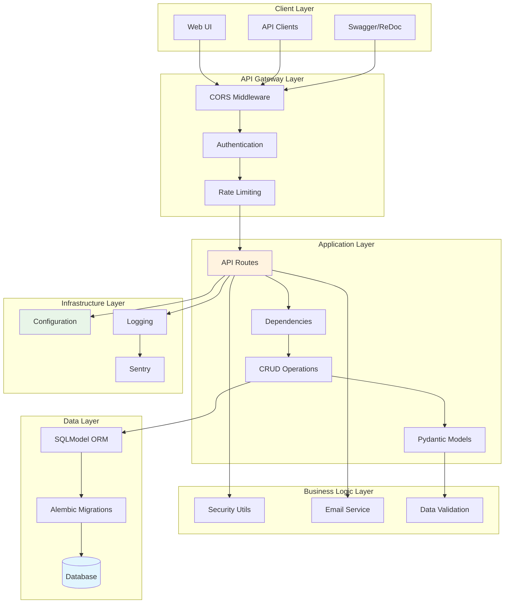
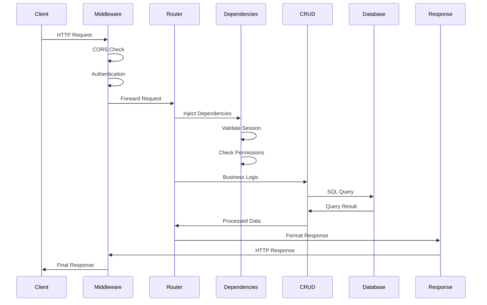
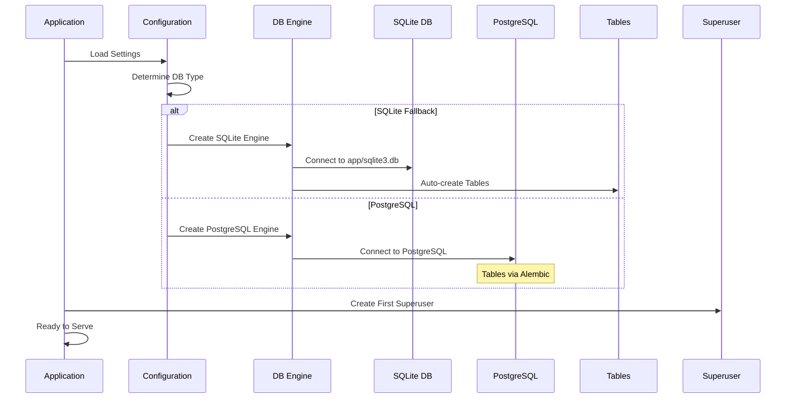
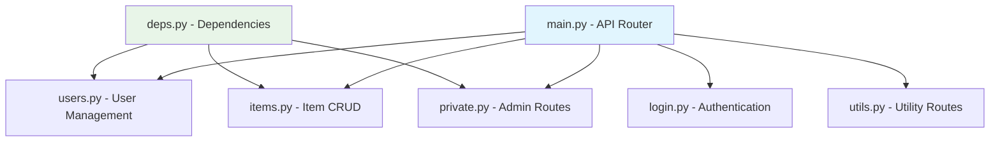
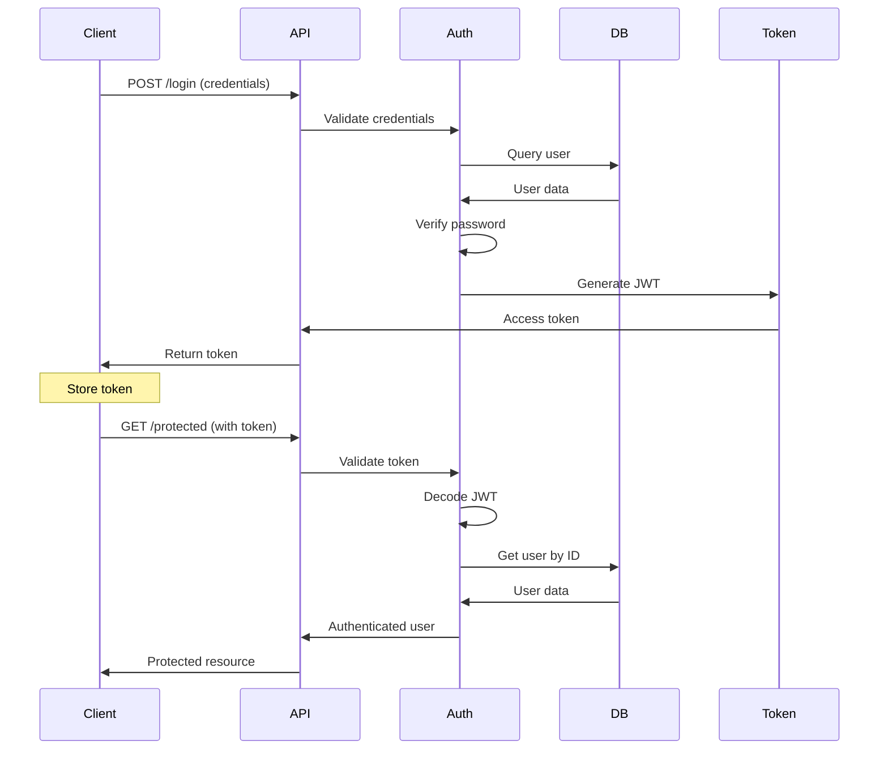
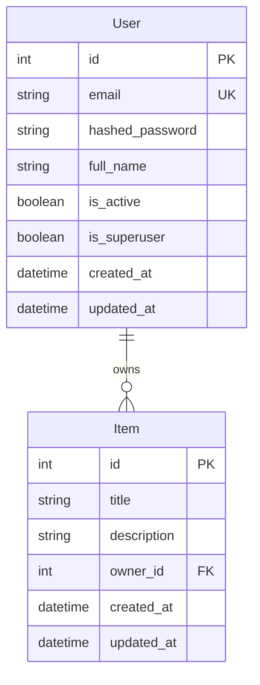
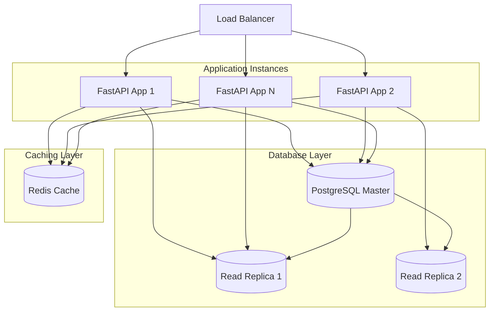
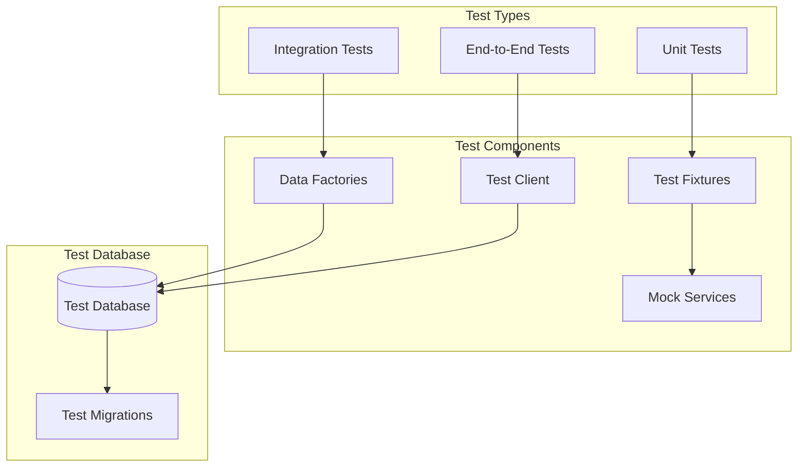

# Architecture Overview

This document provides a comprehensive overview of the FastAPI CRUD application architecture, design patterns, and component interactions.

## 🏗️ High-Level Architecture



## 📁 Project Structure

### Directory Layout

```
fastapi-crud/
├── app/                        # Main application package
│   ├── __init__.py
│   ├── main.py                 # FastAPI application factory
│   ├── models.py               # SQLModel database models
│   ├── crud.py                 # Database operations
│   ├── utils.py                # Utility functions
│   ├── initial_data.py         # Database initialization
│   ├── sqlite3.db             # SQLite database (auto-created)
│   │
│   ├── core/                   # Core application components
│   │   ├── __init__.py
│   │   ├── config.py           # Application configuration
│   │   ├── db.py               # Database connection and session
│   │   └── security.py         # Authentication and security
│   │
│   ├── api/                    # API layer
│   │   ├── __init__.py
│   │   ├── main.py             # API router aggregation
│   │   ├── deps.py             # Dependency injection
│   │   └── routes/             # API route definitions
│   │       ├── __init__.py
│   │       ├── users.py        # User management endpoints
│   │       ├── items.py        # Item CRUD endpoints
│   │       ├── login.py        # Authentication endpoints
│   │       ├── private.py      # Private/admin endpoints
│   │       └── utils.py        # Utility endpoints
│   │
│   ├── alembic/                # Database migrations (PostgreSQL)
│   │   ├── versions/           # Migration files
│   │   ├── env.py              # Alembic configuration
│   │   └── script.py.mako      # Migration template
│   │
│   ├── email-templates/        # Email templates
│   │   ├── src/                # MJML source files
│   │   └── build/              # Compiled HTML templates
│   │
│   └── tests/                  # Test suite
│       ├── conftest.py         # Test configuration
│       ├── api/                # API endpoint tests
│       ├── crud/               # CRUD operation tests
│       └── utils/              # Utility tests
│
├── docs/                       # Documentation
├── scripts/                    # Development scripts
├── .env                        # Environment variables
├── run_dev.sh                 # Development server script
├── check_db.py                # Database configuration checker
├── pyproject.toml             # Project configuration
├── uv.lock                    # Dependency lock file
└── alembic.ini                # Alembic configuration
```

## 🔄 Application Flow

### Request Processing Flow



### Database Initialization Flow



## 🧩 Component Architecture

### Core Components

#### 1. Configuration Management (`app/core/config.py`)

```python
class Settings(BaseSettings):
    """Application configuration with environment-based settings"""
    
    # Database configuration with fallback logic
    @computed_field
    @property
    def SQLALCHEMY_DATABASE_URI(self) -> str:
        # Priority: DATABASE_URL > PostgreSQL > SQLite
```

**Responsibilities**:
- Environment variable parsing
- Database URL construction
- Security settings validation
- CORS configuration

#### 2. Database Layer (`app/core/db.py`)

```python
# Database engine with automatic table creation for SQLite
engine = create_engine(str(settings.SQLALCHEMY_DATABASE_URI))

if str(settings.SQLALCHEMY_DATABASE_URI).startswith("sqlite"):
    SQLModel.metadata.create_all(engine)
```

**Responsibilities**:
- Database connection management
- Session handling
- Table creation (SQLite)
- Connection pooling

#### 3. Security Layer (`app/core/security.py`)

**Responsibilities**:
- JWT token generation and validation
- Password hashing with bcrypt
- User authentication
- Permission checking

#### 4. API Layer (`app/api/`)

**Router Structure**:


## 🎯 Design Patterns

### 1. Dependency Injection Pattern

```python
# app/api/deps.py
def get_current_user(
    session: SessionDep, token: str = Depends(oauth2_scheme)
) -> User:
    """Dependency to get current authenticated user"""
    
# Usage in routes
@router.get("/me")
def read_user_me(current_user: CurrentUser):
    """Get current user information"""
```

**Benefits**:
- Testable code
- Clear separation of concerns
- Reusable components
- Easy mocking

### 2. Repository Pattern (CRUD)

```python
# app/crud.py
def create_user(*, session: Session, user_create: UserCreate) -> User:
    """Create a new user"""

def get_user_by_email(*, session: Session, email: str) -> User | None:
    """Get user by email"""

def update_user(*, session: Session, db_user: User, user_in: UserUpdate) -> User:
    """Update user"""
```

**Benefits**:
- Centralized data access
- Consistent error handling
- Easy testing
- Database abstraction

### 3. Settings Pattern

```python
# app/core/config.py
class Settings(BaseSettings):
    model_config = SettingsConfigDict(
        env_file="../../.env",
        env_ignore_empty=True,
        extra="ignore",
    )
```

**Benefits**:
- Environment-based configuration
- Type validation
- Documentation generation
- IDE support

### 4. Factory Pattern (FastAPI App)

```python
# app/main.py
def create_app() -> FastAPI:
    app = FastAPI(
        title=settings.PROJECT_NAME,
        openapi_url=f"{settings.API_V1_STR}/openapi.json"
    )
    
    # Add middleware
    app.add_middleware(CORSMiddleware, ...)
    
    # Include routers
    app.include_router(api_router, prefix=settings.API_V1_STR)
    
    return app
```

## 🔐 Security Architecture

### Authentication Flow



### Security Features

1. **JWT Authentication**: Stateless token-based auth
2. **Password Hashing**: bcrypt with salt
3. **CORS Protection**: Configurable origins
4. **Input Validation**: Pydantic models
5. **SQL Injection Prevention**: SQLAlchemy ORM
6. **XSS Protection**: FastAPI security headers

## 📊 Data Models

### Entity Relationship Diagram



### Model Definitions

```python
# SQLModel definitions with automatic table creation
class UserBase(SQLModel):
    email: EmailStr = Field(unique=True, index=True)
    is_active: bool = True
    is_superuser: bool = False
    full_name: str | None = None

class User(UserBase, table=True):
    id: int | None = Field(default=None, primary_key=True)
    hashed_password: str
    items: list["Item"] = Relationship(back_populates="owner")

class Item(SQLModel, table=True):
    id: int | None = Field(default=None, primary_key=True)
    title: str = Field(min_length=1, max_length=255)
    description: str | None = Field(default=None, max_length=255)
    owner_id: int = Field(foreign_key="user.id", nullable=False, ondelete="CASCADE")
    owner: User = Relationship(back_populates="items")
```

## 🚀 Scalability Considerations

### Horizontal Scaling



### Performance Optimizations

1. **Database Indexing**: Strategic index placement
2. **Connection Pooling**: Efficient database connections
3. **Caching Strategy**: Redis for session and data caching
4. **Pagination**: Limit large dataset queries
5. **Background Tasks**: Celery for async operations

## 🧪 Testing Architecture

### Test Structure



### Test Categories

1. **Unit Tests**: Individual function testing
2. **Integration Tests**: Component interaction testing
3. **API Tests**: Endpoint testing with test client
4. **Database Tests**: CRUD operation testing
5. **Authentication Tests**: Security flow testing

## 🔄 Development Workflow

### Code Quality Pipeline


### Development Tools

1. **uv**: Fast dependency management
2. **Ruff**: Lightning-fast linting and formatting
3. **MyPy**: Static type checking
4. **Pytest**: Comprehensive testing framework
5. **Pre-commit**: Git hook management
6. **Alembic**: Database migration management

---

**Previous**: [Database Configuration](./database-configuration.md) | **Next**: [Environment Configuration](./environment.md)
