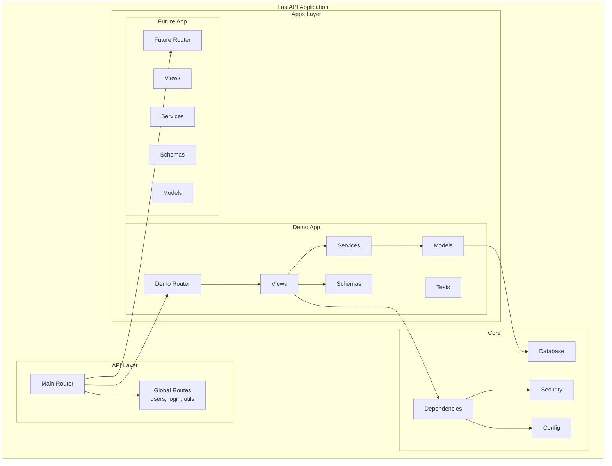

# Apps Architecture - Domain-Driven Development

This document describes the Domain-Driven Development (DDD) architecture implemented in this FastAPI application, similar to Django's app structure.

## Overview

The application follows a modular architecture where each domain (app) is self-contained with its own:
- **Models**: Database entities and domain models
- **Schemas**: Input/Output data models (similar to Django serializers)
- **Services**: Business logic layer
- **Views**: Route handlers and controllers
- **URLs**: Route configuration
- **Tests**: App-specific tests

## Architecture Diagram



## Folder Structure

```
src/
├── core/                    # Core application components
│   ├── config.py           # Configuration settings
│   ├── db.py              # Database engine and initialization
│   └── security.py        # Authentication and security
├── api/                    # Global API routes
│   ├── routes/            # Global route handlers
│   └── main.py           # Main API router
├── apps/                   # Domain-specific applications
│   └── demo/              # Demo application
│       ├── __init__.py
│       ├── models.py      # Database models
│       ├── schemas.py     # Input/Output schemas
│       ├── services.py    # Business logic
│       ├── views.py       # Route handlers
│       ├── urls.py        # Route configuration
│       └── tests/         # App-specific tests
│           ├── __init__.py
│           └── test_products.py
└── models.py              # Main models registry
```

## Demo App Features

The demo app includes:

### Models
- **Product**: Represents products with name, price, category, stock
- **Order**: Customer orders with status tracking
- **OrderItem**: Individual items within an order

### API Endpoints
- `GET /api/v1/demo/products/` - List products with filtering
- `POST /api/v1/demo/products/` - Create new product
- `GET /api/v1/demo/products/{id}` - Get specific product
- `PUT /api/v1/demo/products/{id}` - Update product
- `DELETE /api/v1/demo/products/{id}` - Soft delete product
- `POST /api/v1/demo/orders/` - Create new order
- `GET /api/v1/demo/orders/` - List orders
- `GET /api/v1/demo/orders/{id}` - Get specific order
- `PUT /api/v1/demo/orders/{id}` - Update order status
- `GET /api/v1/demo/dashboard/stats/` - Dashboard statistics (admin only)

### Business Logic
- Stock validation when creating orders
- Automatic total calculation
- Permission-based access control
- Soft deletion for products
- Statistics and analytics

## Creating a New App

To create a new app, follow these steps:

1. **Create app directory structure**:
```bash
mkdir -p src/apps/myapp
touch src/apps/mysrc/__init__.py
touch src/apps/mysrc/models.py
touch src/apps/mysrc/schemas.py
touch src/apps/mysrc/services.py
touch src/apps/mysrc/views.py
touch src/apps/mysrc/urls.py
```

2. **Define models** in `models.py`
3. **Create schemas** in `schemas.py`
4. **Implement business logic** in `services.py`
5. **Create route handlers** in `views.py`
6. **Configure routes** in `urls.py`
7. **Add to main router** in `src/api/main.py`
8. **Import models** in `src/models.py`
9. **Create migration** if using database models
10. **Write tests** in `tests/` directory

## Benefits of This Architecture

1. **Separation of Concerns**: Each layer has a specific responsibility
2. **Modularity**: Apps are self-contained and reusable
3. **Testability**: Easy to test individual components
4. **Scalability**: New features can be added as separate apps
5. **Maintainability**: Code is organized and easy to navigate
6. **Team Collaboration**: Different teams can work on different apps

## Best Practices

1. **Keep services focused**: Each service should handle one domain
2. **Use schemas for validation**: Always validate input/output data
3. **Implement proper error handling**: Use HTTP exceptions appropriately
4. **Write comprehensive tests**: Test all layers independently
5. **Follow naming conventions**: Use clear, descriptive names
6. **Document your APIs**: Use docstrings and OpenAPI descriptions
7. **Implement proper logging**: Log important business events
8. **Handle permissions**: Implement proper access control