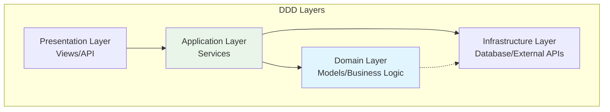

# Best Practices for DDD in FastAPI

This guide consolidates the essential best practices for implementing Domain-Driven Development in FastAPI applications, covering architecture decisions, code organization, and development workflows.

## 🎯 Core Principles

### Domain-Driven Design Fundamentals

1. **Ubiquitous Language**: Use domain terminology consistently across code, documentation, and communication
2. **Bounded Contexts**: Clearly define domain boundaries and responsibilities
3. **Business Logic Isolation**: Keep domain logic separate from infrastructure concerns
4. **Rich Domain Models**: Models should contain behavior, not just data
5. **Service Layer**: Encapsulate business operations in dedicated service classes



## 📁 Project Structure Best Practices

### Recommended Directory Organization

```
src/
├── apps/                    # Domain applications
│   ├── __init__.py
│   ├── shared/             # Shared domain components
│   │   ├── __init__.py
│   │   ├── models.py       # Base models and mixins
│   │   ├── schemas.py      # Common schemas
│   │   └── exceptions.py   # Domain exceptions
│   └── {domain_name}/      # Individual domain app
│       ├── __init__.py
│       ├── models.py       # Domain entities
│       ├── schemas.py      # Input/output schemas
│       ├── services.py     # Business logic
│       ├── views.py        # API endpoints
│       ├── urls.py         # Route configuration
│       └── tests/          # Domain-specific tests
├── api/                    # API infrastructure
│   ├── deps.py            # Dependency injection
│   ├── main.py            # API router configuration
│   └── routes/            # Shared routes
├── core/                   # Application core
│   ├── config.py          # Configuration management
│   ├── db.py              # Database configuration
│   └── security.py        # Authentication/authorization
└── tests/                  # Global tests
    ├── conftest.py        # Shared test configuration
    └── utils/             # Test utilities
```

### File Naming Conventions

```python
# ✅ Good: Clear, descriptive names
src/apps/ecommerce/models.py      # Domain models
src/apps/ecommerce/services.py    # Business services
src/apps/ecommerce/schemas.py     # API schemas

# ❌ Avoid: Generic or unclear names
src/apps/ecommerce/data.py        # Too vague
src/apps/ecommerce/helpers.py     # Non-descriptive
src/apps/ecommerce/utils.py       # Generic
```

## 🏗️ Architecture Best Practices

### Service Layer Design

```python
# ✅ Excellent: Well-structured service with clear responsibilities
class ProductService:
    """
    Product service following DDD principles:
    - Single responsibility
    - Clear business methods
    - Proper error handling
    - Transaction management
    """
    
    @staticmethod
    def create_product(
        *, 
        session: Session, 
        product_in: ProductCreate, 
        created_by_id: uuid.UUID
    ) -> Product:
        """
        Create product with complete business validation
        
        Business Rules:
        1. Product name must be unique within category
        2. Price must be positive
        3. SKU must follow company format
        """
        # Validate business rules first
        ProductService._validate_unique_name(session, product_in.name, product_in.category)
        ProductService._validate_sku_format(product_in.sku)
        
        # Create with audit trail
        db_product = Product.model_validate(
            product_in, 
            update={"created_by_id": created_by_id}
        )
        
        # Apply business logic
        if not product_in.sku:
            db_product.sku = ProductService._generate_sku(product_in)
        
        session.add(db_product)
        session.commit()
        session.refresh(db_product)
        
        # Post-creation business logic
        ProductService._notify_inventory_system(db_product)
        
        return db_product
    
    @staticmethod
    def _validate_unique_name(session: Session, name: str, category: str):
        """Private method for business rule validation"""
        existing = session.exec(
            select(Product).where(
                Product.name == name,
                Product.category == category,
                Product.is_active == True
            )
        ).first()
        
        if existing:
            raise BusinessRuleViolation(
                f"Product '{name}' already exists in category '{category}'"
            )
    
    @staticmethod
    def _generate_sku(product_data: ProductCreate) -> str:
        """Generate SKU following business rules"""
        category_code = product_data.category[:3].upper()
        timestamp = int(time.time())
        return f"{category_code}-{timestamp}"

# ❌ Poor: Service with mixed responsibilities
class BadProductService:
    def create_product_and_send_email_and_update_cache(self, data):
        # Multiple responsibilities in one method
        product = self.create_product(data)
        self.send_welcome_email(product)  # Should be separate
        self.update_cache(product)        # Should be separate
        return product
```

### Model Design Patterns

```python
# ✅ Excellent: Rich domain model with business logic
class Order(BaseModel, table=True):
    """
    Order model demonstrating DDD principles:
    - Rich behavior
    - Business invariants
    - Domain methods
    - Clear state management
    """
    
    # Core data
    id: uuid.UUID = Field(default_factory=uuid.uuid4, primary_key=True)
    customer_id: uuid.UUID = Field(foreign_key="user.id")
    status: OrderStatus = Field(default=OrderStatus.PENDING)
    total_amount: Decimal = Field(default=Decimal("0.00"))
    created_at: datetime = Field(default_factory=datetime.utcnow)
    
    # Relationships
    customer: "User" = Relationship()
    order_items: list["OrderItem"] = Relationship(cascade_delete=True)
    
    # Business methods
    def calculate_total(self) -> Decimal:
        """Calculate order total from items"""
        return sum(item.line_total for item in self.order_items)
    
    def can_be_cancelled(self) -> bool:
        """Business rule: When can order be cancelled?"""
        return self.status in [OrderStatus.PENDING, OrderStatus.CONFIRMED]
    
    def cancel(self, reason: str) -> None:
        """Cancel order with business validation"""
        if not self.can_be_cancelled():
            raise BusinessRuleViolation(
                f"Cannot cancel order in {self.status} status"
            )
        
        self.status = OrderStatus.CANCELLED
        self.cancellation_reason = reason
        self.cancelled_at = datetime.utcnow()
    
    def confirm(self) -> None:
        """Confirm order with validation"""
        if self.status != OrderStatus.PENDING:
            raise BusinessRuleViolation("Only pending orders can be confirmed")
        
        if not self.order_items:
            raise BusinessRuleViolation("Cannot confirm order without items")
        
        self.status = OrderStatus.CONFIRMED
        self.confirmed_at = datetime.utcnow()
    
    # Computed properties
    @property
    def is_complete(self) -> bool:
        """Check if order is in final state"""
        return self.status in [
            OrderStatus.DELIVERED, 
            OrderStatus.CANCELLED, 
            OrderStatus.REFUNDED
        ]

# ❌ Poor: Anemic model with no behavior
class BadOrder(SQLModel, table=True):
    id: uuid.UUID
    customer_id: uuid.UUID
    status: str
    total: float
    # No business methods, all logic elsewhere
```

### Schema Design Excellence

```python
# ✅ Excellent: Comprehensive schema with validation
class ProductCreate(BaseSchema):
    """
    Product creation schema with comprehensive validation:
    - Field-level validation
    - Business rule validation
    - Custom validators
    - Clear error messages
    """
    
    name: Annotated[str, Field(
        min_length=1, 
        max_length=255,
        description="Product name (1-255 characters)"
    )]
    description: Optional[str] = Field(
        None, 
        max_length=2000,
        description="Detailed product description"
    )
    price: Annotated[Decimal, Field(
        gt=0, 
        max_digits=10, 
        decimal_places=2,
        description="Product price (must be positive)"
    )]
    category: Annotated[str, Field(
        min_length=1,
        max_length=100,
        description="Product category"
    )]
    sku: Optional[str] = Field(
        None,
        pattern=r'^[A-Z]{2,5}-\d{4,}$',
        description="Stock Keeping Unit (auto-generated if not provided)"
    )
    tags: list[str] = Field(
        default_factory=list,
        max_length=10,
        description="Product tags (max 10)"
    )
    
    @field_validator('name')
    @classmethod
    def validate_name(cls, v: str) -> str:
        """Validate and normalize product name"""
        # Business rule: No offensive language
        if any(word in v.lower() for word in RESTRICTED_WORDS):
            raise ValueError('Product name contains restricted words')
        
        # Normalize formatting
        return v.strip().title()
    
    @field_validator('tags')
    @classmethod
    def validate_tags(cls, v: list[str]) -> list[str]:
        """Validate product tags"""
        if not v:
            return v
        
        # Business rule: Tags must be unique
        if len(v) != len(set(v)):
            raise ValueError('Tags must be unique')
        
        # Normalize tags
        return [tag.strip().lower() for tag in v if tag.strip()]
    
    @model_validator(mode='after')
    def validate_business_rules(self) -> 'ProductCreate':
        """Cross-field business validation"""
        # Business rule: Premium products need description
        if self.price > Decimal('1000.00') and not self.description:
            raise ValueError('Premium products (>$1000) must have description')
        
        # Business rule: Electronics need specific tags
        if self.category.lower() == 'electronics':
            required_tags = {'warranty', 'brand'}
            if not any(tag in required_tags for tag in self.tags):
                raise ValueError('Electronics must have warranty or brand tags')
        
        return self

# ❌ Poor: Minimal schema without proper validation
class BadProductCreate(BaseModel):
    name: str
    price: float
    category: str
    # No validation, no business rules
```

## 💾 Database Best Practices

### Migration Strategy

```python
# ✅ Excellent: Well-structured migration with rollback
"""Add product inventory tracking

Revision ID: abc123def456
Revises: previous_revision
Create Date: 2025-01-15 10:30:00.000000

Business Context:
- Add inventory tracking fields to Product model
- Support low-stock alerts
- Track inventory movements

"""
from alembic import op
import sqlalchemy as sa
from sqlalchemy.dialects import postgresql

def upgrade():
    """Add inventory tracking fields"""
    # Add new columns
    op.add_column('product', sa.Column(
        'stock_quantity', 
        sa.Integer(), 
        nullable=False, 
        server_default='0'
    ))
    op.add_column('product', sa.Column(
        'low_stock_threshold', 
        sa.Integer(), 
        nullable=False, 
        server_default='10'
    ))
    op.add_column('product', sa.Column(
        'last_stock_update', 
        sa.DateTime(timezone=True), 
        nullable=True
    ))
    
    # Add constraints
    op.create_check_constraint(
        'check_positive_stock',
        'product',
        'stock_quantity >= 0'
    )
    op.create_check_constraint(
        'check_positive_threshold',
        'product',
        'low_stock_threshold >= 0'
    )
    
    # Add index for low stock queries
    op.create_index(
        'ix_product_low_stock',
        'product',
        ['stock_quantity', 'low_stock_threshold']
    )

def downgrade():
    """Remove inventory tracking fields"""
    op.drop_index('ix_product_low_stock', table_name='product')
    op.drop_constraint('check_positive_threshold', 'product')
    op.drop_constraint('check_positive_stock', 'product')
    op.drop_column('product', 'last_stock_update')
    op.drop_column('product', 'low_stock_threshold')
    op.drop_column('product', 'stock_quantity')
```

### Database Index Strategy

```python
# ✅ Excellent: Strategic index placement
class Product(BaseModel, table=True):
    """Product model with optimized indexes"""
    
    name: str = Field(max_length=255, index=True)  # Single field index
    category: str = Field(max_length=100, index=True)
    price: Decimal = Field(max_digits=10, decimal_places=2)
    stock_quantity: int = Field(default=0)
    is_active: bool = Field(default=True)
    created_at: datetime = Field(default_factory=datetime.utcnow)
    
    __table_args__ = (
        # Composite indexes for common query patterns
        Index('ix_product_category_active', 'category', 'is_active'),
        Index('ix_product_price_range', 'price', 'category'),
        Index('ix_product_stock_alert', 'stock_quantity', 'is_active'),
        Index('ix_product_created_status', 'created_at', 'is_active'),
        
        # Partial indexes for specific cases
        Index(
            'ix_product_low_stock',
            'stock_quantity',
            postgresql_where=sa.text('is_active = true AND stock_quantity < 10')
        ),
        
        # Business constraints
        CheckConstraint('price > 0', name='check_positive_price'),
        CheckConstraint('stock_quantity >= 0', name='check_non_negative_stock'),
        
        # Unique constraints
        UniqueConstraint('name', 'category', name='unique_product_per_category'),
    )
```

## 🔒 Security Best Practices

### Authentication and Authorization

```python
# ✅ Excellent: Comprehensive permission system
class PermissionService:
    """Service for handling permissions and authorization"""
    
    @staticmethod
    def check_product_access(
        user: User, 
        product: Product, 
        action: str
    ) -> bool:
        """Check if user can perform action on product"""
        # Superuser can do anything
        if user.is_superuser:
            return True
        
        # Owner can modify their own products
        if action in ['update', 'delete'] and product.created_by_id == user.id:
            return True
        
        # Public read access for active products
        if action == 'read' and product.is_active:
            return True
        
        # Check role-based permissions
        user_permissions = UserService.get_permissions(user)
        required_permission = f"product:{action}"
        
        return required_permission in user_permissions
    
    @staticmethod
    def require_permission(permission: str):
        """Decorator for endpoint permission checking"""
        def decorator(func):
            @wraps(func)
            def wrapper(*args, current_user: User = Depends(get_current_user), **kwargs):
                if not PermissionService.has_permission(current_user, permission):
                    raise HTTPException(
                        status_code=403,
                        detail=f"Permission denied: {permission}"
                    )
                return func(*args, current_user=current_user, **kwargs)
            return wrapper
        return decorator

# Usage in views
@router.delete("/products/{product_id}")
@PermissionService.require_permission("product:delete")
def delete_product(
    product_id: uuid.UUID,
    session: Session = Depends(get_session),
    current_user: User = Depends(get_current_user)
):
    """Delete product with permission check"""
    product = session.get(Product, product_id)
    if not product:
        raise HTTPException(status_code=404, detail="Product not found")
    
    # Additional business logic check
    if not PermissionService.check_product_access(current_user, product, "delete"):
        raise HTTPException(status_code=403, detail="Cannot delete this product")
    
    return ProductService.delete_product(session=session, product_id=product_id)
```

### Input Validation and Sanitization

```python
# ✅ Excellent: Comprehensive input validation
class SecurityValidator:
    """Security-focused validation utilities"""
    
    @staticmethod
    def sanitize_html(content: str) -> str:
        """Sanitize HTML content to prevent XSS"""
        import bleach
        
        allowed_tags = ['p', 'br', 'strong', 'em', 'ul', 'ol', 'li']
        allowed_attributes = {}
        
        return bleach.clean(
            content,
            tags=allowed_tags,
            attributes=allowed_attributes,
            strip=True
        )
    
    @staticmethod
    def validate_file_upload(file_content: bytes, allowed_types: list[str]) -> bool:
        """Validate uploaded file content"""
        import magic
        
        # Check file type
        file_type = magic.from_buffer(file_content, mime=True)
        if file_type not in allowed_types:
            raise ValueError(f"File type {file_type} not allowed")
        
        # Check file size (10MB limit)
        if len(file_content) > 10 * 1024 * 1024:
            raise ValueError("File too large")
        
        return True
    
    @staticmethod
    def validate_sql_injection(query_param: str) -> bool:
        """Basic SQL injection detection"""
        dangerous_patterns = [
            r'\b(union|select|insert|update|delete|drop|create)\b',
            r'[\'";]',
            r'--',
            r'/\*.*\*/',
        ]
        
        for pattern in dangerous_patterns:
            if re.search(pattern, query_param, re.IGNORECASE):
                raise ValueError("Potentially dangerous input detected")
        
        return True

# Usage in schemas
class SecureProductCreate(ProductCreate):
    """Product creation with security validation"""
    
    @field_validator('description')
    @classmethod
    def sanitize_description(cls, v: Optional[str]) -> Optional[str]:
        if not v:
            return v
        return SecurityValidator.sanitize_html(v)
    
    @field_validator('name')
    @classmethod
    def validate_name_security(cls, v: str) -> str:
        SecurityValidator.validate_sql_injection(v)
        return v
```

## 🚀 Performance Best Practices

### Database Query Optimization

```python
# ✅ Excellent: Optimized database queries
class OptimizedProductService:
    """Product service with performance optimizations"""
    
    @staticmethod
    def get_products_with_stats(
        *,
        session: Session,
        category: str | None = None,
        skip: int = 0,
        limit: int = 100
    ) -> dict:
        """Get products with statistics in optimized way"""
        
        # Single query with joins and subqueries
        base_query = select(Product).where(Product.is_active == True)
        
        if category:
            base_query = base_query.where(Product.category == category)
        
        # Get products with pagination
        products_query = base_query.offset(skip).limit(limit)
        products = session.exec(products_query).all()
        
        # Get count in separate optimized query
        count_query = select(func.count(Product.id)).where(Product.is_active == True)
        if category:
            count_query = count_query.where(Product.category == category)
        total = session.exec(count_query).first() or 0
        
        # Get statistics in single query
        stats_query = select(
            func.avg(Product.price).label('avg_price'),
            func.min(Product.price).label('min_price'),
            func.max(Product.price).label('max_price'),
            func.sum(Product.stock_quantity).label('total_stock')
        ).where(Product.is_active == True)
        
        if category:
            stats_query = stats_query.where(Product.category == category)
        
        stats = session.exec(stats_query).first()
        
        return {
            'products': products,
            'total': total,
            'page': (skip // limit) + 1,
            'size': limit,
            'statistics': {
                'average_price': float(stats.avg_price) if stats.avg_price else 0,
                'min_price': float(stats.min_price) if stats.min_price else 0,
                'max_price': float(stats.max_price) if stats.max_price else 0,
                'total_stock': int(stats.total_stock) if stats.total_stock else 0,
            }
        }
    
    @staticmethod
    def get_products_with_relationships(
        *,
        session: Session,
        include_order_stats: bool = False
    ) -> list[Product]:
        """Get products with optimized relationship loading"""
        
        query = select(Product).where(Product.is_active == True)
        
        if include_order_stats:
            # Use selectinload for efficient relationship loading
            query = query.options(
                selectinload(Product.order_items).selectinload(OrderItem.order)
            )
        
        return session.exec(query).all()

# ❌ Poor: N+1 queries and inefficient loading
class BadProductService:
    def get_products_with_orders(self, session: Session):
        products = session.exec(select(Product)).all()
        for product in products:  # N+1 query problem
            product.order_count = len(product.order_items)  # Lazy loading
        return products
```

### Caching Strategies

```python
# ✅ Excellent: Multi-level caching strategy
from functools import lru_cache
from typing import Optional
import redis

class CacheService:
    """Comprehensive caching service"""
    
    def __init__(self):
        self.redis_client = redis.Redis(
            host=settings.REDIS_HOST,
            port=settings.REDIS_PORT,
            decode_responses=True
        )
    
    @lru_cache(maxsize=128)
    def get_product_categories(self) -> list[str]:
        """Cache product categories in memory"""
        # This rarely changes, good for LRU cache
        return ["Electronics", "Books", "Clothing", "Home"]
    
    def get_product_stats(self, category: Optional[str] = None) -> dict:
        """Cache product statistics in Redis"""
        cache_key = f"product_stats:{category or 'all'}"
        
        # Try cache first
        cached = self.redis_client.get(cache_key)
        if cached:
            return json.loads(cached)
        
        # Calculate stats (expensive operation)
        stats = ProductService.calculate_statistics(category=category)
        
        # Cache for 5 minutes
        self.redis_client.setex(
            cache_key, 
            300, 
            json.dumps(stats, cls=DecimalEncoder)
        )
        
        return stats
    
    def invalidate_product_cache(self, product_id: uuid.UUID):
        """Invalidate related caches when product changes"""
        patterns = [
            f"product:{product_id}",
            "product_stats:*",
            "product_list:*"
        ]
        
        for pattern in patterns:
            keys = self.redis_client.keys(pattern)
            if keys:
                self.redis_client.delete(*keys)

# Usage with decorator
def cached_result(timeout: int = 300, key_prefix: str = ""):
    """Decorator for caching function results"""
    def decorator(func):
        @wraps(func)
        def wrapper(*args, **kwargs):
            # Generate cache key
            cache_key = f"{key_prefix}:{func.__name__}:{hash(str(args) + str(kwargs))}"
            
            # Try cache
            cache_service = CacheService()
            cached = cache_service.redis_client.get(cache_key)
            if cached:
                return json.loads(cached)
            
            # Execute function
            result = func(*args, **kwargs)
            
            # Cache result
            cache_service.redis_client.setex(
                cache_key,
                timeout,
                json.dumps(result, cls=DecimalEncoder)
            )
            
            return result
        return wrapper
    return decorator

@cached_result(timeout=600, key_prefix="expensive_calc")
def expensive_product_calculation(category: str) -> dict:
    """Expensive calculation with caching"""
    # Heavy computation here
    return {"result": "computed_value"}
```

## 🧪 Testing Best Practices

### Test Organization

```python
# ✅ Excellent: Well-organized test structure
class TestProductService:
    """Comprehensive product service tests"""
    
    def test_create_product_happy_path(self, session: Session):
        """Test successful product creation with all validations"""
        # Arrange
        product_data = ProductTestData.valid_electronics_product()
        creator_id = uuid.uuid4()
        
        # Act
        result = ProductService.create_product(
            session=session,
            product_in=product_data,
            created_by_id=creator_id
        )
        
        # Assert
        assert result.id is not None
        assert result.name == product_data.name
        assert result.created_by_id == creator_id
        assert result.is_active is True
        TestAssertions.assert_timestamps_valid(result.model_dump())
    
    @pytest.mark.parametrize("invalid_data,expected_error", [
        ({"name": ""}, "Product name cannot be empty"),
        ({"price": -10}, "Price must be positive"),
        ({"stock_quantity": -1}, "Stock cannot be negative"),
    ])
    def test_create_product_validation_errors(
        self, 
        session: Session, 
        invalid_data: dict, 
        expected_error: str
    ):
        """Test various validation error scenarios"""
        base_data = ProductTestData.valid_electronics_product().model_dump()
        base_data.update(invalid_data)
        
        with pytest.raises(ValidationError) as exc_info:
            ProductCreate(**base_data)
        
        assert expected_error in str(exc_info.value)
    
    def test_create_product_business_rule_violation(self, session: Session):
        """Test business rule: duplicate product names in same category"""
        # Create first product
        first_product = ProductTestData.valid_electronics_product()
        ProductService.create_product(
            session=session,
            product_in=first_product,
            created_by_id=uuid.uuid4()
        )
        
        # Try to create duplicate
        duplicate_product = ProductTestData.valid_electronics_product()
        
        with pytest.raises(HTTPException) as exc_info:
            ProductService.create_product(
                session=session,
                product_in=duplicate_product,
                created_by_id=uuid.uuid4()
            )
        
        assert exc_info.value.status_code == 400
        assert "already exists" in exc_info.value.detail
```

### Performance Testing

```python
# ✅ Excellent: Performance testing integration
class TestPerformance:
    """Performance tests for critical operations"""
    
    @pytest.mark.performance
    def test_product_list_performance(self, session: Session):
        """Test product list endpoint performance"""
        # Create test data
        products = ProductTestData.bulk_products(1000)
        session.add_all([Product.model_validate(p) for p in products])
        session.commit()
        
        # Measure performance
        start_time = time.time()
        
        result = ProductService.get_products(
            session=session,
            limit=100
        )
        
        end_time = time.time()
        response_time = end_time - start_time
        
        # Assert performance requirements
        assert len(result) == 100
        assert response_time < 0.5  # Should complete within 500ms
    
    @pytest.mark.performance
    def test_concurrent_operations(self, session: Session):
        """Test concurrent product operations"""
        def create_product(index: int) -> Product:
            product_data = ProductCreate(
                name=f"Concurrent Product {index}",
                price=Decimal("10.00"),
                category="Test"
            )
            return ProductService.create_product(
                session=session,
                product_in=product_data,
                created_by_id=uuid.uuid4()
            )
        
        # Test concurrent creation
        with ThreadPoolExecutor(max_workers=5) as executor:
            futures = [
                executor.submit(create_product, i) 
                for i in range(10)
            ]
            
            results = [future.result() for future in as_completed(futures)]
        
        # Verify all succeeded
        assert len(results) == 10
        assert all(r.id is not None for r in results)
```

## 📝 Documentation Best Practices

### API Documentation

```python
# ✅ Excellent: Comprehensive API documentation
@router.post(
    "/products/",
    response_model=ProductResponse,
    status_code=status.HTTP_201_CREATED,
    summary="Create a new product",
    description="""
    Create a new product in the catalog.
    
    **Business Rules:**
    - Product name must be unique within the same category
    - Price must be positive
    - SKU will be auto-generated if not provided
    - User must have 'product:create' permission
    
    **Example Usage:**
    ```json
    {
        "name": "iPhone 15 Pro",
        "description": "Latest Apple smartphone",
        "price": "999.99",
        "category": "Electronics",
        "stock_quantity": 50,
        "tags": ["smartphone", "apple", "premium"]
    }
    ```
    """,
    responses={
        201: {
            "description": "Product created successfully",
            "content": {
                "application/json": {
                    "example": {
                        "id": "550e8400-e29b-41d4-a716-446655440000",
                        "name": "iPhone 15 Pro",
                        "price": "999.99",
                        "category": "Electronics",
                        "stock_quantity": 50,
                        "is_active": True,
                        "created_at": "2025-01-15T10:30:00Z"
                    }
                }
            }
        },
        400: {
            "description": "Business rule violation",
            "content": {
                "application/json": {
                    "example": {
                        "detail": "Product 'iPhone 15 Pro' already exists in category 'Electronics'"
                    }
                }
            }
        },
        422: {
            "description": "Validation error",
            "content": {
                "application/json": {
                    "example": {
                        "detail": [
                            {
                                "loc": ["body", "price"],
                                "msg": "ensure this value is greater than 0",
                                "type": "value_error.number.not_gt",
                                "ctx": {"limit_value": 0}
                            }
                        ]
                    }
                }
            }
        }
    },
    tags=["Products"]
)
def create_product(
    *,
    session: Session = Depends(get_session),
    product_in: ProductCreate = Body(
        ...,
        example={
            "name": "iPhone 15 Pro",
            "description": "Latest Apple smartphone with Pro features",
            "price": "999.99",
            "category": "Electronics",
            "stock_quantity": 50,
            "tags": ["smartphone", "apple", "premium"]
        }
    ),
    current_user: User = Depends(get_current_active_user)
) -> Any:
    """
    Create new product with comprehensive validation and business rules.
    
    Requires authentication and 'product:create' permission.
    """
    return ProductService.create_product(
        session=session,
        product_in=product_in,
        created_by_id=current_user.id
    )
```

### Code Documentation

```python
# ✅ Excellent: Comprehensive code documentation
class ProductService:
    """
    Product service implementing business logic for product management.
    
    This service handles all product-related operations including creation,
    updates, deletion, and querying. It enforces business rules and maintains
    data integrity.
    
    Business Rules Enforced:
    - Product names must be unique within categories
    - Prices must be positive decimal values
    - SKUs must follow company format (AUTO-GENERATED if not provided)
    - Stock quantities cannot be negative
    - Only active products appear in public listings
    
    Usage Example:
        >>> product_data = ProductCreate(name="Test", price=Decimal("10.00"))
        >>> product = ProductService.create_product(
        ...     session=session,
        ...     product_in=product_data,
        ...     created_by_id=user.id
        ... )
        >>> assert product.id is not None
    
    Thread Safety:
        This service is thread-safe when used with proper database session
        management. Each operation should use a separate session instance.
    
    Performance Notes:
        - get_products() uses database indexes for efficient filtering
        - Bulk operations are available for large datasets
        - Consider using caching for frequently accessed data
    """
    
    @staticmethod
    def create_product(
        *, 
        session: Session, 
        product_in: ProductCreate, 
        created_by_id: uuid.UUID
    ) -> Product:
        """
        Create a new product with full business validation.
        
        This method performs comprehensive validation and applies all business
        rules before creating the product. It also handles automatic SKU
        generation and audit trail creation.
        
        Args:
            session: Database session for transaction management
            product_in: Product creation data with all required fields
            created_by_id: UUID of the user creating the product
            
        Returns:
            Product: The created product instance with generated ID and metadata
            
        Raises:
            HTTPException: 
                - 400: Business rule violation (e.g., duplicate name)
                - 422: Input validation error
            ValueError: Invalid input data format
            DatabaseError: Database constraint violation
            
        Business Rules Applied:
            1. Product name uniqueness within category
            2. Price positivity validation
            3. SKU format validation or auto-generation
            4. Category existence validation
            5. Stock quantity non-negativity
            
        Side Effects:
            - Creates database record
            - Generates audit log entry
            - May trigger inventory system notifications
            - Updates category statistics cache
            
        Example:
            >>> product_data = ProductCreate(
            ...     name="Gaming Laptop",
            ...     price=Decimal("1299.99"),
            ...     category="Electronics",
            ...     stock_quantity=10
            ... )
            >>> product = ProductService.create_product(
            ...     session=session,
            ...     product_in=product_data,
            ...     created_by_id=user.id
            ... )
            >>> assert product.name == "Gaming Laptop"
            >>> assert product.sku.startswith("ELE-")
            
        Performance:
            - Executes 2-3 database queries (validation + creation)
            - Typical response time: <100ms
            - Scales linearly with validation complexity
        """
        # Implementation here...
```

## 🚀 Deployment Best Practices

### Environment Configuration

```python
# ✅ Excellent: Comprehensive environment management
class Settings(BaseSettings):
    """
    Application settings with environment-specific configurations.
    
    Supports multiple environments (local, staging, production) with
    appropriate defaults and validation.
    """
    
    # Environment identification
    ENVIRONMENT: Literal["local", "staging", "production"] = "local"
    DEBUG: bool = Field(default=False, description="Enable debug mode")
    
    # Security settings
    SECRET_KEY: str = Field(
        default="changethis",
        min_length=32,
        description="Secret key for JWT token signing"
    )
    ACCESS_TOKEN_EXPIRE_MINUTES: int = Field(
        default=30,
        ge=1,
        le=10080,  # Max 1 week
        description="JWT token expiration time in minutes"
    )
    
    # Database configuration
    DATABASE_URL: str = Field(
        default="sqlite:///./app.db",
        description="Database connection URL"
    )
    DATABASE_POOL_SIZE: int = Field(
        default=5,
        ge=1,
        le=20,
        description="Database connection pool size"
    )
    
    # Redis configuration
    REDIS_URL: str = Field(
        default="redis://localhost:6379",
        description="Redis connection URL for caching"
    )
    
    # API configuration
    API_V1_STR: str = "/api/v1"
    PROJECT_NAME: str = "FastAPI DDD Application"
    API_RATE_LIMIT: str = Field(
        default="100/minute",
        description="API rate limiting (requests/time)"
    )
    
    # Email configuration
    SMTP_TLS: bool = True
    SMTP_PORT: Optional[int] = None
    SMTP_HOST: Optional[str] = None
    SMTP_USER: Optional[str] = None
    SMTP_PASSWORD: Optional[str] = None
    
    # File upload settings
    MAX_UPLOAD_SIZE: int = Field(
        default=10485760,  # 10MB
        ge=1024,  # Min 1KB
        description="Maximum file upload size in bytes"
    )
    ALLOWED_FILE_TYPES: list[str] = Field(
        default=["image/jpeg", "image/png", "application/pdf"],
        description="Allowed MIME types for file uploads"
    )
    
    # Monitoring and logging
    LOG_LEVEL: str = Field(
        default="INFO",
        regex=r"^(DEBUG|INFO|WARNING|ERROR|CRITICAL)$",
        description="Application log level"
    )
    SENTRY_DSN: Optional[str] = Field(
        default=None,
        description="Sentry DSN for error tracking"
    )
    
    # Business configuration
    DEFAULT_PAGINATION_SIZE: int = Field(
        default=20,
        ge=1,
        le=100,
        description="Default number of items per page"
    )
    MAX_PAGINATION_SIZE: int = Field(
        default=100,
        ge=1,
        le=1000,
        description="Maximum items per page"
    )
    
    @field_validator('SECRET_KEY')
    @classmethod
    def validate_secret_key(cls, v: str, values: dict) -> str:
        """Validate secret key strength"""
        if values.get('ENVIRONMENT') != 'local' and v == 'changethis':
            raise ValueError('SECRET_KEY must be changed for non-local environments')
        return v
    
    @model_validator(mode='after')
    def validate_environment_settings(self) -> 'Settings':
        """Validate environment-specific settings"""
        if self.ENVIRONMENT == 'production':
            # Production-specific validations
            if self.DEBUG:
                raise ValueError('DEBUG must be False in production')
            
            if not self.SENTRY_DSN:
                warnings.warn('SENTRY_DSN recommended for production')
            
            if 'sqlite' in self.DATABASE_URL.lower():
                warnings.warn('SQLite not recommended for production')
        
        return self
    
    class Config:
        env_file = ".env"
        case_sensitive = True
        
        @classmethod
        def prepare_field(cls, field) -> None:
            """Custom field preparation for environment variables"""
            if 'description' in field.field_info.extra:
                field.field_info.extra['env_description'] = field.field_info.extra['description']

# Environment-specific configurations
@lru_cache()
def get_settings() -> Settings:
    """Get cached settings instance"""
    return Settings()

settings = get_settings()
```

This comprehensive best practices guide provides the foundation for building maintainable, scalable, and robust FastAPI applications using Domain-Driven Development principles.

---

**Previous**: [Testing Strategy](Testing.md) | **Up**: [DDD Guide Home](README.md)
