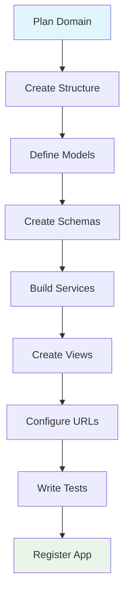

# Creating New Apps Guide

This guide provides step-by-step instructions for creating new domain applications in our FastAPI DDD architecture. Follow these patterns to maintain consistency and leverage the full power of our modular design.

## 🎯 Overview

Creating a new app involves:

1. **Planning**: Define the domain and its boundaries
2. **Structure**: Create the app folder structure
3. **Models**: Define database entities
4. **Schemas**: Create API input/output schemas  
5. **Services**: Implement business logic
6. **Views**: Create API endpoints
7. **URLs**: Configure routing
8. **Tests**: Write comprehensive tests
9. **Integration**: Register with the main application



## 📋 Step 1: Planning Your Domain

### Define Domain Boundaries

Before creating an app, clearly define:

- **Domain Purpose**: What business area does this app handle?
- **Entity Relationships**: How does it relate to other domains?
- **Business Rules**: What are the core business logic requirements?
- **API Scope**: What endpoints will this app expose?

### Example: Blog App Planning

```markdown
## Blog App Domain Definition

**Purpose**: Handle blog content management including posts, comments, and categories

**Core Entities**:
- BlogPost: Main content entities
- Comment: User comments on posts
- Category: Content categorization
- Tag: Content tagging system

**Business Rules**:
- Posts must have title and content
- Only published posts are publicly visible
- Comments require moderation
- Categories form a hierarchy

**API Endpoints**:
- CRUD operations for posts
- Comment management
- Category browsing
- Search and filtering
```

## 📁 Step 2: Create App Structure

### Create Base Directory Structure

```bash
# Navigate to apps directory
cd src/apps

# Create new app directory
mkdir blog
cd blog

# Create core files
touch __init__.py
touch models.py
touch schemas.py
touch services.py
touch views.py
touch urls.py

# Create tests directory
mkdir tests
touch tests/__init__.py
touch tests/test_models.py
touch tests/test_services.py
touch tests/test_views.py
```

### Initialize App Package

```python
# src/apps/blog/__init__.py
"""
Blog App - Content Management Domain

This app handles blog posts, comments, categories, and tags.
Provides REST API for content management and public content access.
"""

__version__ = "1.0.0"
__author__ = "Your Team"
__description__ = "Blog content management system"

# Export main components for easy importing
from .models import BlogPost, Comment, Category, Tag
from .services import BlogPostService, CommentService, CategoryService
from .views import router as blog_router

__all__ = [
    "BlogPost",
    "Comment", 
    "Category",
    "Tag",
    "BlogPostService",
    "CommentService", 
    "CategoryService",
    "blog_router"
]
```

## 🗄️ Step 3: Define Models

### Create Domain Models

```python
# src/apps/blog/models.py
from datetime import datetime
from enum import Enum
import uuid
from sqlmodel import SQLModel, Field, Relationship, Index, CheckConstraint
from typing import Optional, TYPE_CHECKING

if TYPE_CHECKING:
    from src.models import User

# Enums
class PostStatus(str, Enum):
    DRAFT = "draft"
    PUBLISHED = "published"
    ARCHIVED = "archived"

class CommentStatus(str, Enum):
    PENDING = "pending"
    APPROVED = "approved"
    REJECTED = "rejected"

# Base models
class BaseModel(SQLModel):
    """Base model for blog app entities"""
    id: uuid.UUID = Field(default_factory=uuid.uuid4, primary_key=True)
    created_at: datetime = Field(default_factory=datetime.utcnow)
    updated_at: datetime = Field(default_factory=datetime.utcnow)
    is_active: bool = Field(default=True)

# Domain models
class Category(BaseModel, table=True):
    """Blog category model with hierarchy support"""
    
    name: str = Field(max_length=100, index=True)
    slug: str = Field(max_length=100, unique=True, index=True)
    description: Optional[str] = Field(default=None, max_length=500)
    
    # Hierarchy support
    parent_id: Optional[uuid.UUID] = Field(default=None, foreign_key="category.id")
    parent: Optional["Category"] = Relationship(
        back_populates="children",
        sa_relationship_kwargs={"remote_side": "Category.id"}
    )
    children: list["Category"] = Relationship(back_populates="parent")
    
    # Relationships
    posts: list["BlogPost"] = Relationship(back_populates="category")
    
    __table_args__ = (
        Index("ix_category_name_active", "name", "is_active"),
    )

class Tag(BaseModel, table=True):
    """Blog tag model for content tagging"""
    
    name: str = Field(max_length=50, unique=True, index=True)
    slug: str = Field(max_length=50, unique=True, index=True)
    description: Optional[str] = Field(default=None, max_length=200)
    
    # Many-to-many with posts (defined in association table)

class BlogPost(BaseModel, table=True):
    """Main blog post model"""
    
    # Content fields
    title: str = Field(max_length=200, index=True)
    slug: str = Field(max_length=200, unique=True, index=True)
    content: str = Field()
    excerpt: Optional[str] = Field(default=None, max_length=500)
    
    # Metadata
    status: PostStatus = Field(default=PostStatus.DRAFT, index=True)
    featured_image: Optional[str] = Field(default=None, max_length=500)
    meta_title: Optional[str] = Field(default=None, max_length=60)
    meta_description: Optional[str] = Field(default=None, max_length=160)
    
    # Publishing
    published_at: Optional[datetime] = Field(default=None, index=True)
    view_count: int = Field(default=0, ge=0)
    
    # Relationships
    author_id: uuid.UUID = Field(foreign_key="user.id", index=True)
    category_id: Optional[uuid.UUID] = Field(default=None, foreign_key="category.id")
    
    author: "User" = Relationship()
    category: Optional[Category] = Relationship(back_populates="posts")
    comments: list["Comment"] = Relationship(
        back_populates="post",
        cascade_delete=True
    )
    
    # Business methods
    def is_published(self) -> bool:
        """Check if post is published and public"""
        return (
            self.status == PostStatus.PUBLISHED 
            and self.published_at is not None 
            and self.published_at <= datetime.utcnow()
        )
    
    def can_be_commented(self) -> bool:
        """Check if post allows comments"""
        return self.is_published() and self.is_active
    
    __table_args__ = (
        Index("ix_post_status_published", "status", "published_at"),
        Index("ix_post_author_status", "author_id", "status"),
        CheckConstraint("view_count >= 0", name="check_positive_view_count"),
    )

class Comment(BaseModel, table=True):
    """Blog comment model with moderation"""
    
    # Content
    content: str = Field(max_length=1000)
    author_name: str = Field(max_length=100)
    author_email: str = Field(max_length=255)
    author_website: Optional[str] = Field(default=None, max_length=255)
    
    # Moderation
    status: CommentStatus = Field(default=CommentStatus.PENDING, index=True)
    moderated_at: Optional[datetime] = Field(default=None)
    moderated_by_id: Optional[uuid.UUID] = Field(default=None, foreign_key="user.id")
    
    # Relationships
    post_id: uuid.UUID = Field(foreign_key="blogpost.id", index=True)
    parent_id: Optional[uuid.UUID] = Field(default=None, foreign_key="comment.id")
    
    post: BlogPost = Relationship(back_populates="comments")
    parent: Optional["Comment"] = Relationship(
        back_populates="replies",
        sa_relationship_kwargs={"remote_side": "Comment.id"}
    )
    replies: list["Comment"] = Relationship(back_populates="parent")
    moderated_by: Optional["User"] = Relationship()
    
    __table_args__ = (
        Index("ix_comment_post_status", "post_id", "status"),
        Index("ix_comment_moderation", "status", "created_at"),
    )

# Association table for many-to-many relationship
class PostTag(SQLModel, table=True):
    """Association table for posts and tags"""
    
    post_id: uuid.UUID = Field(foreign_key="blogpost.id", primary_key=True)
    tag_id: uuid.UUID = Field(foreign_key="tag.id", primary_key=True)
    
    __table_args__ = (
        Index("ix_posttag_post", "post_id"),
        Index("ix_posttag_tag", "tag_id"),
    )
```

## 📊 Step 4: Create Schemas

### Define API Schemas

```python
# src/apps/blog/schemas.py
from datetime import datetime
from typing import Optional, Annotated
import uuid
from pydantic import BaseModel, ConfigDict, Field, field_validator, model_validator

from src.apps.blog.models import PostStatus, CommentStatus

# Base schema
class BaseSchema(BaseModel):
    model_config = ConfigDict(
        from_attributes=True,
        use_enum_values=True,
        validate_assignment=True,
        str_strip_whitespace=True,
    )

# Category schemas
class CategoryCreate(BaseSchema):
    name: Annotated[str, Field(min_length=1, max_length=100)]
    slug: Annotated[str, Field(min_length=1, max_length=100, pattern=r'^[a-z0-9-]+$')]
    description: Optional[str] = Field(None, max_length=500)
    parent_id: Optional[uuid.UUID] = None
    
    @field_validator('slug')
    @classmethod
    def validate_slug(cls, v: str) -> str:
        """Ensure slug is URL-friendly"""
        if not v.replace('-', '').isalnum():
            raise ValueError('Slug must contain only letters, numbers, and hyphens')
        return v.lower()

class CategoryUpdate(BaseSchema):
    name: Optional[str] = Field(None, min_length=1, max_length=100)
    slug: Optional[str] = Field(None, min_length=1, max_length=100, pattern=r'^[a-z0-9-]+$')
    description: Optional[str] = Field(None, max_length=500)
    parent_id: Optional[uuid.UUID] = None
    is_active: Optional[bool] = None

class CategoryResponse(BaseSchema):
    id: uuid.UUID
    name: str
    slug: str
    description: Optional[str]
    parent_id: Optional[uuid.UUID]
    is_active: bool
    created_at: datetime
    updated_at: datetime
    
    # Computed fields
    post_count: int = Field(default=0, description="Number of posts in category")

# Tag schemas
class TagCreate(BaseSchema):
    name: Annotated[str, Field(min_length=1, max_length=50)]
    slug: Annotated[str, Field(min_length=1, max_length=50, pattern=r'^[a-z0-9-]+$')]
    description: Optional[str] = Field(None, max_length=200)

class TagResponse(BaseSchema):
    id: uuid.UUID
    name: str
    slug: str
    description: Optional[str]
    created_at: datetime

# Blog post schemas
class BlogPostCreate(BaseSchema):
    title: Annotated[str, Field(min_length=1, max_length=200)]
    slug: Annotated[str, Field(min_length=1, max_length=200, pattern=r'^[a-z0-9-]+$')]
    content: str = Field(min_length=1)
    excerpt: Optional[str] = Field(None, max_length=500)
    status: PostStatus = PostStatus.DRAFT
    featured_image: Optional[str] = Field(None, max_length=500)
    meta_title: Optional[str] = Field(None, max_length=60)
    meta_description: Optional[str] = Field(None, max_length=160)
    category_id: Optional[uuid.UUID] = None
    tag_ids: list[uuid.UUID] = Field(default_factory=list, max_length=10)
    
    @field_validator('content')
    @classmethod
    def validate_content(cls, v: str) -> str:
        """Validate blog post content"""
        if len(v.strip()) < 10:
            raise ValueError('Content must be at least 10 characters long')
        return v.strip()
    
    @field_validator('excerpt')
    @classmethod
    def validate_excerpt(cls, v: Optional[str]) -> Optional[str]:
        """Auto-generate excerpt if not provided"""
        if v is None:
            return v
        return v.strip()

class BlogPostUpdate(BaseSchema):
    title: Optional[str] = Field(None, min_length=1, max_length=200)
    slug: Optional[str] = Field(None, min_length=1, max_length=200)
    content: Optional[str] = Field(None, min_length=1)
    excerpt: Optional[str] = Field(None, max_length=500)
    status: Optional[PostStatus] = None
    featured_image: Optional[str] = Field(None, max_length=500)
    meta_title: Optional[str] = Field(None, max_length=60)
    meta_description: Optional[str] = Field(None, max_length=160)
    category_id: Optional[uuid.UUID] = None
    tag_ids: Optional[list[uuid.UUID]] = Field(None, max_length=10)

class BlogPostResponse(BaseSchema):
    id: uuid.UUID
    title: str
    slug: str
    content: str
    excerpt: Optional[str]
    status: PostStatus
    featured_image: Optional[str]
    meta_title: Optional[str]
    meta_description: Optional[str]
    published_at: Optional[datetime]
    view_count: int
    created_at: datetime
    updated_at: datetime
    
    # Relationships
    author_id: uuid.UUID
    category_id: Optional[uuid.UUID]
    category: Optional[CategoryResponse]
    tags: list[TagResponse] = Field(default_factory=list)
    
    # Computed fields
    comment_count: int = Field(default=0)
    read_time_minutes: int = Field(default=1)
    
    @field_validator('read_time_minutes', mode='before')
    @classmethod
    def calculate_read_time(cls, v, values) -> int:
        """Calculate estimated read time"""
        content = values.get('content', '')
        words = len(content.split())
        # Average reading speed: 200 words per minute
        return max(1, round(words / 200))

# Comment schemas
class CommentCreate(BaseSchema):
    content: Annotated[str, Field(min_length=1, max_length=1000)]
    author_name: Annotated[str, Field(min_length=1, max_length=100)]
    author_email: str = Field(pattern=r'^[a-zA-Z0-9._%+-]+@[a-zA-Z0-9.-]+\.[a-zA-Z]{2,}$')
    author_website: Optional[str] = Field(None, max_length=255)
    parent_id: Optional[uuid.UUID] = None
    
    @field_validator('author_website')
    @classmethod
    def validate_website(cls, v: Optional[str]) -> Optional[str]:
        """Validate website URL format"""
        if v is None:
            return v
        
        if not v.startswith(('http://', 'https://')):
            v = f'https://{v}'
        
        # Basic URL validation
        import re
        url_pattern = re.compile(
            r'^https?://'  # http:// or https://
            r'(?:(?:[A-Z0-9](?:[A-Z0-9-]{0,61}[A-Z0-9])?\.)+[A-Z]{2,6}\.?|'  # domain...
            r'localhost|'  # localhost...
            r'\d{1,3}\.\d{1,3}\.\d{1,3}\.\d{1,3})'  # ...or ip
            r'(?::\d+)?'  # optional port
            r'(?:/?|[/?]\S+)$', re.IGNORECASE)
        
        if not url_pattern.match(v):
            raise ValueError('Invalid website URL')
        
        return v

class CommentResponse(BaseSchema):
    id: uuid.UUID
    content: str
    author_name: str
    author_email: str  # Only for admin users
    author_website: Optional[str]
    status: CommentStatus
    created_at: datetime
    
    # Relationships
    post_id: uuid.UUID
    parent_id: Optional[uuid.UUID]
    replies: list["CommentResponse"] = Field(default_factory=list)

# Pagination and list schemas
class BlogPostListResponse(BaseSchema):
    items: list[BlogPostResponse]
    total: int
    page: int
    size: int
    pages: int

class CommentListResponse(BaseSchema):
    items: list[CommentResponse]
    total: int
    page: int
    size: int
    pages: int

# Statistics schemas
class BlogStats(BaseSchema):
    total_posts: int = Field(ge=0)
    published_posts: int = Field(ge=0)
    draft_posts: int = Field(ge=0)
    total_comments: int = Field(ge=0)
    pending_comments: int = Field(ge=0)
    total_categories: int = Field(ge=0)
    total_tags: int = Field(ge=0)
    total_views: int = Field(ge=0)
```

## ⚙️ Step 5: Implement Services

### Create Business Logic Services

```python
# src/apps/blog/services.py
from datetime import datetime
from typing import Any
import uuid
from fastapi import HTTPException
from sqlmodel import Session, select, func, or_

from src.apps.blog.models import BlogPost, Category, Tag, Comment, PostTag, PostStatus, CommentStatus
from src.apps.blog.schemas import (
    BlogPostCreate, BlogPostUpdate, CategoryCreate, CategoryUpdate,
    TagCreate, CommentCreate, BlogStats
)

class CategoryService:
    """Service for category management"""
    
    @staticmethod
    def create_category(
        *, session: Session, category_in: CategoryCreate, created_by_id: uuid.UUID
    ) -> Category:
        """Create a new category"""
        # Check for duplicate slug
        existing = session.exec(
            select(Category).where(Category.slug == category_in.slug)
        ).first()
        
        if existing:
            raise HTTPException(
                status_code=400,
                detail="Category with this slug already exists"
            )
        
        # Validate parent category exists
        if category_in.parent_id:
            parent = session.get(Category, category_in.parent_id)
            if not parent or not parent.is_active:
                raise HTTPException(
                    status_code=400,
                    detail="Parent category not found or inactive"
                )
        
        db_category = Category.model_validate(category_in)
        session.add(db_category)
        session.commit()
        session.refresh(db_category)
        return db_category
    
    @staticmethod
    def get_categories_tree(*, session: Session) -> list[Category]:
        """Get categories in tree structure"""
        # Get all active categories
        categories = session.exec(
            select(Category)
            .where(Category.is_active == True)
            .order_by(Category.name)
        ).all()
        
        # Build tree structure (simplified - in production use recursive CTEs)
        root_categories = [cat for cat in categories if cat.parent_id is None]
        return root_categories

class BlogPostService:
    """Service for blog post management"""
    
    @staticmethod
    def create_post(
        *, session: Session, post_in: BlogPostCreate, author_id: uuid.UUID
    ) -> BlogPost:
        """Create a new blog post"""
        # Check for duplicate slug
        existing = session.exec(
            select(BlogPost).where(BlogPost.slug == post_in.slug)
        ).first()
        
        if existing:
            raise HTTPException(
                status_code=400,
                detail="Post with this slug already exists"
            )
        
        # Validate category exists
        if post_in.category_id:
            category = session.get(Category, post_in.category_id)
            if not category or not category.is_active:
                raise HTTPException(
                    status_code=400,
                    detail="Category not found or inactive"
                )
        
        # Create post (exclude tags from initial creation)
        post_data = post_in.model_dump(exclude={"tag_ids"})
        post_data["author_id"] = author_id
        
        # Set published_at if status is published
        if post_in.status == PostStatus.PUBLISHED:
            post_data["published_at"] = datetime.utcnow()
        
        db_post = BlogPost(**post_data)
        session.add(db_post)
        session.flush()  # Get post ID
        
        # Handle tags
        if post_in.tag_ids:
            BlogPostService._associate_tags(
                session=session, 
                post_id=db_post.id, 
                tag_ids=post_in.tag_ids
            )
        
        session.commit()
        session.refresh(db_post)
        return db_post
    
    @staticmethod
    def update_post(
        *, session: Session, db_post: BlogPost, post_in: BlogPostUpdate
    ) -> BlogPost:
        """Update a blog post"""
        update_data = post_in.model_dump(exclude_unset=True, exclude={"tag_ids"})
        
        # Handle status change to published
        if (post_in.status == PostStatus.PUBLISHED 
            and db_post.status != PostStatus.PUBLISHED):
            update_data["published_at"] = datetime.utcnow()
        
        # Handle status change from published
        elif (post_in.status != PostStatus.PUBLISHED 
              and db_post.status == PostStatus.PUBLISHED):
            update_data["published_at"] = None
        
        # Update post fields
        db_post.sqlmodel_update(update_data)
        db_post.updated_at = datetime.utcnow()
        
        # Handle tag updates
        if post_in.tag_ids is not None:
            # Remove existing tag associations
            session.exec(
                select(PostTag).where(PostTag.post_id == db_post.id)
            ).all()
            
            # Add new tag associations
            if post_in.tag_ids:
                BlogPostService._associate_tags(
                    session=session,
                    post_id=db_post.id,
                    tag_ids=post_in.tag_ids
                )
        
        session.add(db_post)
        session.commit()
        session.refresh(db_post)
        return db_post
    
    @staticmethod
    def get_published_posts(
        *,
        session: Session,
        skip: int = 0,
        limit: int = 10,
        category_slug: str | None = None,
        tag_slug: str | None = None,
        search: str | None = None
    ) -> list[BlogPost]:
        """Get published posts with filtering"""
        statement = select(BlogPost).where(
            BlogPost.status == PostStatus.PUBLISHED,
            BlogPost.published_at <= datetime.utcnow(),
            BlogPost.is_active == True
        )
        
        # Category filter
        if category_slug:
            statement = statement.join(Category).where(
                Category.slug == category_slug,
                Category.is_active == True
            )
        
        # Tag filter (simplified - use proper join in production)
        if tag_slug:
            statement = statement.join(PostTag).join(Tag).where(
                Tag.slug == tag_slug,
                Tag.is_active == True
            )
        
        # Search filter
        if search:
            search_term = f"%{search}%"
            statement = statement.where(
                or_(
                    BlogPost.title.ilike(search_term),
                    BlogPost.content.ilike(search_term),
                    BlogPost.excerpt.ilike(search_term)
                )
            )
        
        statement = statement.order_by(
            BlogPost.published_at.desc()
        ).offset(skip).limit(limit)
        
        return session.exec(statement).all()
    
    @staticmethod
    def increment_view_count(*, session: Session, post_id: uuid.UUID) -> bool:
        """Increment post view count"""
        post = session.get(BlogPost, post_id)
        if not post:
            return False
        
        post.view_count += 1
        session.add(post)
        session.commit()
        return True
    
    @staticmethod
    def _associate_tags(*, session: Session, post_id: uuid.UUID, tag_ids: list[uuid.UUID]):
        """Associate tags with post"""
        # Validate all tags exist
        existing_tags = session.exec(
            select(Tag).where(Tag.id.in_(tag_ids))
        ).all()
        
        if len(existing_tags) != len(tag_ids):
            raise HTTPException(
                status_code=400,
                detail="One or more tags not found"
            )
        
        # Create associations
        for tag_id in tag_ids:
            association = PostTag(post_id=post_id, tag_id=tag_id)
            session.add(association)

class CommentService:
    """Service for comment management"""
    
    @staticmethod
    def create_comment(
        *, session: Session, comment_in: CommentCreate, post_id: uuid.UUID
    ) -> Comment:
        """Create a new comment"""
        # Validate post exists and allows comments
        post = session.get(BlogPost, post_id)
        if not post or not post.can_be_commented():
            raise HTTPException(
                status_code=400,
                detail="Post not found or comments not allowed"
            )
        
        # Validate parent comment if specified
        if comment_in.parent_id:
            parent = session.get(Comment, comment_in.parent_id)
            if not parent or parent.post_id != post_id:
                raise HTTPException(
                    status_code=400,
                    detail="Parent comment not found or not on this post"
                )
        
        comment_data = comment_in.model_dump()
        comment_data["post_id"] = post_id
        
        db_comment = Comment(**comment_data)
        session.add(db_comment)
        session.commit()
        session.refresh(db_comment)
        return db_comment
    
    @staticmethod
    def moderate_comment(
        *, 
        session: Session, 
        comment_id: uuid.UUID, 
        status: CommentStatus,
        moderator_id: uuid.UUID
    ) -> Comment:
        """Moderate a comment"""
        comment = session.get(Comment, comment_id)
        if not comment:
            raise HTTPException(status_code=404, detail="Comment not found")
        
        comment.status = status
        comment.moderated_at = datetime.utcnow()
        comment.moderated_by_id = moderator_id
        
        session.add(comment)
        session.commit()
        session.refresh(comment)
        return comment

class BlogStatsService:
    """Service for blog statistics"""
    
    @staticmethod
    def get_blog_stats(*, session: Session) -> BlogStats:
        """Get comprehensive blog statistics"""
        total_posts = session.exec(select(func.count(BlogPost.id))).first() or 0
        published_posts = session.exec(
            select(func.count(BlogPost.id)).where(BlogPost.status == PostStatus.PUBLISHED)
        ).first() or 0
        draft_posts = session.exec(
            select(func.count(BlogPost.id)).where(BlogPost.status == PostStatus.DRAFT)
        ).first() or 0
        total_comments = session.exec(select(func.count(Comment.id))).first() or 0
        pending_comments = session.exec(
            select(func.count(Comment.id)).where(Comment.status == CommentStatus.PENDING)
        ).first() or 0
        total_categories = session.exec(
            select(func.count(Category.id)).where(Category.is_active == True)
        ).first() or 0
        total_tags = session.exec(select(func.count(Tag.id))).first() or 0
        total_views = session.exec(select(func.sum(BlogPost.view_count))).first() or 0
        
        return BlogStats(
            total_posts=total_posts,
            published_posts=published_posts,
            draft_posts=draft_posts,
            total_comments=total_comments,
            pending_comments=pending_comments,
            total_categories=total_categories,
            total_tags=total_tags,
            total_views=total_views
        )
```

## 🌐 Step 6: Create API Views

### Create API Endpoints

```python
# src/apps/blog/views.py
from typing import Any
import uuid
from fastapi import APIRouter, Depends, HTTPException, Query, status
from sqlmodel import Session

from src.api.deps import get_current_active_user, get_current_active_superuser, get_session
from src.models import User
from src.apps.blog.models import BlogPost, Category, Comment
from src.apps.blog.schemas import (
    BlogPostCreate, BlogPostUpdate, BlogPostResponse, BlogPostListResponse,
    CategoryCreate, CategoryUpdate, CategoryResponse,
    CommentCreate, CommentResponse, CommentListResponse,
    BlogStats
)
from src.apps.blog.services import (
    BlogPostService, CategoryService, CommentService, BlogStatsService
)

router = APIRouter()

# Category endpoints
@router.post("/categories/", response_model=CategoryResponse)
def create_category(
    *,
    session: Session = Depends(get_session),
    category_in: CategoryCreate,
    current_user: User = Depends(get_current_active_superuser)
) -> Any:
    """Create new category (admin only)"""
    return CategoryService.create_category(
        session=session,
        category_in=category_in,
        created_by_id=current_user.id
    )

@router.get("/categories/", response_model=list[CategoryResponse])
def get_categories(
    session: Session = Depends(get_session)
) -> Any:
    """Get all categories in tree structure"""
    return CategoryService.get_categories_tree(session=session)

@router.get("/categories/{category_id}", response_model=CategoryResponse)
def get_category(
    category_id: uuid.UUID,
    session: Session = Depends(get_session)
) -> Any:
    """Get category by ID"""
    category = session.get(Category, category_id)
    if not category:
        raise HTTPException(status_code=404, detail="Category not found")
    return category

# Blog post endpoints
@router.post("/posts/", response_model=BlogPostResponse)
def create_post(
    *,
    session: Session = Depends(get_session),
    post_in: BlogPostCreate,
    current_user: User = Depends(get_current_active_user)
) -> Any:
    """Create new blog post"""
    return BlogPostService.create_post(
        session=session,
        post_in=post_in,
        author_id=current_user.id
    )

@router.get("/posts/", response_model=BlogPostListResponse)
def get_posts(
    session: Session = Depends(get_session),
    skip: int = Query(0, ge=0),
    limit: int = Query(10, ge=1, le=100),
    category_slug: str | None = Query(None),
    tag_slug: str | None = Query(None),
    search: str | None = Query(None)
) -> Any:
    """Get published blog posts with filtering"""
    posts = BlogPostService.get_published_posts(
        session=session,
        skip=skip,
        limit=limit,
        category_slug=category_slug,
        tag_slug=tag_slug,
        search=search
    )
    
    # Get total count for pagination
    # (simplified - implement proper count query)
    total = len(posts)  # This should be a separate count query
    
    return BlogPostListResponse(
        items=posts,
        total=total,
        page=(skip // limit) + 1,
        size=limit,
        pages=(total + limit - 1) // limit
    )

@router.get("/posts/{post_slug}", response_model=BlogPostResponse)
def get_post_by_slug(
    post_slug: str,
    session: Session = Depends(get_session)
) -> Any:
    """Get blog post by slug"""
    post = session.exec(
        select(BlogPost).where(
            BlogPost.slug == post_slug,
            BlogPost.status == PostStatus.PUBLISHED,
            BlogPost.is_active == True
        )
    ).first()
    
    if not post:
        raise HTTPException(status_code=404, detail="Post not found")
    
    # Increment view count
    BlogPostService.increment_view_count(session=session, post_id=post.id)
    
    return post

@router.put("/posts/{post_id}", response_model=BlogPostResponse)
def update_post(
    *,
    session: Session = Depends(get_session),
    post_id: uuid.UUID,
    post_in: BlogPostUpdate,
    current_user: User = Depends(get_current_active_user)
) -> Any:
    """Update blog post"""
    post = session.get(BlogPost, post_id)
    if not post:
        raise HTTPException(status_code=404, detail="Post not found")
    
    # Check permissions (author or admin)
    if post.author_id != current_user.id and not current_user.is_superuser:
        raise HTTPException(status_code=403, detail="Not enough permissions")
    
    return BlogPostService.update_post(
        session=session,
        db_post=post,
        post_in=post_in
    )

# Comment endpoints
@router.post("/posts/{post_id}/comments/", response_model=CommentResponse)
def create_comment(
    *,
    session: Session = Depends(get_session),
    post_id: uuid.UUID,
    comment_in: CommentCreate
) -> Any:
    """Create comment on blog post"""
    return CommentService.create_comment(
        session=session,
        comment_in=comment_in,
        post_id=post_id
    )

@router.get("/posts/{post_id}/comments/", response_model=CommentListResponse)
def get_post_comments(
    post_id: uuid.UUID,
    session: Session = Depends(get_session),
    skip: int = Query(0, ge=0),
    limit: int = Query(10, ge=1, le=100)
) -> Any:
    """Get approved comments for a post"""
    comments = session.exec(
        select(Comment).where(
            Comment.post_id == post_id,
            Comment.status == CommentStatus.APPROVED,
            Comment.is_active == True
        ).order_by(Comment.created_at.asc())
        .offset(skip).limit(limit)
    ).all()
    
    total = len(comments)  # Implement proper count
    
    return CommentListResponse(
        items=comments,
        total=total,
        page=(skip // limit) + 1,
        size=limit,
        pages=(total + limit - 1) // limit
    )

@router.put("/comments/{comment_id}/moderate", response_model=CommentResponse)
def moderate_comment(
    *,
    session: Session = Depends(get_session),
    comment_id: uuid.UUID,
    status: CommentStatus,
    current_user: User = Depends(get_current_active_superuser)
) -> Any:
    """Moderate comment (admin only)"""
    return CommentService.moderate_comment(
        session=session,
        comment_id=comment_id,
        status=status,
        moderator_id=current_user.id
    )

# Statistics endpoint
@router.get("/stats", response_model=BlogStats)
def get_blog_stats(
    session: Session = Depends(get_session),
    current_user: User = Depends(get_current_active_superuser)
) -> Any:
    """Get blog statistics (admin only)"""
    return BlogStatsService.get_blog_stats(session=session)
```

## 🔗 Step 7: Configure URLs

### Create URL Configuration

```python
# src/apps/blog/urls.py
from fastapi import APIRouter
from src.apps.blog.views import router as blog_router

# Create app router with prefix
router = APIRouter(
    prefix="/blog",
    tags=["blog"],
    responses={
        404: {"description": "Not found"},
        500: {"description": "Internal server error"}
    }
)

# Include all blog routes
router.include_router(blog_router)

# Health check endpoint
@router.get("/health")
def blog_health_check():
    """Blog app health check"""
    return {"status": "healthy", "app": "blog"}
```

## 🧪 Step 8: Write Tests

### Create Comprehensive Tests

```python
# src/apps/blog/tests/test_services.py
import pytest
import uuid
from datetime import datetime
from sqlmodel import Session

from src.apps.blog.models import BlogPost, Category, PostStatus
from src.apps.blog.schemas import BlogPostCreate, CategoryCreate
from src.apps.blog.services import BlogPostService, CategoryService

class TestCategoryService:
    def test_create_category_success(self, session: Session):
        """Test successful category creation"""
        category_data = CategoryCreate(
            name="Technology",
            slug="technology",
            description="Tech-related posts"
        )
        
        result = CategoryService.create_category(
            session=session,
            category_in=category_data,
            created_by_id=uuid.uuid4()
        )
        
        assert result.name == "Technology"
        assert result.slug == "technology"
        assert result.is_active is True

    def test_create_category_duplicate_slug(self, session: Session):
        """Test duplicate slug validation"""
        category_data = CategoryCreate(name="Tech", slug="tech")
        
        # Create first category
        CategoryService.create_category(
            session=session,
            category_in=category_data,
            created_by_id=uuid.uuid4()
        )
        
        # Try to create duplicate
        with pytest.raises(HTTPException) as exc_info:
            CategoryService.create_category(
                session=session,
                category_in=category_data,
                created_by_id=uuid.uuid4()
            )
        
        assert exc_info.value.status_code == 400

class TestBlogPostService:
    def test_create_post_success(self, session: Session):
        """Test successful post creation"""
        post_data = BlogPostCreate(
            title="Test Post",
            slug="test-post",
            content="This is test content for the blog post.",
            status=PostStatus.DRAFT
        )
        
        result = BlogPostService.create_post(
            session=session,
            post_in=post_data,
            author_id=uuid.uuid4()
        )
        
        assert result.title == "Test Post"
        assert result.status == PostStatus.DRAFT
        assert result.published_at is None

    def test_create_published_post_sets_published_at(self, session: Session):
        """Test that published posts get published_at timestamp"""
        post_data = BlogPostCreate(
            title="Published Post",
            slug="published-post",
            content="This post is published immediately.",
            status=PostStatus.PUBLISHED
        )
        
        result = BlogPostService.create_post(
            session=session,
            post_in=post_data,
            author_id=uuid.uuid4()
        )
        
        assert result.status == PostStatus.PUBLISHED
        assert result.published_at is not None
        assert result.published_at <= datetime.utcnow()

# src/apps/blog/tests/test_views.py
import pytest
from fastapi.testclient import TestClient
from sqlmodel import Session

from src.apps.blog.models import BlogPost, PostStatus

class TestBlogEndpoints:
    def test_create_category_success(
        self, 
        client: TestClient, 
        superuser_token_headers: dict
    ):
        """Test category creation endpoint"""
        data = {
            "name": "Technology",
            "slug": "technology",
            "description": "Tech posts"
        }
        
        response = client.post(
            "/api/v1/blog/categories/",
            json=data,
            headers=superuser_token_headers
        )
        
        assert response.status_code == 200
        content = response.json()
        assert content["name"] == "Technology"
        assert content["slug"] == "technology"

    def test_get_posts_public_access(self, client: TestClient, session: Session):
        """Test public access to published posts"""
        # Create test post
        post = BlogPost(
            title="Public Post",
            slug="public-post",
            content="This is public content.",
            status=PostStatus.PUBLISHED,
            published_at=datetime.utcnow(),
            author_id=uuid.uuid4()
        )
        session.add(post)
        session.commit()
        
        response = client.get("/api/v1/blog/posts/")
        
        assert response.status_code == 200
        content = response.json()
        assert content["total"] >= 1
        assert len(content["items"]) >= 1

    def test_get_post_by_slug(self, client: TestClient, session: Session):
        """Test getting post by slug"""
        post = BlogPost(
            title="Slug Post",
            slug="slug-post",
            content="Content for slug test.",
            status=PostStatus.PUBLISHED,
            published_at=datetime.utcnow(),
            author_id=uuid.uuid4()
        )
        session.add(post)
        session.commit()
        
        response = client.get("/api/v1/blog/posts/slug-post")
        
        assert response.status_code == 200
        content = response.json()
        assert content["title"] == "Slug Post"
        assert content["slug"] == "slug-post"
```

## 🔧 Step 9: Register App

### Register with Main Application

```python
# Update src/api/main.py
from fastapi import APIRouter
from src.api.routes import items, login, private, users
from src.apps.demo.urls import router as demo_router
from src.apps.blog.urls import router as blog_router  # Add this import

api_router = APIRouter()
api_router.include_router(login.router, tags=["login"])
api_router.include_router(users.router, prefix="/users", tags=["users"])
api_router.include_router(private.router, prefix="/private", tags=["private"])
api_router.include_router(items.router, prefix="/items", tags=["items"])
api_router.include_router(demo_router, prefix="/demo")
api_router.include_router(blog_router, prefix="/blog")  # Add this line
```

### Update Models Registry

```python
# Update src/models.py to include blog models
# ...existing imports...
from src.apps.demo.models import Product, Order, OrderItem
from src.apps.blog.models import BlogPost, Category, Comment, Tag, PostTag  # Add this

# The models are automatically registered with SQLModel when imported
```

### Create Database Migration

```bash
# Generate migration for new blog models
alembic revision --autogenerate -m "add_blog_app_models"

# Review the generated migration file
# src/alembic/versions/[timestamp]_add_blog_app_models.py

# Apply the migration
alembic upgrade head
```

## 📊 Step 10: Verify Implementation

### Test the Complete App

```bash
# Run the development server
./run_dev.sh

# Test endpoints using curl or API documentation
curl -X GET "http://localhost:8001/api/v1/blog/categories/"
curl -X GET "http://localhost:8001/api/v1/blog/posts/"

# Run tests
pytest src/apps/blog/tests/ -v

# Check API documentation
open http://localhost:8001/docs
```

### Verify in API Documentation

1. **Navigate to**: http://localhost:8001/docs
2. **Check Blog Section**: Should see all blog endpoints
3. **Test Endpoints**: Use the interactive documentation
4. **Verify Schemas**: Check request/response models

## 🎯 Best Practices Summary

### Do's ✅

- **Follow naming conventions** consistently
- **Implement comprehensive validation** in schemas
- **Write business logic in services** not views
- **Create proper database indexes** for performance
- **Write tests for all functionality**
- **Use proper HTTP status codes**
- **Implement proper error handling**
- **Add comprehensive documentation**

### Don'ts ❌

- **Don't put business logic in views**
- **Don't skip input validation**
- **Don't forget to test edge cases**
- **Don't ignore database constraints**
- **Don't expose internal model details in APIs**
- **Don't hardcode configuration values**
- **Don't skip migration reviews**

### Performance Tips 🚀

- **Use database indexes** for commonly queried fields
- **Implement proper pagination** for list endpoints
- **Use select loading** for relationships
- **Cache expensive calculations**
- **Optimize database queries**
- **Use background tasks** for heavy operations

---

**Previous**: [Models & Schemas](Models-and-Schemas.md) | **Next**: [Testing Strategy](Testing.md)
