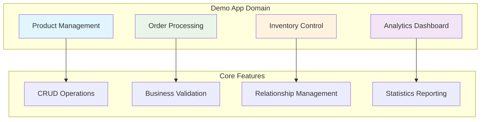
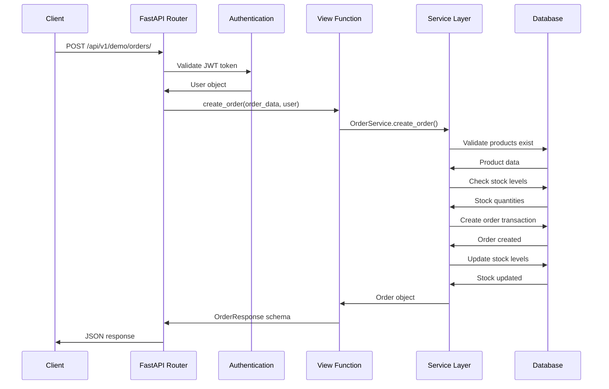
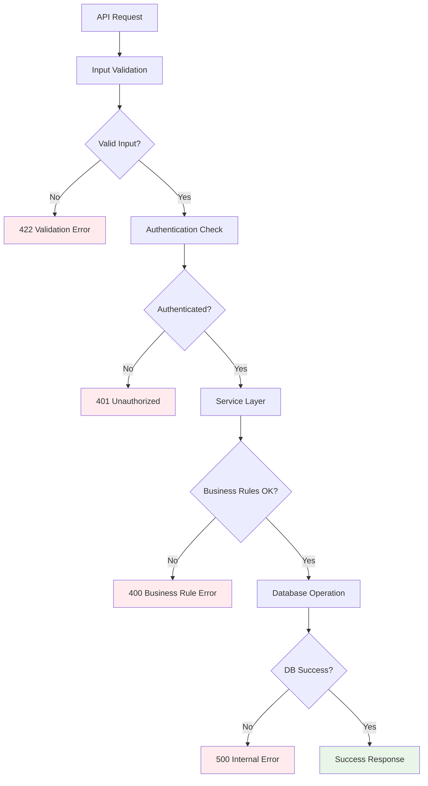

# Demo App Walkthrough

This document provides a comprehensive walkthrough of the demo app implementation, showcasing all the DDD patterns and best practices used in our FastAPI architecture.

## 🎯 Demo App Overview

The demo app implements a simple e-commerce domain with:

- **Products**: Catalog management with categories and inventory
- **Orders**: Order processing with item management
- **Dashboard**: Analytics and statistics
- **Business Rules**: Stock validation, pricing logic, and audit trails



## 📊 Domain Models Analysis

### Product Model Deep Dive

```python
# src/apps/demo/models.py
class Product(BaseModel, AuditMixin, table=True):
    """
    Product model demonstrating:
    - Business field validation
    - Audit trail implementation
    - Relationship management
    - Database constraints
    """
    
    # Core business fields
    name: str = Field(max_length=255, index=True)
    description: str | None = Field(default=None, max_length=1000)
    price: Decimal = Field(max_digits=10, decimal_places=2, ge=0)
    category: str = Field(max_length=100, index=True)
    
    # Inventory management
    stock_quantity: int = Field(default=0, ge=0)
    
    # Business metadata
    is_active: bool = Field(default=True, index=True)
    
    # Audit trail (from AuditMixin)
    created_by_id: uuid.UUID | None = Field(foreign_key="user.id")
    
    # Relationships
    order_items: list["OrderItem"] = Relationship(back_populates="product")
    
    # Database optimization
    __table_args__ = (
        Index("ix_product_category_active", "category", "is_active"),
        Index("ix_product_price_range", "price", "category"),
        CheckConstraint("price >= 0", name="check_positive_price"),
        CheckConstraint("stock_quantity >= 0", name="check_positive_stock"),
    )
```

**Key Features Demonstrated**:

1. **Field Validation**: Using SQLModel Field with constraints
2. **Indexing Strategy**: Multiple indexes for common query patterns
3. **Business Constraints**: Database-level validation rules
4. **Audit Trail**: Tracking who created/modified records
5. **Relationships**: Proper foreign key relationships

### Order Model Complex Relationships

```python
class Order(BaseModel, table=True):
    """
    Order model demonstrating:
    - Complex relationships
    - Calculated fields
    - Business state management
    - Foreign key relationships
    """
    
    # Customer relationship
    customer_id: uuid.UUID = Field(foreign_key="user.id", index=True)
    customer: "User" = Relationship()
    
    # Order state
    status: str = Field(default="pending", index=True)
    total_amount: Decimal = Field(max_digits=12, decimal_places=2, ge=0)
    
    # One-to-many relationship with order items
    order_items: list["OrderItem"] = Relationship(
        back_populates="order",
        cascade_delete=True  # Delete items when order is deleted
    )
    
    # Business logic methods
    def calculate_total(self) -> Decimal:
        """Business method to calculate order total"""
        return sum(item.quantity * item.unit_price for item in self.order_items)
```

**Key Features Demonstrated**:

1. **Relationship Types**: One-to-many, many-to-one relationships
2. **Cascade Operations**: Automatic deletion of related records
3. **Business Methods**: Domain logic embedded in models
4. **Status Management**: Order state tracking

## 🔧 Service Layer Implementation

### Product Service Business Logic

```python
class ProductService:
    """
    Product service demonstrating:
    - Input validation
    - Business rule enforcement
    - Error handling
    - Statistics generation
    """
    
    @staticmethod
    def create_product(
        *, session: Session, product_in: ProductCreate, created_by_id: uuid.UUID
    ) -> Product:
        """
        Create product with business validation
        
        Business Rules:
        1. Product name must be unique among active products
        2. Price must be positive
        3. Stock quantity cannot be negative
        4. Category must be valid
        """
        # Rule 1: Check for duplicate names
        existing = session.exec(
            select(Product).where(
                Product.name == product_in.name, 
                Product.is_active == True
            )
        ).first()

        if existing:
            raise HTTPException(
                status_code=400, 
                detail="Product with this name already exists"
            )

        # Create with audit trail
        db_product = Product.model_validate(
            product_in, 
            update={"created_by_id": created_by_id}
        )
        session.add(db_product)
        session.commit()
        session.refresh(db_product)
        return db_product
```

**Business Logic Patterns**:

1. **Validation Before Creation**: Check business rules first
2. **Proper Error Handling**: Use HTTP exceptions with meaningful messages
3. **Audit Trail**: Automatically track who created records
4. **Transaction Management**: Use session for atomic operations

### Order Service Complex Business Logic

```python
class OrderService:
    """
    Order service demonstrating:
    - Multi-step transaction processing
    - Cross-entity validation
    - Stock management
    - Complex business rules
    """
    
    @staticmethod
    def create_order(
        *, session: Session, order_in: OrderCreate, customer_id: uuid.UUID
    ) -> Order:
        """
        Create order with complex business validation
        
        Business Process:
        1. Validate all products exist and are active
        2. Check sufficient stock for all items
        3. Calculate order total
        4. Create order and items atomically
        5. Update product stock levels
        """
        total_amount = 0.0
        order_items_data = []

        # Step 1 & 2: Validate products and stock
        for item in order_in.order_items:
            product = session.get(Product, item.product_id)
            
            if not product or not product.is_active:
                raise HTTPException(
                    status_code=400,
                    detail=f"Product {item.product_id} not found or inactive",
                )

            if product.stock_quantity < item.quantity:
                raise HTTPException(
                    status_code=400,
                    detail=f"Insufficient stock for product {product.name}",
                )

            # Step 3: Calculate totals
            item_total = product.price * item.quantity
            total_amount += item_total

            order_items_data.append({
                "product_id": item.product_id,
                "quantity": item.quantity,
                "unit_price": product.price,
            })

        # Step 4: Create order and items atomically
        order_data = order_in.model_dump(exclude={"order_items"})
        order_data.update({
            "customer_id": customer_id, 
            "total_amount": total_amount
        })
        
        db_order = Order(**order_data)
        session.add(db_order)
        session.flush()  # Get order ID without committing

        for item_data in order_items_data:
            order_item = OrderItem(order_id=db_order.id, **item_data)
            session.add(order_item)

        # Step 5: Update stock levels
        for item in order_in.order_items:
            product = session.get(Product, item.product_id)
            product.stock_quantity -= item.quantity
            session.add(product)

        session.commit()
        session.refresh(db_order)
        return db_order
```

**Complex Business Logic Patterns**:

1. **Multi-Step Validation**: Validate all inputs before any changes
2. **Transaction Integrity**: Use flush() to get IDs before commit
3. **Cross-Entity Updates**: Update related entities in same transaction
4. **Rollback Safety**: All changes are atomic (commit or rollback all)

## 📋 Schema Design Patterns

### Input Schema Validation

```python
class ProductCreate(BaseSchema):
    """
    Input schema demonstrating:
    - Field validation with constraints
    - Custom validators
    - Business rule validation
    - Type safety
    """
    
    name: str = Field(min_length=1, max_length=255)
    description: str | None = Field(None, max_length=1000)
    price: Decimal = Field(gt=0, max_digits=10, decimal_places=2)
    category: str = Field(min_length=1, max_length=100)
    stock_quantity: int = Field(ge=0, default=0)
    
    @field_validator('name')
    @classmethod
    def validate_name(cls, v: str) -> str:
        """Custom validation for product name"""
        if not v.strip():
            raise ValueError('Product name cannot be empty')
        return v.strip().title()
```

### Output Schema with Computed Fields

```python
class OrderResponse(BaseSchema):
    """
    Output schema demonstrating:
    - Nested relationships
    - Computed fields
    - Selective field exposure
    - Type safety
    """
    
    id: uuid.UUID
    customer_id: uuid.UUID
    status: str
    total_amount: Decimal
    created_at: datetime
    
    # Nested relationships
    order_items: list[OrderItemResponse]
    
    # Computed field
    @computed_field
    @property
    def item_count(self) -> int:
        """Calculate total number of items"""
        return sum(item.quantity for item in self.order_items)
```

## 🌐 API Design Patterns

### RESTful Endpoint Design

```python
# src/apps/demo/views.py

@router.post("/products/", response_model=ProductResponse)
def create_product(
    *,
    session: Session = Depends(get_session),
    product_in: ProductCreate,
    current_user: User = Depends(get_current_active_user)
) -> Any:
    """
    Create new product
    
    Demonstrates:
    - Proper HTTP method usage (POST for creation)
    - Dependency injection pattern
    - Type hints for better IDE support
    - Authentication requirement
    """
    return ProductService.create_product(
        session=session,
        product_in=product_in,
        created_by_id=current_user.id
    )

@router.get("/products/", response_model=list[ProductResponse])
def get_products(
    session: Session = Depends(get_session),
    skip: int = Query(0, ge=0, description="Number of records to skip"),
    limit: int = Query(100, ge=1, le=100, description="Number of records to return"),
    category: str | None = Query(None, description="Filter by category"),
    is_active: bool | None = Query(None, description="Filter by active status"),
) -> Any:
    """
    Get products with filtering and pagination
    
    Demonstrates:
    - Query parameter validation
    - Optional filtering
    - Pagination support
    - Clear documentation
    """
    return ProductService.get_products(
        session=session,
        skip=skip,
        limit=limit,
        category=category,
        is_active=is_active,
    )
```

### Complex Endpoint with Business Logic

```python
@router.post("/orders/", response_model=OrderResponse)
def create_order(
    *,
    session: Session = Depends(get_session),
    order_in: OrderCreate,
    current_user: User = Depends(get_current_active_user)
) -> Any:
    """
    Create new order
    
    Business Process:
    1. Validate user permissions
    2. Validate product availability
    3. Calculate order totals
    4. Create order and update inventory
    5. Return complete order details
    
    Demonstrates:
    - Complex business logic delegation to service
    - Proper error handling
    - Transaction management
    - User context passing
    """
    try:
        return OrderService.create_order(
            session=session,
            order_in=order_in,
            customer_id=current_user.id
        )
    except HTTPException:
        # Re-raise HTTP exceptions
        raise
    except Exception as e:
        # Log unexpected errors and return generic message
        logger.error(f"Unexpected error creating order: {e}")
        raise HTTPException(
            status_code=500,
            detail="Internal server error"
        )
```

## 📊 Analytics and Statistics

### Dashboard Statistics Service

```python
class DashboardService:
    """
    Dashboard service demonstrating:
    - Aggregation queries
    - Cross-domain statistics
    - Performance optimization
    - Data presentation
    """
    
    @staticmethod
    def get_dashboard_stats(*, session: Session) -> DashboardStats:
        """
        Get comprehensive dashboard statistics
        
        Demonstrates:
        - Service composition pattern
        - Aggregation of multiple services
        - Efficient data collection
        """
        # Use specialized services for domain-specific stats
        product_stats = ProductService.get_product_stats(session=session)
        order_stats = OrderService.get_order_stats(session=session)
        recent_orders = OrderService.get_orders(session=session, limit=5)

        return DashboardStats(
            products=product_stats,
            orders=order_stats,
            recent_orders=recent_orders
        )
```

### Statistics Calculation Patterns

```python
@staticmethod
def get_product_stats(*, session: Session) -> ProductStats:
    """
    Calculate product statistics efficiently
    
    Demonstrates:
    - Efficient database queries
    - Aggregation functions
    - Null handling
    - Performance optimization
    """
    # Use SQLModel's func for database-level aggregation
    total_products = session.exec(select(func.count(Product.id))).first() or 0
    active_products = session.exec(
        select(func.count(Product.id)).where(Product.is_active == True)
    ).first() or 0
    total_categories = session.exec(
        select(func.count(func.distinct(Product.category)))
    ).first() or 0
    low_stock_products = session.exec(
        select(func.count(Product.id)).where(
            Product.stock_quantity < 10, 
            Product.is_active == True
        )
    ).first() or 0

    return ProductStats(
        total_products=total_products,
        active_products=active_products,
        total_categories=total_categories,
        low_stock_products=low_stock_products,
    )
```

## 🧪 Testing Patterns

### Service Layer Testing

```python
# src/apps/demo/tests/test_products.py

class TestProductService:
    """
    Test class demonstrating:
    - Comprehensive service testing
    - Business rule validation
    - Error condition testing
    - Data integrity testing
    """
    
    def test_create_product_success(self, session: Session):
        """Test successful product creation"""
        product_data = ProductCreate(
            name="Test Product",
            price=Decimal("99.99"),
            category="Electronics",
            stock_quantity=10
        )
        
        result = ProductService.create_product(
            session=session,
            product_in=product_data,
            created_by_id=uuid.uuid4()
        )
        
        # Verify all fields
        assert result.name == product_data.name
        assert result.price == product_data.price
        assert result.is_active is True
        assert result.id is not None
        assert result.created_at is not None

    def test_create_product_duplicate_name(self, session: Session):
        """Test business rule: no duplicate product names"""
        # Create first product
        ProductService.create_product(
            session=session,
            product_in=ProductCreate(name="Duplicate", price=Decimal("10.0")),
            created_by_id=uuid.uuid4()
        )
        
        # Try to create duplicate
        with pytest.raises(HTTPException) as exc_info:
            ProductService.create_product(
                session=session,
                product_in=ProductCreate(name="Duplicate", price=Decimal("20.0")),
                created_by_id=uuid.uuid4()
            )
        
        assert exc_info.value.status_code == 400
        assert "already exists" in exc_info.value.detail
```

### API Integration Testing

```python
# src/apps/demo/tests/test_views.py

class TestProductAPI:
    """
    API test class demonstrating:
    - End-to-end API testing
    - Authentication testing
    - Error response testing
    - Data validation testing
    """
    
    def test_create_product_success(
        self, 
        client: TestClient, 
        normal_user_token_headers: dict
    ):
        """Test product creation API endpoint"""
        data = {
            "name": "API Test Product",
            "price": "29.99",
            "category": "Test Category",
            "stock_quantity": 5
        }
        
        response = client.post(
            "/api/v1/demo/products/",
            json=data,
            headers=normal_user_token_headers
        )
        
        assert response.status_code == 200
        content = response.json()
        assert content["name"] == data["name"]
        assert content["price"] == data["price"]
        assert "id" in content

    def test_get_products_public_access(self, client: TestClient):
        """Test public access to product list"""
        response = client.get("/api/v1/demo/products/")
        
        assert response.status_code == 200
        content = response.json()
        assert isinstance(content, list)

    def test_create_product_validation_error(
        self, 
        client: TestClient, 
        normal_user_token_headers: dict
    ):
        """Test input validation"""
        invalid_data = {
            "name": "",  # Invalid: empty name
            "price": "-10",  # Invalid: negative price
            "category": "Test"
        }
        
        response = client.post(
            "/api/v1/demo/products/",
            json=invalid_data,
            headers=normal_user_token_headers
        )
        
        assert response.status_code == 422  # Validation error
```

## 🔄 Data Flow Analysis

### Complete Request Flow



### Error Handling Flow



## 📈 Performance Considerations

### Database Optimization

```python
# Efficient queries with proper indexing
class ProductService:
    @staticmethod
    def get_products_optimized(
        *, 
        session: Session, 
        category: str | None = None
    ) -> list[Product]:
        """
        Optimized product query demonstrating:
        - Index usage for filtering
        - Selective field loading
        - Query optimization
        """
        statement = select(Product)
        
        # Use indexed fields for filtering
        if category:
            statement = statement.where(Product.category == category)
        
        # Use indexed field for active status
        statement = statement.where(Product.is_active == True)
        
        # Order by indexed field
        statement = statement.order_by(Product.created_at.desc())
        
        return session.exec(statement).all()
```

### Caching Strategies

```python
from functools import lru_cache

class CachedStatsService:
    """
    Demonstrate caching for expensive operations
    """
    
    @staticmethod
    @lru_cache(maxsize=1)
    def get_cached_stats(session_id: str) -> dict:
        """
        Cache expensive statistics calculations
        
        Note: In production, use Redis or similar for distributed caching
        """
        # Expensive calculation here
        return {"computed": "stats"}
```

## 🎯 Key Takeaways

### Architecture Benefits Demonstrated

1. **Separation of Concerns**: Clear boundaries between layers
2. **Testability**: Easy to test each layer independently
3. **Maintainability**: Consistent patterns across the application
4. **Scalability**: Easy to add new features and domains
5. **Reusability**: Services can be reused across different endpoints

### Business Logic Patterns

1. **Validation First**: Always validate before processing
2. **Atomic Transactions**: Use database transactions for consistency
3. **Error Handling**: Proper error messages and HTTP status codes
4. **Audit Trails**: Track who did what and when
5. **Performance**: Optimize database queries and use caching

### API Design Patterns

1. **RESTful Design**: Proper HTTP methods and status codes
2. **Input Validation**: Comprehensive schema validation
3. **Output Formatting**: Consistent response structures
4. **Documentation**: Clear endpoint documentation
5. **Security**: Proper authentication and authorization

The demo app serves as a comprehensive example of how to implement DDD patterns in FastAPI, providing a solid foundation for building scalable, maintainable applications.

---

**Previous**: [Creating New Apps](Creating-Apps.md) | **Next**: [Best Practices](Best-Practices.md)
