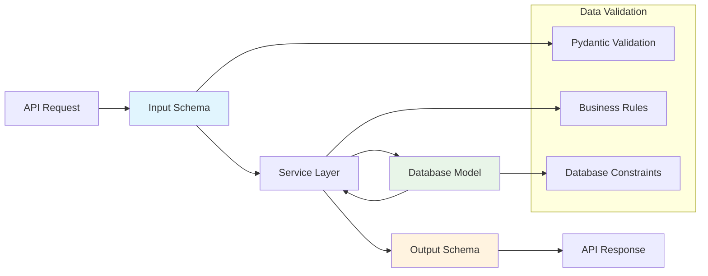

# Models & Schemas Guide

This guide covers the data modeling patterns used in our FastAPI DDD architecture, including database models, API schemas, and validation patterns.

## 🎯 Overview

In our DDD architecture, we maintain clear separation between:

- **Models**: Database entities representing domain objects
- **Schemas**: API input/output data structures with validation
- **DTOs**: Data Transfer Objects for internal communication



## 📊 Database Models

### Model Base Patterns

```python
# src/apps/shared/models.py
from datetime import datetime
import uuid
from sqlmodel import SQLModel, Field, Relationship
from typing import Optional

class BaseModel(SQLModel):
    """Base model with common fields for all entities"""
    
    id: uuid.UUID = Field(
        default_factory=uuid.uuid4,
        primary_key=True,
        index=True
    )
    created_at: datetime = Field(default_factory=datetime.utcnow)
    updated_at: datetime = Field(default_factory=datetime.utcnow)
    is_active: bool = Field(default=True, index=True)
    
    class Config:
        # Enable automatic updated_at field updates
        json_encoders = {
            datetime: lambda v: v.isoformat()
        }

class AuditMixin(SQLModel):
    """Mixin for audit trail functionality"""
    
    created_by_id: uuid.UUID | None = Field(
        default=None, 
        foreign_key="user.id",
        index=True
    )
    updated_by_id: uuid.UUID | None = Field(
        default=None, 
        foreign_key="user.id",
        index=True
    )
    
    # Relationships for audit trail
    created_by: Optional["User"] = Relationship(
        foreign_keys=[created_by_id],
        sa_relationship_kwargs={"remote_side": "User.id"}
    )
    updated_by: Optional["User"] = Relationship(
        foreign_keys=[updated_by_id],
        sa_relationship_kwargs={"remote_side": "User.id"}
    )
```

### Real-World Model Examples

```python
# src/apps/demo/models.py
from decimal import Decimal
from datetime import datetime
from enum import Enum
import uuid
from sqlmodel import SQLModel, Field, Relationship, Index, CheckConstraint
from typing import Optional, TYPE_CHECKING

if TYPE_CHECKING:
    from src.models import User

class ProductCategory(str, Enum):
    """Product category enumeration"""
    ELECTRONICS = "electronics"
    CLOTHING = "clothing"
    BOOKS = "books"
    HOME = "home"
    SPORTS = "sports"

class Product(BaseModel, AuditMixin, table=True):
    """Product model with full feature set"""
    
    # Core fields
    name: str = Field(max_length=255, index=True)
    description: str | None = Field(default=None, max_length=1000)
    price: Decimal = Field(max_digits=10, decimal_places=2, ge=0)
    category: ProductCategory = Field(index=True)
    
    # Inventory management
    stock_quantity: int = Field(default=0, ge=0)
    sku: str | None = Field(default=None, max_length=100, unique=True)
    
    # Business fields
    is_featured: bool = Field(default=False, index=True)
    weight: Decimal | None = Field(default=None, max_digits=8, decimal_places=3)
    
    # Relationships
    order_items: list["OrderItem"] = Relationship(back_populates="product")
    reviews: list["ProductReview"] = Relationship(
        back_populates="product",
        cascade_delete=True
    )
    
    # Database constraints and indexes
    __table_args__ = (
        Index("ix_product_category_active", "category", "is_active"),
        Index("ix_product_price_range", "price", "category"),
        CheckConstraint("price >= 0", name="check_positive_price"),
        CheckConstraint("stock_quantity >= 0", name="check_positive_stock"),
    )
    
    def __str__(self) -> str:
        return f"Product(name='{self.name}', price={self.price})"

class OrderStatus(str, Enum):
    """Order status enumeration"""
    PENDING = "pending"
    CONFIRMED = "confirmed"
    SHIPPED = "shipped"
    DELIVERED = "delivered"
    CANCELLED = "cancelled"

class Order(BaseModel, table=True):
    """Order model with complex relationships"""
    
    # Customer relationship
    customer_id: uuid.UUID = Field(foreign_key="user.id", index=True)
    customer: "User" = Relationship()
    
    # Order details
    status: OrderStatus = Field(default=OrderStatus.PENDING, index=True)
    total_amount: Decimal = Field(max_digits=12, decimal_places=2, ge=0)
    notes: str | None = Field(default=None, max_length=500)
    
    # Shipping information
    shipping_address: str | None = Field(default=None, max_length=500)
    tracking_number: str | None = Field(default=None, max_length=100)
    shipped_at: datetime | None = Field(default=None)
    delivered_at: datetime | None = Field(default=None)
    
    # Relationships
    order_items: list["OrderItem"] = Relationship(
        back_populates="order",
        cascade_delete=True
    )
    
    # Business logic methods
    def calculate_total(self) -> Decimal:
        """Calculate total amount from order items"""
        return sum(item.quantity * item.unit_price for item in self.order_items)
    
    def can_be_cancelled(self) -> bool:
        """Business rule: Can order be cancelled?"""
        return self.status in [OrderStatus.PENDING, OrderStatus.CONFIRMED]
    
    __table_args__ = (
        Index("ix_order_customer_status", "customer_id", "status"),
        Index("ix_order_date_range", "created_at", "status"),
        CheckConstraint("total_amount >= 0", name="check_positive_total"),
    )

class OrderItem(BaseModel, table=True):
    """Order item model with business logic"""
    
    # Relationships
    order_id: uuid.UUID = Field(foreign_key="order.id", index=True)
    product_id: uuid.UUID = Field(foreign_key="product.id", index=True)
    
    order: Order = Relationship(back_populates="order_items")
    product: Product = Relationship(back_populates="order_items")
    
    # Item details
    quantity: int = Field(ge=1)
    unit_price: Decimal = Field(max_digits=10, decimal_places=2, ge=0)
    
    # Calculated properties
    @property
    def line_total(self) -> Decimal:
        """Calculate line total"""
        return self.quantity * self.unit_price
    
    __table_args__ = (
        Index("ix_orderitem_order_product", "order_id", "product_id"),
        CheckConstraint("quantity > 0", name="check_positive_quantity"),
        CheckConstraint("unit_price >= 0", name="check_positive_unit_price"),
    )
```

### Advanced Model Patterns

```python
# Polymorphic models
class NotificationBase(BaseModel):
    """Base notification model"""
    
    user_id: uuid.UUID = Field(foreign_key="user.id")
    title: str = Field(max_length=255)
    message: str = Field(max_length=1000)
    is_read: bool = Field(default=False)
    type: str = Field(index=True)  # Discriminator column
    
    user: "User" = Relationship()

class EmailNotification(NotificationBase, table=True):
    """Email notification specific fields"""
    
    email_address: str = Field(max_length=255)
    sent_at: datetime | None = Field(default=None)
    delivery_status: str = Field(default="pending")

class SMSNotification(NotificationBase, table=True):
    """SMS notification specific fields"""
    
    phone_number: str = Field(max_length=20)
    carrier: str | None = Field(default=None)
    sent_at: datetime | None = Field(default=None)

# Tree/Hierarchical models
class Category(BaseModel, table=True):
    """Hierarchical category model"""
    
    name: str = Field(max_length=255, index=True)
    slug: str = Field(max_length=255, unique=True, index=True)
    description: str | None = Field(default=None)
    
    # Self-referential relationship
    parent_id: uuid.UUID | None = Field(default=None, foreign_key="category.id")
    parent: Optional["Category"] = Relationship(
        back_populates="children",
        sa_relationship_kwargs={"remote_side": "Category.id"}
    )
    children: list["Category"] = Relationship(back_populates="parent")
    
    # Tree methods
    def get_ancestors(self) -> list["Category"]:
        """Get all ancestor categories"""
        ancestors = []
        current = self.parent
        while current:
            ancestors.append(current)
            current = current.parent
        return ancestors
    
    def get_descendants(self) -> list["Category"]:
        """Get all descendant categories"""
        descendants = []
        for child in self.children:
            descendants.append(child)
            descendants.extend(child.get_descendants())
        return descendants
```

## 🔧 API Schemas

### Schema Design Patterns

```python
# src/apps/demo/schemas.py
from decimal import Decimal
from datetime import datetime
import uuid
from pydantic import BaseModel, ConfigDict, Field, validator, field_validator
from typing import Optional, Annotated

# Base schemas
class BaseSchema(BaseModel):
    """Base schema with common configuration"""
    
    model_config = ConfigDict(
        # Allow arbitrary types (for UUID, datetime, etc.)
        arbitrary_types_allowed=True,
        # Use enum values instead of enum names
        use_enum_values=True,
        # Validate on assignment
        validate_assignment=True,
        # Convert strings to appropriate types
        str_strip_whitespace=True,
    )

# Input schemas (for API requests)
class ProductCreate(BaseSchema):
    """Schema for creating a new product"""
    
    name: Annotated[str, Field(min_length=1, max_length=255)]
    description: Optional[str] = Field(None, max_length=1000)
    price: Annotated[Decimal, Field(gt=0, max_digits=10, decimal_places=2)]
    category: ProductCategory
    stock_quantity: Annotated[int, Field(ge=0)] = 0
    sku: Optional[str] = Field(None, max_length=100)
    is_featured: bool = False
    weight: Optional[Decimal] = Field(None, gt=0, max_digits=8, decimal_places=3)
    
    @field_validator('name')
    @classmethod
    def validate_name(cls, v: str) -> str:
        """Custom validation for product name"""
        if not v or v.isspace():
            raise ValueError('Product name cannot be empty')
        
        # Business rule: No special characters except spaces and hyphens
        allowed_chars = set('abcdefghijklmnopqrstuvwxyzABCDEFGHIJKLMNOPQRSTUVWXYZ0123456789 -')
        if not set(v).issubset(allowed_chars):
            raise ValueError('Product name contains invalid characters')
        
        return v.title()  # Title case
    
    @field_validator('sku')
    @classmethod
    def validate_sku(cls, v: Optional[str]) -> Optional[str]:
        """Validate SKU format"""
        if v is None:
            return v
        
        # Business rule: SKU must be uppercase alphanumeric
        if not v.replace('-', '').isalnum():
            raise ValueError('SKU must contain only letters, numbers, and hyphens')
        
        return v.upper()

class ProductUpdate(BaseSchema):
    """Schema for updating a product (all fields optional)"""
    
    name: Optional[str] = Field(None, min_length=1, max_length=255)
    description: Optional[str] = Field(None, max_length=1000)
    price: Optional[Decimal] = Field(None, gt=0, max_digits=10, decimal_places=2)
    category: Optional[ProductCategory] = None
    stock_quantity: Optional[int] = Field(None, ge=0)
    sku: Optional[str] = Field(None, max_length=100)
    is_featured: Optional[bool] = None
    weight: Optional[Decimal] = Field(None, gt=0, max_digits=8, decimal_places=3)
    is_active: Optional[bool] = None
    
    # Reuse validators from create schema
    _validate_name = field_validator('name')(ProductCreate.validate_name)
    _validate_sku = field_validator('sku')(ProductCreate.validate_sku)

# Output schemas (for API responses)
class ProductResponse(BaseSchema):
    """Schema for product API responses"""
    
    id: uuid.UUID
    name: str
    description: Optional[str]
    price: Decimal
    category: ProductCategory
    stock_quantity: int
    sku: Optional[str]
    is_featured: bool
    weight: Optional[Decimal]
    is_active: bool
    created_at: datetime
    updated_at: datetime
    
    # Optional audit fields (only for admin users)
    created_by_id: Optional[uuid.UUID] = None

class ProductListResponse(BaseSchema):
    """Schema for paginated product list"""
    
    items: list[ProductResponse]
    total: int
    page: int
    size: int
    pages: int
    
    @property
    def has_next(self) -> bool:
        return self.page < self.pages
    
    @property
    def has_prev(self) -> bool:
        return self.page > 1
```

### Complex Schema Examples

```python
# Nested schemas with relationships
class OrderItemCreate(BaseSchema):
    """Schema for creating order items"""
    
    product_id: uuid.UUID
    quantity: Annotated[int, Field(ge=1, le=1000)]
    
    @field_validator('quantity')
    @classmethod
    def validate_quantity(cls, v: int) -> int:
        """Business rule validation for quantity"""
        if v <= 0:
            raise ValueError('Quantity must be positive')
        if v > 100:  # Business rule: max 100 items per line
            raise ValueError('Quantity cannot exceed 100 per item')
        return v

class OrderCreate(BaseSchema):
    """Schema for creating orders with nested items"""
    
    order_items: Annotated[
        list[OrderItemCreate], 
        Field(min_length=1, max_length=50)
    ]
    notes: Optional[str] = Field(None, max_length=500)
    shipping_address: Optional[str] = Field(None, max_length=500)
    
    @field_validator('order_items')
    @classmethod
    def validate_order_items(cls, v: list[OrderItemCreate]) -> list[OrderItemCreate]:
        """Validate order items business rules"""
        if not v:
            raise ValueError('Order must contain at least one item')
        
        # Business rule: No duplicate products
        product_ids = [item.product_id for item in v]
        if len(product_ids) != len(set(product_ids)):
            raise ValueError('Duplicate products not allowed in single order')
        
        return v

class OrderItemResponse(BaseSchema):
    """Schema for order item responses with product details"""
    
    id: uuid.UUID
    product_id: uuid.UUID
    quantity: int
    unit_price: Decimal
    line_total: Decimal
    
    # Nested product information
    product: ProductResponse

class OrderResponse(BaseSchema):
    """Complete order response schema"""
    
    id: uuid.UUID
    customer_id: uuid.UUID
    status: OrderStatus
    total_amount: Decimal
    notes: Optional[str]
    shipping_address: Optional[str]
    tracking_number: Optional[str]
    shipped_at: Optional[datetime]
    delivered_at: Optional[datetime]
    created_at: datetime
    updated_at: datetime
    
    # Nested relationships
    order_items: list[OrderItemResponse]
    
    # Computed fields
    item_count: int = Field(description="Total number of items in order")
    
    @field_validator('item_count', mode='before')
    @classmethod
    def calculate_item_count(cls, v, values) -> int:
        """Calculate total item count"""
        order_items = values.get('order_items', [])
        return sum(item.quantity for item in order_items)
```

### Validation Patterns

```python
# Custom validators
class AddressValidator:
    """Reusable address validation logic"""
    
    @staticmethod
    def validate_postal_code(postal_code: str, country: str = "US") -> str:
        """Validate postal code format"""
        if country == "US":
            import re
            if not re.match(r'^\d{5}(-\d{4})?$', postal_code):
                raise ValueError('Invalid US postal code format')
        return postal_code
    
    @staticmethod
    def validate_address_components(street: str, city: str, state: str) -> dict:
        """Validate address components"""
        if not street.strip():
            raise ValueError('Street address is required')
        if not city.strip():
            raise ValueError('City is required')
        if len(state) != 2:
            raise ValueError('State must be 2-letter code')
        
        return {
            'street': street.strip().title(),
            'city': city.strip().title(),
            'state': state.upper()
        }

class UserProfileSchema(BaseSchema):
    """User profile with complex validation"""
    
    email: str = Field(pattern=r'^[a-zA-Z0-9._%+-]+@[a-zA-Z0-9.-]+\.[a-zA-Z]{2,}$')
    phone: Optional[str] = Field(None, pattern=r'^\+?1?\d{9,15}$')
    birth_date: Optional[datetime] = None
    
    # Address fields
    street_address: str
    city: str
    state: str
    postal_code: str
    country: str = "US"
    
    @field_validator('birth_date')
    @classmethod
    def validate_age(cls, v: Optional[datetime]) -> Optional[datetime]:
        """Validate user age"""
        if v is None:
            return v
        
        from datetime import datetime, timedelta
        today = datetime.now()
        age = today - v
        
        # Business rule: Must be at least 13 years old
        if age < timedelta(days=13*365):
            raise ValueError('User must be at least 13 years old')
        
        # Business rule: Must be less than 120 years old
        if age > timedelta(days=120*365):
            raise ValueError('Invalid birth date')
        
        return v
    
    @field_validator('postal_code')
    @classmethod
    def validate_postal_code(cls, v: str, values) -> str:
        """Validate postal code using reusable validator"""
        country = values.get('country', 'US')
        return AddressValidator.validate_postal_code(v, country)
    
    @model_validator(mode='after')
    def validate_address(self) -> 'UserProfileSchema':
        """Cross-field address validation"""
        validated = AddressValidator.validate_address_components(
            street=self.street_address,
            city=self.city,
            state=self.state
        )
        
        self.street_address = validated['street']
        self.city = validated['city']
        self.state = validated['state']
        
        return self
```

## 📊 Statistics and Analytics Schemas

```python
# Analytics and reporting schemas
class ProductStats(BaseSchema):
    """Product statistics schema"""
    
    total_products: int = Field(ge=0)
    active_products: int = Field(ge=0)
    total_categories: int = Field(ge=0)
    low_stock_products: int = Field(ge=0)
    
    @field_validator('active_products')
    @classmethod
    def validate_active_not_greater_than_total(cls, v: int, values) -> int:
        """Ensure active products don't exceed total"""
        total = values.get('total_products', 0)
        if v > total:
            raise ValueError('Active products cannot exceed total products')
        return v

class OrderStats(BaseSchema):
    """Order statistics schema"""
    
    total_orders: int = Field(ge=0)
    pending_orders: int = Field(ge=0)
    completed_orders: int = Field(ge=0)
    total_revenue: Decimal = Field(ge=0, max_digits=15, decimal_places=2)
    
    @property
    def completion_rate(self) -> float:
        """Calculate order completion rate"""
        if self.total_orders == 0:
            return 0.0
        return (self.completed_orders / self.total_orders) * 100

class DashboardStats(BaseSchema):
    """Dashboard overview statistics"""
    
    products: ProductStats
    orders: OrderStats
    recent_orders: list[OrderResponse] = Field(max_length=10)
    
    # Computed metrics
    @property
    def average_order_value(self) -> Decimal:
        """Calculate average order value"""
        if not self.recent_orders:
            return Decimal('0.00')
        
        total = sum(order.total_amount for order in self.recent_orders)
        return total / len(self.recent_orders)
```

## 🔄 Schema Conversion Patterns

```python
# Model to schema conversion utilities
class SchemaConverter:
    """Utility for converting between models and schemas"""
    
    @staticmethod
    def model_to_schema(model: SQLModel, schema_class: type[BaseSchema]) -> BaseSchema:
        """Convert model instance to schema"""
        model_data = model.model_dump()
        return schema_class(**model_data)
    
    @staticmethod
    def models_to_schemas(
        models: list[SQLModel], 
        schema_class: type[BaseSchema]
    ) -> list[BaseSchema]:
        """Convert list of models to schemas"""
        return [
            SchemaConverter.model_to_schema(model, schema_class) 
            for model in models
        ]
    
    @staticmethod
    def paginated_response(
        items: list[SQLModel],
        total: int,
        page: int,
        size: int,
        schema_class: type[BaseSchema]
    ) -> dict:
        """Create paginated response"""
        return {
            "items": SchemaConverter.models_to_schemas(items, schema_class),
            "total": total,
            "page": page,
            "size": size,
            "pages": (total + size - 1) // size
        }

# Usage in services
class ProductService:
    @staticmethod
    def get_products_paginated(
        *,
        session: Session,
        page: int = 1,
        size: int = 10
    ) -> ProductListResponse:
        """Get paginated products with proper schema conversion"""
        offset = (page - 1) * size
        
        # Get products
        products = session.exec(
            select(Product)
            .where(Product.is_active == True)
            .offset(offset)
            .limit(size)
        ).all()
        
        # Get total count
        total = session.exec(
            select(func.count(Product.id))
            .where(Product.is_active == True)
        ).first() or 0
        
        # Convert to response schema
        response_data = SchemaConverter.paginated_response(
            items=products,
            total=total,
            page=page,
            size=size,
            schema_class=ProductResponse
        )
        
        return ProductListResponse(**response_data)
```

## 🧪 Testing Schemas

```python
import pytest
from decimal import Decimal
from pydantic import ValidationError

class TestProductSchemas:
    def test_product_create_valid(self):
        """Test valid product creation schema"""
        data = {
            "name": "Test Product",
            "price": Decimal("99.99"),
            "category": "electronics",
            "stock_quantity": 10
        }
        
        schema = ProductCreate(**data)
        assert schema.name == "Test Product"
        assert schema.price == Decimal("99.99")

    def test_product_create_invalid_price(self):
        """Test invalid price validation"""
        data = {
            "name": "Test Product",
            "price": Decimal("-10.00"),  # Invalid negative price
            "category": "electronics"
        }
        
        with pytest.raises(ValidationError) as exc_info:
            ProductCreate(**data)
        
        assert "greater than 0" in str(exc_info.value)

    def test_product_name_validation(self):
        """Test custom product name validation"""
        # Valid name
        valid_data = {
            "name": "valid product name",
            "price": Decimal("10.00"),
            "category": "electronics"
        }
        schema = ProductCreate(**valid_data)
        assert schema.name == "Valid Product Name"  # Title case
        
        # Invalid name with special characters
        invalid_data = valid_data.copy()
        invalid_data["name"] = "invalid@product!"
        
        with pytest.raises(ValidationError) as exc_info:
            ProductCreate(**invalid_data)
        
        assert "invalid characters" in str(exc_info.value)

    def test_order_items_validation(self):
        """Test order items business rules"""
        # Valid order
        valid_items = [
            {"product_id": uuid.uuid4(), "quantity": 2},
            {"product_id": uuid.uuid4(), "quantity": 1}
        ]
        
        schema = OrderCreate(order_items=valid_items)
        assert len(schema.order_items) == 2
        
        # Invalid: duplicate products
        duplicate_id = uuid.uuid4()
        invalid_items = [
            {"product_id": duplicate_id, "quantity": 2},
            {"product_id": duplicate_id, "quantity": 1}
        ]
        
        with pytest.raises(ValidationError) as exc_info:
            OrderCreate(order_items=invalid_items)
        
        assert "Duplicate products" in str(exc_info.value)
```

## 🔧 Advanced Schema Patterns

### Dynamic Schema Generation

```python
from typing import Type, get_type_hints

class DynamicSchemaGenerator:
    """Generate schemas dynamically based on models"""
    
    @staticmethod
    def create_response_schema(
        model_class: Type[SQLModel], 
        exclude_fields: set[str] | None = None
    ) -> Type[BaseSchema]:
        """Create response schema from model"""
        exclude_fields = exclude_fields or set()
        
        # Get model fields
        model_fields = get_type_hints(model_class)
        schema_fields = {
            name: (field_type, Field(...))
            for name, field_type in model_fields.items()
            if name not in exclude_fields
        }
        
        # Create dynamic schema class
        schema_class = type(
            f"{model_class.__name__}Response",
            (BaseSchema,),
            {
                "__annotations__": schema_fields,
                "__module__": model_class.__module__
            }
        )
        
        return schema_class

# Usage
ProductResponseSchema = DynamicSchemaGenerator.create_response_schema(
    Product,
    exclude_fields={"created_by_id", "updated_by_id"}
)
```

### Conditional Schema Fields

```python
from typing import Any, Dict
from pydantic import model_validator

class ConditionalSchema(BaseSchema):
    """Schema with conditional field requirements"""
    
    user_type: str = Field(choices=["admin", "customer", "vendor"])
    email: str
    
    # Optional fields that become required based on user_type
    company_name: Optional[str] = None
    tax_id: Optional[str] = None
    admin_permissions: Optional[list[str]] = None
    
    @model_validator(mode='after')
    def validate_conditional_fields(self) -> 'ConditionalSchema':
        """Validate fields based on user type"""
        if self.user_type == "vendor":
            if not self.company_name:
                raise ValueError("Company name required for vendors")
            if not self.tax_id:
                raise ValueError("Tax ID required for vendors")
        
        elif self.user_type == "admin":
            if not self.admin_permissions:
                raise ValueError("Admin permissions required for admin users")
        
        return self
```

---

**Previous**: [Service Layer](Services.md) | **Next**: [Creating New Apps](Creating-Apps.md)
