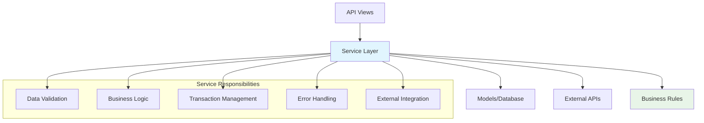

# Service Layer Patterns and Best Practices

The Service Layer is the heart of Domain-Driven Development, containing all business logic and rules. This guide covers how to design, implement, and test services in our FastAPI DDD architecture.

## 🎯 Service Layer Overview

### Purpose of Services

Services encapsulate business logic and act as a bridge between the API layer (views) and the data layer (models). They enforce business rules, handle complex operations, and maintain data consistency.



### Service Design Principles

1. **Single Responsibility**: Each service handles one domain
2. **Stateless**: Services don't maintain state between calls
3. **Dependency Injection**: Services receive dependencies (like database sessions)
4. **Error Handling**: Services handle and translate errors appropriately
5. **Transaction Management**: Services manage database transactions

## 📁 Service Structure

### Basic Service Template

```python
# src/apps/myapp/services.py
from typing import Any
import uuid
from fastapi import HTTPException
from sqlmodel import Session, select, func

from src.apps.myapp.models import MyModel
from src.apps.myapp.schemas import (
    MyModelCreate,
    MyModelUpdate,
    MyModelStats,
)


class MyModelService:
    """Service for MyModel-related business logic"""

    @staticmethod
    def create(
        *, 
        session: Session, 
        obj_in: MyModelCreate, 
        created_by_id: uuid.UUID
    ) -> MyModel:
        """Create a new model instance with business validation"""
        # Business validation
        if obj_in.some_field and not obj_in.other_field:
            raise HTTPException(
                status_code=400,
                detail="Other field is required when some field is provided"
            )
        
        # Check for duplicates
        existing = session.exec(
            select(MyModel).where(MyModel.unique_field == obj_in.unique_field)
        ).first()
        
        if existing:
            raise HTTPException(
                status_code=400,
                detail="Model with this unique field already exists"
            )
        
        # Create the model
        db_obj = MyModel.model_validate(
            obj_in, 
            update={"created_by_id": created_by_id}
        )
        session.add(db_obj)
        session.commit()
        session.refresh(db_obj)
        return db_obj

    @staticmethod
    def get(*, session: Session, id: uuid.UUID) -> MyModel | None:
        """Get a model by ID"""
        return session.get(MyModel, id)

    @staticmethod
    def get_multi(
        *,
        session: Session,
        skip: int = 0,
        limit: int = 100,
        filters: dict[str, Any] | None = None,
    ) -> list[MyModel]:
        """Get multiple models with filtering"""
        statement = select(MyModel)
        
        # Apply filters
        if filters:
            for key, value in filters.items():
                if hasattr(MyModel, key) and value is not None:
                    statement = statement.where(
                        getattr(MyModel, key) == value
                    )
        
        statement = statement.offset(skip).limit(limit)
        return session.exec(statement).all()

    @staticmethod
    def update(
        *, 
        session: Session, 
        db_obj: MyModel, 
        obj_in: MyModelUpdate
    ) -> MyModel:
        """Update a model with business validation"""
        # Business validation
        if obj_in.status and obj_in.status == "completed":
            if not db_obj.required_field:
                raise HTTPException(
                    status_code=400,
                    detail="Required field must be set before completion"
                )
        
        # Update the model
        obj_data = obj_in.model_dump(exclude_unset=True)
        db_obj.sqlmodel_update(obj_data)
        session.add(db_obj)
        session.commit()
        session.refresh(db_obj)
        return db_obj

    @staticmethod
    def delete(*, session: Session, id: uuid.UUID) -> bool:
        """Soft delete a model"""
        obj = session.get(MyModel, id)
        if not obj:
            return False
        
        # Business logic for deletion
        if obj.status == "active":
            raise HTTPException(
                status_code=400,
                detail="Cannot delete active model"
            )
        
        obj.is_active = False
        session.add(obj)
        session.commit()
        return True

    @staticmethod
    def get_stats(*, session: Session) -> MyModelStats:
        """Get model statistics"""
        total = session.exec(select(func.count(MyModel.id))).first() or 0
        active = session.exec(
            select(func.count(MyModel.id)).where(MyModel.is_active == True)
        ).first() or 0
        
        return MyModelStats(
            total=total,
            active=active,
            inactive=total - active
        )
```

## 🔧 Real-World Example: Demo App Services

Let's examine the actual services from our demo app:

### Product Service

```python
class ProductService:
    """Service for product-related business logic"""

    @staticmethod
    def create_product(
        *, session: Session, product_in: ProductCreate, created_by_id: uuid.UUID
    ) -> Product:
        """Create a new product with business validation"""
        # Business Rule: No duplicate product names
        existing = session.exec(
            select(Product).where(
                Product.name == product_in.name, 
                Product.is_active == True
            )
        ).first()

        if existing:
            raise HTTPException(
                status_code=400, 
                detail="Product with this name already exists"
            )

        # Create with audit trail
        db_product = Product.model_validate(
            product_in, 
            update={"created_by_id": created_by_id}
        )
        session.add(db_product)
        session.commit()
        session.refresh(db_product)
        return db_product

    @staticmethod
    def get_product_stats(*, session: Session) -> ProductStats:
        """Business intelligence: Product statistics"""
        total_products = session.exec(select(func.count(Product.id))).first() or 0
        active_products = session.exec(
            select(func.count(Product.id)).where(Product.is_active == True)
        ).first() or 0
        total_categories = session.exec(
            select(func.count(func.distinct(Product.category)))
        ).first() or 0
        low_stock_products = session.exec(
            select(func.count(Product.id)).where(
                Product.stock_quantity < 10, 
                Product.is_active == True
            )
        ).first() or 0

        return ProductStats(
            total_products=total_products,
            active_products=active_products,
            total_categories=total_categories,
            low_stock_products=low_stock_products,
        )
```

### Order Service with Complex Business Logic

```python
class OrderService:
    """Service for order-related business logic"""

    @staticmethod
    def create_order(
        *, session: Session, order_in: OrderCreate, customer_id: uuid.UUID
    ) -> Order:
        """Create order with complex business validation"""
        total_amount = 0.0
        order_items_data = []

        # Business Rule: Validate all products and stock
        for item in order_in.order_items:
            product = session.get(Product, item.product_id)
            
            # Business Rule: Product must exist and be active
            if not product or not product.is_active:
                raise HTTPException(
                    status_code=400,
                    detail=f"Product {item.product_id} not found or inactive",
                )

            # Business Rule: Sufficient stock required
            if product.stock_quantity < item.quantity:
                raise HTTPException(
                    status_code=400,
                    detail=f"Insufficient stock for product {product.name}",
                )

            # Business Logic: Calculate totals
            item_total = product.price * item.quantity
            total_amount += item_total

            order_items_data.append({
                "product_id": item.product_id,
                "quantity": item.quantity,
                "unit_price": product.price,
            })

        # Transaction: Create order and items atomically
        order_data = order_in.model_dump(exclude={"order_items"})
        order_data.update({
            "customer_id": customer_id, 
            "total_amount": total_amount
        })
        
        db_order = Order(**order_data)
        session.add(db_order)
        session.flush()  # Get order ID without committing

        # Create order items
        for item_data in order_items_data:
            order_item = OrderItem(order_id=db_order.id, **item_data)
            session.add(order_item)

        # Business Logic: Update stock quantities
        for item in order_in.order_items:
            product = session.get(Product, item.product_id)
            product.stock_quantity -= item.quantity
            session.add(product)

        session.commit()
        session.refresh(db_order)
        return db_order
```

## 🎯 Service Patterns and Best Practices

### 1. Input Validation Pattern

```python
class ValidationService:
    @staticmethod
    def validate_business_rules(*, data: dict) -> dict:
        """Centralized business rule validation"""
        errors = []
        
        # Rule 1: Check required fields
        if not data.get("email"):
            errors.append("Email is required")
        
        # Rule 2: Business logic validation
        if data.get("age", 0) < 18 and data.get("requires_guardian", False):
            errors.append("Guardian information required for minors")
        
        # Rule 3: Cross-field validation
        if data.get("end_date") and data.get("start_date"):
            if data["end_date"] < data["start_date"]:
                errors.append("End date must be after start date")
        
        if errors:
            raise HTTPException(status_code=400, detail="; ".join(errors))
        
        return data
```

### 2. Transaction Management Pattern

```python
class TransactionService:
    @staticmethod
    def complex_operation(*, session: Session, data: ComplexData) -> Result:
        """Handle complex multi-step operations"""
        try:
            # Step 1: Create primary entity
            primary = PrimaryModel(**data.primary_data)
            session.add(primary)
            session.flush()  # Get ID without committing
            
            # Step 2: Create related entities
            for related_data in data.related_items:
                related = RelatedModel(
                    primary_id=primary.id, 
                    **related_data
                )
                session.add(related)
            
            # Step 3: Update external systems
            external_service.update(primary.id)
            
            # Step 4: Commit everything
            session.commit()
            session.refresh(primary)
            
            return Result(success=True, data=primary)
            
        except Exception as e:
            session.rollback()
            raise HTTPException(
                status_code=500,
                detail=f"Operation failed: {str(e)}"
            )
```

### 3. Error Handling Pattern

```python
class ErrorHandlingService:
    @staticmethod
    def safe_operation(*, session: Session, data: dict) -> dict:
        """Demonstrate comprehensive error handling"""
        try:
            # Validate input
            if not data.get("required_field"):
                raise ValueError("Required field is missing")
            
            # Business operation
            result = session.exec(select(Model).where(...)).first()
            
            if not result:
                raise HTTPException(
                    status_code=404,
                    detail="Resource not found"
                )
            
            return {"status": "success", "data": result}
            
        except ValueError as e:
            # Handle validation errors
            raise HTTPException(status_code=400, detail=str(e))
        
        except HTTPException:
            # Re-raise HTTP exceptions
            raise
        
        except Exception as e:
            # Handle unexpected errors
            logger.error(f"Unexpected error in safe_operation: {e}")
            raise HTTPException(
                status_code=500,
                detail="Internal server error"
            )
```

### 4. Caching Pattern

```python
from functools import lru_cache
from typing import Any

class CachingService:
    @staticmethod
    @lru_cache(maxsize=128)
    def get_expensive_calculation(param: str) -> dict[str, Any]:
        """Cache expensive calculations"""
        # Expensive operation here
        return {"result": "computed_value"}
    
    @staticmethod
    def get_with_cache(*, session: Session, key: str) -> dict:
        """Cache database queries with TTL"""
        cache_key = f"service_cache:{key}"
        
        # Try cache first
        cached = cache.get(cache_key)
        if cached:
            return cached
        
        # Fetch from database
        result = session.exec(
            select(Model).where(Model.key == key)
        ).first()
        
        if result:
            data = result.model_dump()
            cache.set(cache_key, data, timeout=300)  # 5 minute cache
            return data
        
        return {}
```

### 5. Async Service Pattern

```python
import asyncio
from typing import Any

class AsyncService:
    @staticmethod
    async def async_operation(*, data: dict) -> dict[str, Any]:
        """Handle asynchronous operations"""
        # Simulate async operations
        await asyncio.sleep(0.1)
        
        # Multiple async calls
        tasks = [
            external_api_call(data["id"]),
            another_async_operation(data["type"]),
            third_party_service.process(data)
        ]
        
        results = await asyncio.gather(*tasks, return_exceptions=True)
        
        # Process results
        return {
            "external_result": results[0] if not isinstance(results[0], Exception) else None,
            "operation_result": results[1] if not isinstance(results[1], Exception) else None,
            "service_result": results[2] if not isinstance(results[2], Exception) else None,
        }
```

## 🧪 Testing Services

### Unit Testing Pattern

```python
import pytest
from unittest.mock import Mock, patch
from sqlmodel import Session

from src.apps.demo.services import ProductService
from src.apps.demo.schemas import ProductCreate


class TestProductService:
    def test_create_product_success(self, session: Session):
        """Test successful product creation"""
        product_data = ProductCreate(
            name="Test Product",
            price=99.99,
            category="Electronics",
            stock_quantity=10
        )
        
        result = ProductService.create_product(
            session=session,
            product_in=product_data,
            created_by_id=uuid.uuid4()
        )
        
        assert result.name == product_data.name
        assert result.price == product_data.price
        assert result.is_active is True

    def test_create_product_duplicate_name(self, session: Session):
        """Test duplicate product name validation"""
        # Create first product
        ProductService.create_product(
            session=session,
            product_in=ProductCreate(name="Duplicate", price=10.0),
            created_by_id=uuid.uuid4()
        )
        
        # Try to create duplicate
        with pytest.raises(HTTPException) as exc_info:
            ProductService.create_product(
                session=session,
                product_in=ProductCreate(name="Duplicate", price=20.0),
                created_by_id=uuid.uuid4()
            )
        
        assert exc_info.value.status_code == 400
        assert "already exists" in exc_info.value.detail

    @patch('src.apps.demo.services.external_service')
    def test_with_external_dependency(self, mock_external, session: Session):
        """Test service with external dependencies"""
        mock_external.validate.return_value = True
        
        result = ProductService.some_method_with_external_call(
            session=session,
            data={"test": "data"}
        )
        
        mock_external.validate.assert_called_once()
        assert result is not None
```

### Integration Testing Pattern

```python
class TestServiceIntegration:
    def test_order_creation_integration(self, session: Session, sample_products: list[Product]):
        """Test complete order creation flow"""
        order_data = OrderCreate(
            order_items=[
                OrderItemCreate(
                    product_id=sample_products[0].id,
                    quantity=2
                ),
                OrderItemCreate(
                    product_id=sample_products[1].id,
                    quantity=1
                )
            ]
        )
        
        # Create order
        order = OrderService.create_order(
            session=session,
            order_in=order_data,
            customer_id=uuid.uuid4()
        )
        
        # Verify order
        assert order.total_amount > 0
        assert len(order.order_items) == 2
        
        # Verify stock was updated
        session.refresh(sample_products[0])
        assert sample_products[0].stock_quantity < 10  # Assuming initial stock was 10
```

## 📊 Performance Considerations

### Database Query Optimization

```python
class OptimizedService:
    @staticmethod
    def get_with_relationships(*, session: Session, id: uuid.UUID) -> Model:
        """Optimize queries with eager loading"""
        return session.exec(
            select(Model)
            .options(selectinload(Model.related_items))
            .where(Model.id == id)
        ).first()
    
    @staticmethod
    def bulk_operations(*, session: Session, items: list[dict]) -> list[Model]:
        """Handle bulk operations efficiently"""
        # Bulk insert
        objects = [Model(**item) for item in items]
        session.add_all(objects)
        session.commit()
        
        return objects
```

### Service-Level Caching

```python
from functools import wraps
import hashlib
import json

def cache_result(timeout: int = 300):
    """Decorator for caching service results"""
    def decorator(func):
        @wraps(func)
        def wrapper(*args, **kwargs):
            # Create cache key
            cache_key = f"{func.__name__}:{hashlib.md5(
                json.dumps(kwargs, sort_keys=True, default=str).encode()
            ).hexdigest()}"
            
            # Try cache
            cached = cache.get(cache_key)
            if cached:
                return cached
            
            # Execute function
            result = func(*args, **kwargs)
            
            # Cache result
            cache.set(cache_key, result, timeout=timeout)
            return result
        
        return wrapper
    return decorator

class CachedService:
    @staticmethod
    @cache_result(timeout=600)  # 10 minute cache
    def expensive_calculation(*, session: Session, params: dict) -> dict:
        """Cache expensive calculations"""
        # Expensive operation
        result = session.exec(complex_query).all()
        return {"data": [item.model_dump() for item in result]}
```

## 🔗 Service Integration

### Dependency Injection Pattern

```python
from abc import ABC, abstractmethod

class EmailServiceInterface(ABC):
    @abstractmethod
    def send_email(self, to: str, subject: str, body: str) -> bool:
        pass

class NotificationService:
    def __init__(self, email_service: EmailServiceInterface):
        self.email_service = email_service
    
    def notify_user(self, user: User, message: str) -> bool:
        return self.email_service.send_email(
            to=user.email,
            subject="Notification",
            body=message
        )

# Usage in views
def create_user_endpoint(
    user_data: UserCreate,
    session: Session = Depends(get_session),
    email_service: EmailServiceInterface = Depends(get_email_service)
):
    user = UserService.create_user(session=session, user_in=user_data)
    
    notification_service = NotificationService(email_service)
    notification_service.notify_user(user, "Welcome!")
    
    return user
```

## 📝 Service Documentation

### Docstring Standards

```python
class DocumentedService:
    @staticmethod
    def complex_business_operation(
        *,
        session: Session,
        data: ComplexData,
        options: dict[str, Any] | None = None
    ) -> OperationResult:
        """
        Perform complex business operation with multiple steps.
        
        This method handles the complete workflow for processing complex
        business data, including validation, transformation, and persistence.
        
        Args:
            session: Database session for transaction management
            data: Input data containing all required information
            options: Optional configuration parameters
                - validate_strict: Enable strict validation (default: True)
                - send_notifications: Send email notifications (default: False)
                - background_processing: Process in background (default: False)
        
        Returns:
            OperationResult containing:
                - success: Boolean indicating operation success
                - data: Processed data object
                - errors: List of any non-fatal errors
                - metadata: Additional operation information
        
        Raises:
            HTTPException: 
                - 400: Invalid input data or business rule violation
                - 404: Required related objects not found
                - 500: Internal processing error
        
        Example:
            >>> result = DocumentedService.complex_business_operation(
            ...     session=session,
            ...     data=ComplexData(field1="value1", field2="value2"),
            ...     options={"validate_strict": True}
            ... )
            >>> assert result.success
            >>> assert result.data.id is not None
        
        Business Rules:
            - Data must pass strict validation when validate_strict=True
            - Related objects must exist and be active
            - User must have appropriate permissions
            - Operation is logged for audit purposes
        
        Note:
            This operation is transactional. All changes are rolled back
            if any step fails.
        """
        # Implementation here
        pass
```

---

**Previous**: [Implementation Guide](Implementation.md) | **Next**: [Models & Schemas](Models-and-Schemas.md)
