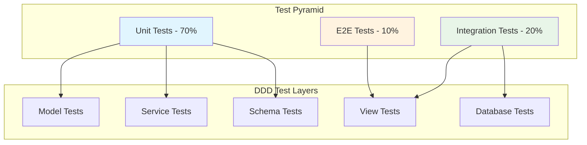

# Testing Strategy for DDD Applications

This guide covers comprehensive testing strategies for Domain-Driven Development applications, including unit tests, integration tests, and end-to-end testing patterns.

## 🎯 Testing Philosophy

Our testing strategy follows the **Test Pyramid** principle with emphasis on:

- **Fast Feedback**: Quick unit tests for immediate validation
- **Comprehensive Coverage**: Testing all layers of the DDD architecture
- **Business Rule Validation**: Ensuring domain logic correctness
- **API Contract Testing**: Validating external interfaces
- **Integration Confidence**: Testing component interactions



## 📁 Test Structure Organization

### Test Directory Structure

```
src/apps/demo/tests/
├── __init__.py
├── conftest.py              # Shared fixtures for demo app
├── test_models.py           # Model unit tests
├── test_schemas.py          # Schema validation tests
├── test_services.py         # Service layer tests
├── test_views.py           # API endpoint tests
├── integration/
│   ├── __init__.py
│   ├── test_order_flow.py   # End-to-end business flows
│   └── test_data_integrity.py
└── fixtures/
    ├── __init__.py
    ├── products.py          # Test data fixtures
    └── orders.py
```

### Base Test Configuration

```python
# src/apps/demo/tests/conftest.py
import pytest
import uuid
from decimal import Decimal
from datetime import datetime
from sqlmodel import Session
from fastapi.testclient import TestClient

from src.apps.demo.models import Product, Order, OrderItem
from src.apps.demo.schemas import ProductCreate, OrderCreate, OrderItemCreate

@pytest.fixture
def sample_product_data():
    """Sample product data for testing"""
    return ProductCreate(
        name="Test Product",
        description="A test product for unit testing",
        price=Decimal("99.99"),
        category="Electronics",
        stock_quantity=10
    )

@pytest.fixture
def sample_product(session: Session, sample_product_data: ProductCreate) -> Product:
    """Create a sample product in database"""
    product = Product.model_validate(sample_product_data)
    product.created_by_id = uuid.uuid4()
    session.add(product)
    session.commit()
    session.refresh(product)
    return product

@pytest.fixture
def sample_products(session: Session) -> list[Product]:
    """Create multiple sample products"""
    products = []
    for i in range(3):
        product = Product(
            name=f"Product {i+1}",
            description=f"Description for product {i+1}",
            price=Decimal(f"{(i+1)*10}.99"),
            category="Electronics" if i % 2 == 0 else "Books",
            stock_quantity=10 + i,
            created_by_id=uuid.uuid4()
        )
        session.add(product)
        products.append(product)
    
    session.commit()
    for product in products:
        session.refresh(product)
    
    return products

@pytest.fixture
def order_create_data(sample_products: list[Product]) -> OrderCreate:
    """Sample order creation data"""
    return OrderCreate(
        order_items=[
            OrderItemCreate(
                product_id=sample_products[0].id,
                quantity=2
            ),
            OrderItemCreate(
                product_id=sample_products[1].id,
                quantity=1
            )
        ]
    )
```

## 🧪 Unit Testing Patterns

### Model Testing

```python
# src/apps/demo/tests/test_models.py
import pytest
import uuid
from decimal import Decimal
from sqlmodel import Session

from src.apps.demo.models import Product, Order, OrderItem

class TestProductModel:
    """Test Product model functionality"""
    
    def test_product_creation(self, session: Session):
        """Test basic product creation"""
        product = Product(
            name="Test Product",
            description="Test description",
            price=Decimal("29.99"),
            category="Test Category",
            stock_quantity=5,
            created_by_id=uuid.uuid4()
        )
        
        session.add(product)
        session.commit()
        session.refresh(product)
        
        assert product.id is not None
        assert product.name == "Test Product"
        assert product.price == Decimal("29.99")
        assert product.is_active is True
        assert product.created_at is not None

    def test_product_constraints(self, session: Session):
        """Test product model constraints"""
        # Test price constraint
        with pytest.raises(Exception):  # Should raise constraint violation
            product = Product(
                name="Invalid Product",
                price=Decimal("-10.00"),  # Negative price should fail
                category="Test",
                created_by_id=uuid.uuid4()
            )
            session.add(product)
            session.commit()

    def test_product_relationships(self, session: Session, sample_product: Product):
        """Test product relationships with order items"""
        # Create order and order item
        order = Order(
            customer_id=uuid.uuid4(),
            status="pending",
            total_amount=Decimal("99.99")
        )
        session.add(order)
        session.flush()
        
        order_item = OrderItem(
            order_id=order.id,
            product_id=sample_product.id,
            quantity=2,
            unit_price=sample_product.price
        )
        session.add(order_item)
        session.commit()
        
        # Test relationship loading
        session.refresh(sample_product)
        assert len(sample_product.order_items) == 1
        assert sample_product.order_items[0].quantity == 2

class TestOrderModel:
    """Test Order model functionality"""
    
    def test_order_creation(self, session: Session):
        """Test basic order creation"""
        order = Order(
            customer_id=uuid.uuid4(),
            status="pending",
            total_amount=Decimal("199.98")
        )
        
        session.add(order)
        session.commit()
        session.refresh(order)
        
        assert order.id is not None
        assert order.status == "pending"
        assert order.total_amount == Decimal("199.98")

    def test_calculate_total(self, session: Session, sample_products: list[Product]):
        """Test order total calculation"""
        order = Order(
            customer_id=uuid.uuid4(),
            status="pending",
            total_amount=Decimal("0.00")
        )
        session.add(order)
        session.flush()
        
        # Add order items
        item1 = OrderItem(
            order_id=order.id,
            product_id=sample_products[0].id,
            quantity=2,
            unit_price=Decimal("10.00")
        )
        item2 = OrderItem(
            order_id=order.id,
            product_id=sample_products[1].id,
            quantity=1,
            unit_price=Decimal("20.00")
        )
        
        session.add_all([item1, item2])
        session.commit()
        session.refresh(order)
        
        # Test calculation method
        calculated_total = order.calculate_total()
        assert calculated_total == Decimal("40.00")  # (2*10) + (1*20)
```

### Schema Testing

```python
# src/apps/demo/tests/test_schemas.py
import pytest
import uuid
from decimal import Decimal
from pydantic import ValidationError

from src.apps.demo.schemas import ProductCreate, ProductUpdate, OrderCreate, OrderItemCreate

class TestProductSchemas:
    """Test product schema validation"""
    
    def test_product_create_valid(self):
        """Test valid product creation schema"""
        data = {
            "name": "Valid Product",
            "description": "A valid product description",
            "price": Decimal("99.99"),
            "category": "Electronics",
            "stock_quantity": 10
        }
        
        schema = ProductCreate(**data)
        assert schema.name == "Valid Product"
        assert schema.price == Decimal("99.99")
        assert schema.stock_quantity == 10

    def test_product_create_invalid_price(self):
        """Test invalid price validation"""
        data = {
            "name": "Test Product",
            "price": Decimal("-10.00"),  # Invalid negative price
            "category": "Electronics"
        }
        
        with pytest.raises(ValidationError) as exc_info:
            ProductCreate(**data)
        
        errors = exc_info.value.errors()
        assert any("greater than 0" in str(error) for error in errors)

    def test_product_create_invalid_name(self):
        """Test name validation"""
        # Empty name
        with pytest.raises(ValidationError):
            ProductCreate(
                name="",
                price=Decimal("10.00"),
                category="Test"
            )
        
        # Name too long
        with pytest.raises(ValidationError):
            ProductCreate(
                name="x" * 256,  # Exceeds max length
                price=Decimal("10.00"),
                category="Test"
            )

    def test_product_update_partial(self):
        """Test partial update schema"""
        # Should allow partial updates
        update_data = ProductUpdate(name="Updated Name")
        assert update_data.name == "Updated Name"
        assert update_data.price is None  # Other fields remain None

class TestOrderSchemas:
    """Test order schema validation"""
    
    def test_order_create_valid(self):
        """Test valid order creation"""
        order_data = OrderCreate(
            order_items=[
                OrderItemCreate(
                    product_id=uuid.uuid4(),
                    quantity=2
                ),
                OrderItemCreate(
                    product_id=uuid.uuid4(),
                    quantity=1
                )
            ]
        )
        
        assert len(order_data.order_items) == 2
        assert order_data.order_items[0].quantity == 2

    def test_order_create_empty_items(self):
        """Test order with no items fails validation"""
        with pytest.raises(ValidationError) as exc_info:
            OrderCreate(order_items=[])
        
        errors = exc_info.value.errors()
        assert any("at least 1 item" in str(error) for error in errors)

    def test_order_item_invalid_quantity(self):
        """Test order item quantity validation"""
        with pytest.raises(ValidationError):
            OrderItemCreate(
                product_id=uuid.uuid4(),
                quantity=0  # Invalid: must be >= 1
            )
        
        with pytest.raises(ValidationError):
            OrderItemCreate(
                product_id=uuid.uuid4(),
                quantity=-1  # Invalid: negative quantity
            )
```

### Service Layer Testing

```python
# src/apps/demo/tests/test_services.py
import pytest
import uuid
from decimal import Decimal
from fastapi import HTTPException
from sqlmodel import Session

from src.apps.demo.models import Product, Order
from src.apps.demo.schemas import ProductCreate, OrderCreate, OrderItemCreate
from src.apps.demo.services import ProductService, OrderService

class TestProductService:
    """Test ProductService business logic"""
    
    def test_create_product_success(self, session: Session):
        """Test successful product creation"""
        product_data = ProductCreate(
            name="Service Test Product",
            price=Decimal("49.99"),
            category="Test Category",
            stock_quantity=5
        )
        
        result = ProductService.create_product(
            session=session,
            product_in=product_data,
            created_by_id=uuid.uuid4()
        )
        
        assert result.name == product_data.name
        assert result.price == product_data.price
        assert result.is_active is True
        assert result.created_by_id is not None

    def test_create_product_duplicate_name(self, session: Session):
        """Test duplicate product name validation"""
        product_data = ProductCreate(
            name="Duplicate Product",
            price=Decimal("10.00"),
            category="Test"
        )
        
        # Create first product
        ProductService.create_product(
            session=session,
            product_in=product_data,
            created_by_id=uuid.uuid4()
        )
        
        # Try to create duplicate
        with pytest.raises(HTTPException) as exc_info:
            ProductService.create_product(
                session=session,
                product_in=product_data,
                created_by_id=uuid.uuid4()
            )
        
        assert exc_info.value.status_code == 400
        assert "already exists" in exc_info.value.detail

    def test_get_products_filtering(self, session: Session, sample_products: list[Product]):
        """Test product filtering functionality"""
        # Test category filtering
        electronics = ProductService.get_products(
            session=session,
            category="Electronics"
        )
        
        assert len(electronics) > 0
        assert all(p.category == "Electronics" for p in electronics)
        
        # Test active status filtering
        active_products = ProductService.get_products(
            session=session,
            is_active=True
        )
        
        assert len(active_products) > 0
        assert all(p.is_active for p in active_products)

    def test_update_product(self, session: Session, sample_product: Product):
        """Test product update functionality"""
        from src.apps.demo.schemas import ProductUpdate
        
        update_data = ProductUpdate(
            name="Updated Product Name",
            price=Decimal("199.99")
        )
        
        result = ProductService.update_product(
            session=session,
            db_product=sample_product,
            product_in=update_data
        )
        
        assert result.name == "Updated Product Name"
        assert result.price == Decimal("199.99")
        assert result.updated_at > result.created_at

    def test_delete_product_soft_delete(self, session: Session, sample_product: Product):
        """Test soft delete functionality"""
        result = ProductService.delete_product(
            session=session,
            product_id=sample_product.id
        )
        
        assert result is True
        
        # Verify product is soft deleted
        session.refresh(sample_product)
        assert sample_product.is_active is False

class TestOrderService:
    """Test OrderService complex business logic"""
    
    def test_create_order_success(
        self, 
        session: Session, 
        sample_products: list[Product],
        order_create_data: OrderCreate
    ):
        """Test successful order creation"""
        customer_id = uuid.uuid4()
        
        result = OrderService.create_order(
            session=session,
            order_in=order_create_data,
            customer_id=customer_id
        )
        
        assert result.customer_id == customer_id
        assert result.total_amount > 0
        assert len(result.order_items) == 2
        
        # Verify stock was updated
        session.refresh(sample_products[0])
        assert sample_products[0].stock_quantity == 8  # 10 - 2

    def test_create_order_insufficient_stock(
        self, 
        session: Session, 
        sample_products: list[Product]
    ):
        """Test order creation with insufficient stock"""
        # Create order with more items than available stock
        order_data = OrderCreate(
            order_items=[
                OrderItemCreate(
                    product_id=sample_products[0].id,
                    quantity=100  # More than available stock
                )
            ]
        )
        
        with pytest.raises(HTTPException) as exc_info:
            OrderService.create_order(
                session=session,
                order_in=order_data,
                customer_id=uuid.uuid4()
            )
        
        assert exc_info.value.status_code == 400
        assert "Insufficient stock" in exc_info.value.detail

    def test_create_order_invalid_product(self, session: Session):
        """Test order creation with invalid product"""
        order_data = OrderCreate(
            order_items=[
                OrderItemCreate(
                    product_id=uuid.uuid4(),  # Non-existent product
                    quantity=1
                )
            ]
        )
        
        with pytest.raises(HTTPException) as exc_info:
            OrderService.create_order(
                session=session,
                order_in=order_data,
                customer_id=uuid.uuid4()
            )
        
        assert exc_info.value.status_code == 400
        assert "not found" in exc_info.value.detail

    def test_create_order_total_calculation(
        self, 
        session: Session, 
        sample_products: list[Product]
    ):
        """Test order total calculation accuracy"""
        order_data = OrderCreate(
            order_items=[
                OrderItemCreate(
                    product_id=sample_products[0].id,
                    quantity=2
                ),
                OrderItemCreate(
                    product_id=sample_products[1].id,
                    quantity=1
                )
            ]
        )
        
        result = OrderService.create_order(
            session=session,
            order_in=order_data,
            customer_id=uuid.uuid4()
        )
        
        # Calculate expected total
        expected_total = (
            sample_products[0].price * 2 + 
            sample_products[1].price * 1
        )
        
        assert result.total_amount == expected_total

    def test_get_order_stats(self, session: Session, sample_products: list[Product]):
        """Test order statistics calculation"""
        # Create some test orders
        for i in range(3):
            order_data = OrderCreate(
                order_items=[
                    OrderItemCreate(
                        product_id=sample_products[0].id,
                        quantity=1
                    )
                ]
            )
            
            order = OrderService.create_order(
                session=session,
                order_in=order_data,
                customer_id=uuid.uuid4()
            )
            
            # Mark some as completed
            if i < 2:
                order.status = "completed"
                session.add(order)
        
        session.commit()
        
        stats = OrderService.get_order_stats(session=session)
        
        assert stats.total_orders >= 3
        assert stats.completed_orders >= 2
        assert stats.pending_orders >= 1
        assert stats.total_revenue > 0
```

## 🌐 API Integration Testing

### API Endpoint Testing

```python
# src/apps/demo/tests/test_views.py
import pytest
import uuid
from decimal import Decimal
from fastapi.testclient import TestClient
from sqlmodel import Session

from src.apps.demo.models import Product

class TestProductAPI:
    """Test product API endpoints"""
    
    def test_create_product_success(
        self, 
        client: TestClient, 
        normal_user_token_headers: dict
    ):
        """Test successful product creation via API"""
        data = {
            "name": "API Test Product",
            "description": "Created via API test",
            "price": "79.99",
            "category": "Test Category",
            "stock_quantity": 15
        }
        
        response = client.post(
            "/api/v1/demo/products/",
            json=data,
            headers=normal_user_token_headers
        )
        
        assert response.status_code == 200
        content = response.json()
        assert content["name"] == data["name"]
        assert content["price"] == data["price"]
        assert content["stock_quantity"] == data["stock_quantity"]
        assert "id" in content
        assert "created_at" in content

    def test_create_product_unauthorized(self, client: TestClient):
        """Test product creation without authentication"""
        data = {
            "name": "Unauthorized Product",
            "price": "10.00",
            "category": "Test"
        }
        
        response = client.post("/api/v1/demo/products/", json=data)
        assert response.status_code == 401

    def test_create_product_validation_error(
        self, 
        client: TestClient, 
        normal_user_token_headers: dict
    ):
        """Test API validation errors"""
        invalid_data = {
            "name": "",  # Invalid: empty name
            "price": "-10.00",  # Invalid: negative price
            "category": "Test"
        }
        
        response = client.post(
            "/api/v1/demo/products/",
            json=invalid_data,
            headers=normal_user_token_headers
        )
        
        assert response.status_code == 422
        error_detail = response.json()["detail"]
        assert isinstance(error_detail, list)

    def test_get_products_pagination(
        self, 
        client: TestClient, 
        sample_products: list[Product]
    ):
        """Test product list pagination"""
        response = client.get("/api/v1/demo/products/?skip=0&limit=2")
        
        assert response.status_code == 200
        content = response.json()
        assert isinstance(content, list)
        assert len(content) <= 2

    def test_get_products_filtering(
        self, 
        client: TestClient, 
        sample_products: list[Product]
    ):
        """Test product filtering via API"""
        # Test category filtering
        response = client.get("/api/v1/demo/products/?category=Electronics")
        
        assert response.status_code == 200
        content = response.json()
        
        # Verify all returned products are in Electronics category
        for product in content:
            assert product["category"] == "Electronics"

    def test_get_product_by_id(
        self, 
        client: TestClient, 
        sample_product: Product
    ):
        """Test getting product by ID"""
        response = client.get(f"/api/v1/demo/products/{sample_product.id}")
        
        assert response.status_code == 200
        content = response.json()
        assert content["id"] == str(sample_product.id)
        assert content["name"] == sample_product.name

    def test_get_product_not_found(self, client: TestClient):
        """Test 404 for non-existent product"""
        fake_id = uuid.uuid4()
        response = client.get(f"/api/v1/demo/products/{fake_id}")
        
        assert response.status_code == 404

    def test_update_product_success(
        self, 
        client: TestClient, 
        normal_user_token_headers: dict,
        sample_product: Product
    ):
        """Test product update via API"""
        update_data = {
            "name": "Updated Product Name",
            "price": "299.99"
        }
        
        response = client.put(
            f"/api/v1/demo/products/{sample_product.id}",
            json=update_data,
            headers=normal_user_token_headers
        )
        
        assert response.status_code == 200
        content = response.json()
        assert content["name"] == update_data["name"]
        assert content["price"] == update_data["price"]

    def test_delete_product_success(
        self, 
        client: TestClient, 
        normal_user_token_headers: dict,
        sample_product: Product
    ):
        """Test product deletion via API"""
        response = client.delete(
            f"/api/v1/demo/products/{sample_product.id}",
            headers=normal_user_token_headers
        )
        
        assert response.status_code == 200
        
        # Verify product is soft deleted
        get_response = client.get(f"/api/v1/demo/products/{sample_product.id}")
        assert get_response.status_code == 404

class TestOrderAPI:
    """Test order API endpoints"""
    
    def test_create_order_success(
        self, 
        client: TestClient, 
        normal_user_token_headers: dict,
        sample_products: list[Product]
    ):
        """Test successful order creation via API"""
        order_data = {
            "order_items": [
                {
                    "product_id": str(sample_products[0].id),
                    "quantity": 2
                },
                {
                    "product_id": str(sample_products[1].id),
                    "quantity": 1
                }
            ]
        }
        
        response = client.post(
            "/api/v1/demo/orders/",
            json=order_data,
            headers=normal_user_token_headers
        )
        
        assert response.status_code == 200
        content = response.json()
        assert len(content["order_items"]) == 2
        assert content["total_amount"] > 0
        assert content["status"] == "pending"

    def test_create_order_insufficient_stock(
        self, 
        client: TestClient, 
        normal_user_token_headers: dict,
        sample_products: list[Product]
    ):
        """Test order creation with insufficient stock"""
        order_data = {
            "order_items": [
                {
                    "product_id": str(sample_products[0].id),
                    "quantity": 1000  # More than available
                }
            ]
        }
        
        response = client.post(
            "/api/v1/demo/orders/",
            json=order_data,
            headers=normal_user_token_headers
        )
        
        assert response.status_code == 400
        assert "Insufficient stock" in response.json()["detail"]

    def test_get_orders_by_user(
        self, 
        client: TestClient, 
        normal_user_token_headers: dict
    ):
        """Test getting orders for current user"""
        response = client.get(
            "/api/v1/demo/orders/me",
            headers=normal_user_token_headers
        )
        
        assert response.status_code == 200
        content = response.json()
        assert isinstance(content, list)
```

## 🔄 Integration Testing

### End-to-End Business Flow Testing

```python
# src/apps/demo/tests/integration/test_order_flow.py
import pytest
from decimal import Decimal
from fastapi.testclient import TestClient
from sqlmodel import Session

class TestOrderBusinessFlow:
    """Test complete order processing business flow"""
    
    def test_complete_order_flow(
        self, 
        client: TestClient, 
        normal_user_token_headers: dict,
        session: Session
    ):
        """Test complete order flow from product creation to order completion"""
        
        # Step 1: Create products
        product_data = {
            "name": "Flow Test Product",
            "price": "50.00",
            "category": "Test",
            "stock_quantity": 10
        }
        
        product_response = client.post(
            "/api/v1/demo/products/",
            json=product_data,
            headers=normal_user_token_headers
        )
        assert product_response.status_code == 200
        product = product_response.json()
        
        # Step 2: Create order
        order_data = {
            "order_items": [
                {
                    "product_id": product["id"],
                    "quantity": 3
                }
            ]
        }
        
        order_response = client.post(
            "/api/v1/demo/orders/",
            json=order_data,
            headers=normal_user_token_headers
        )
        assert order_response.status_code == 200
        order = order_response.json()
        
        # Step 3: Verify order details
        assert order["total_amount"] == "150.00"  # 3 * 50.00
        assert len(order["order_items"]) == 1
        assert order["order_items"][0]["quantity"] == 3
        
        # Step 4: Verify stock was updated
        updated_product_response = client.get(f"/api/v1/demo/products/{product['id']}")
        updated_product = updated_product_response.json()
        assert updated_product["stock_quantity"] == 7  # 10 - 3
        
        # Step 5: Update order status
        update_response = client.put(
            f"/api/v1/demo/orders/{order['id']}",
            json={"status": "completed"},
            headers=normal_user_token_headers
        )
        assert update_response.status_code == 200
        
        # Step 6: Verify final state
        final_order_response = client.get(
            f"/api/v1/demo/orders/{order['id']}",
            headers=normal_user_token_headers
        )
        final_order = final_order_response.json()
        assert final_order["status"] == "completed"

    def test_concurrent_order_creation(
        self, 
        client: TestClient, 
        normal_user_token_headers: dict,
        session: Session
    ):
        """Test handling of concurrent orders on same product"""
        # Create product with limited stock
        product_data = {
            "name": "Limited Stock Product",
            "price": "25.00",
            "category": "Test",
            "stock_quantity": 1  # Only 1 in stock
        }
        
        product_response = client.post(
            "/api/v1/demo/products/",
            json=product_data,
            headers=normal_user_token_headers
        )
        product = product_response.json()
        
        # Try to create two orders for the same product
        order_data = {
            "order_items": [
                {
                    "product_id": product["id"],
                    "quantity": 1
                }
            ]
        }
        
        # First order should succeed
        first_order_response = client.post(
            "/api/v1/demo/orders/",
            json=order_data,
            headers=normal_user_token_headers
        )
        assert first_order_response.status_code == 200
        
        # Second order should fail due to insufficient stock
        second_order_response = client.post(
            "/api/v1/demo/orders/",
            json=order_data,
            headers=normal_user_token_headers
        )
        assert second_order_response.status_code == 400
        assert "Insufficient stock" in second_order_response.json()["detail"]
```

## 📊 Performance Testing

### Load Testing Patterns

```python
# src/apps/demo/tests/test_performance.py
import pytest
import time
from concurrent.futures import ThreadPoolExecutor, as_completed
from fastapi.testclient import TestClient

class TestPerformance:
    """Performance testing for critical endpoints"""
    
    def test_product_list_performance(self, client: TestClient, sample_products: list):
        """Test product list endpoint performance"""
        start_time = time.time()
        
        response = client.get("/api/v1/demo/products/")
        
        end_time = time.time()
        response_time = end_time - start_time
        
        assert response.status_code == 200
        assert response_time < 1.0  # Should respond within 1 second

    def test_concurrent_product_creation(
        self, 
        client: TestClient, 
        normal_user_token_headers: dict
    ):
        """Test concurrent product creation"""
        def create_product(index):
            data = {
                "name": f"Concurrent Product {index}",
                "price": "10.00",
                "category": "Test"
            }
            return client.post(
                "/api/v1/demo/products/",
                json=data,
                headers=normal_user_token_headers
            )
        
        # Create 10 products concurrently
        with ThreadPoolExecutor(max_workers=5) as executor:
            futures = [executor.submit(create_product, i) for i in range(10)]
            responses = [future.result() for future in as_completed(futures)]
        
        # All should succeed
        for response in responses:
            assert response.status_code == 200

    @pytest.mark.skip(reason="Heavy test - run manually")
    def test_database_query_performance(self, session: Session):
        """Test database query performance with large dataset"""
        # Create large number of products
        products = []
        for i in range(1000):
            product = Product(
                name=f"Performance Product {i}",
                price=Decimal("10.00"),
                category="Performance Test",
                created_by_id=uuid.uuid4()
            )
            products.append(product)
        
        session.add_all(products)
        session.commit()
        
        # Test query performance
        start_time = time.time()
        
        results = ProductService.get_products(
            session=session,
            category="Performance Test"
        )
        
        end_time = time.time()
        query_time = end_time - start_time
        
        assert len(results) == 1000
        assert query_time < 2.0  # Should complete within 2 seconds
```

## 🎯 Testing Best Practices

### Test Data Management

```python
# src/apps/demo/tests/fixtures/products.py
"""Reusable test data fixtures"""

from decimal import Decimal
from src.apps.demo.schemas import ProductCreate

class ProductTestData:
    """Centralized test data for products"""
    
    @staticmethod
    def electronics_product() -> ProductCreate:
        return ProductCreate(
            name="Test Electronics",
            description="Electronic device for testing",
            price=Decimal("199.99"),
            category="Electronics",
            stock_quantity=5
        )
    
    @staticmethod
    def book_product() -> ProductCreate:
        return ProductCreate(
            name="Test Book",
            description="Educational book for testing",
            price=Decimal("29.99"),
            category="Books",
            stock_quantity=10
        )
    
    @staticmethod
    def invalid_product_data() -> dict:
        return {
            "name": "",  # Invalid
            "price": "-10.00",  # Invalid
            "category": "Test"
        }
    
    @staticmethod
    def bulk_products(count: int) -> list[ProductCreate]:
        return [
            ProductCreate(
                name=f"Bulk Product {i}",
                price=Decimal(f"{i * 10}.99"),
                category="Bulk Test",
                stock_quantity=i + 1
            )
            for i in range(count)
        ]
```

### Assertion Helpers

```python
# src/apps/demo/tests/utils.py
"""Test utility functions"""

from decimal import Decimal
from datetime import datetime
from typing import Any, Dict

class TestAssertions:
    """Custom assertion helpers for DDD testing"""
    
    @staticmethod
    def assert_product_equal(actual: Dict[str, Any], expected: Dict[str, Any]):
        """Assert product data equality with business logic"""
        assert actual["name"] == expected["name"]
        assert Decimal(actual["price"]) == Decimal(expected["price"])
        assert actual["category"] == expected["category"]
        assert actual["stock_quantity"] == expected["stock_quantity"]
    
    @staticmethod
    def assert_order_total_correct(order: Dict[str, Any]):
        """Assert order total calculation is correct"""
        calculated_total = sum(
            Decimal(item["unit_price"]) * item["quantity"]
            for item in order["order_items"]
        )
        assert Decimal(order["total_amount"]) == calculated_total
    
    @staticmethod
    def assert_timestamps_valid(obj: Dict[str, Any]):
        """Assert timestamp fields are valid"""
        assert "created_at" in obj
        assert "updated_at" in obj
        
        created_at = datetime.fromisoformat(obj["created_at"].replace('Z', '+00:00'))
        updated_at = datetime.fromisoformat(obj["updated_at"].replace('Z', '+00:00'))
        
        assert created_at <= updated_at
        assert created_at <= datetime.now()

    @staticmethod
    def assert_business_rule_error(response, expected_message: str):
        """Assert business rule validation error"""
        assert response.status_code == 400
        assert expected_message in response.json()["detail"]
```

## 🚀 Running Tests

### Test Execution Commands

```bash
# Run all tests
pytest src/apps/demo/tests/ -v

# Run specific test categories
pytest src/apps/demo/tests/test_services.py -v
pytest src/apps/demo/tests/test_views.py -v

# Run with coverage
pytest src/apps/demo/tests/ --cov=src/apps/demo --cov-report=html

# Run performance tests
pytest src/apps/demo/tests/test_performance.py -v

# Run integration tests only
pytest src/apps/demo/tests/integration/ -v

# Run tests in parallel
pytest src/apps/demo/tests/ -n auto

# Run with specific markers
pytest -m "not slow" src/apps/demo/tests/
```

### Continuous Integration Setup

```yaml
# .github/workflows/test.yml
name: Test Suite

on: [push, pull_request]

jobs:
  test:
    runs-on: ubuntu-latest
    
    steps:
    - uses: actions/checkout@v3
    
    - name: Set up Python
      uses: actions/setup-python@v4
      with:
        python-version: '3.11'
    
    - name: Install dependencies
      run: |
        pip install uv
        uv sync
    
    - name: Run tests
      run: |
        uv run pytest src/apps/demo/tests/ --cov=src/apps/demo --cov-report=xml
    
    - name: Upload coverage
      uses: codecov/codecov-action@v3
      with:
        file: ./coverage.xml
```

The testing strategy ensures comprehensive coverage of all DDD layers while maintaining fast feedback loops and reliable validation of business rules and system behavior.

---

**Previous**: [Demo App Walkthrough](Demo-App.md) | **Next**: [Best Practices](Best-Practices.md)
