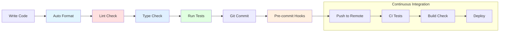
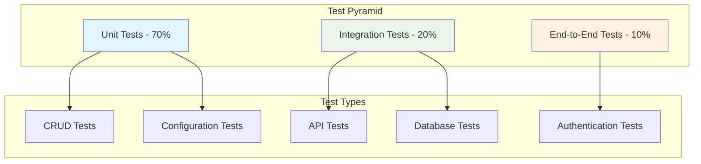
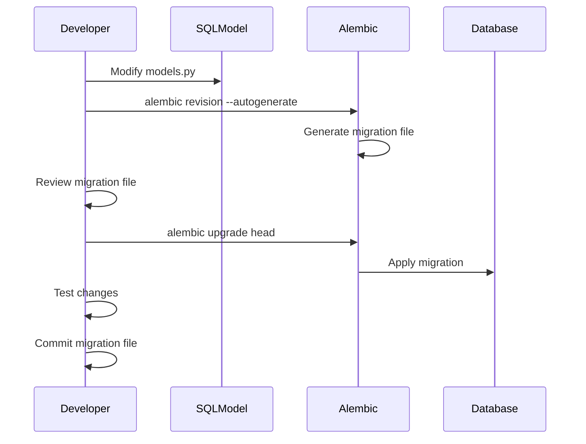

# Development Workflow

This guide covers the complete development workflow for the FastAPI CRUD application, including setup, coding standards, testing, and deployment processes.

## 🚀 Quick Development Setup

```bash
# Clone the repository (if starting from template)
git clone <repository-url>
cd fastapi-crud

# Install dependencies
uv sync

# Set up development environment
cp .env.example .env  # Configure as needed

# Run the application
./run_dev.sh

# Verify setup
curl http://localhost:8001/docs
```

## 🛠️ Development Tools Stack

### Core Tools

| Tool | Purpose | Configuration |
|------|---------|---------------|
| **uv** | Package management | `pyproject.toml`, `uv.lock` |
| **Ruff** | Linting & formatting | `pyproject.toml` |
| **MyPy** | Type checking | `pyproject.toml` |
| **Pytest** | Testing framework | `pyproject.toml` |
| **Pre-commit** | Git hooks | `.pre-commit-config.yaml` |
| **Alembic** | Database migrations | `alembic.ini` |

### Development Workflow



## 📝 Coding Standards

### Python Code Style

The project follows strict coding standards enforced by automated tools:

```toml
# pyproject.toml - Ruff configuration
[tool.ruff]
target-version = "py311"
line-length = 88

[tool.ruff.lint]
select = [
    "E",      # pycodestyle errors
    "W",      # pycodestyle warnings
    "F",      # pyflakes
    "I",      # isort
    "B",      # flake8-bugbear
    "C4",     # flake8-comprehensions
    "UP",     # pyupgrade
]

[tool.ruff.lint.per-file-ignores]
"__init__.py" = ["F401"]  # Allow unused imports in __init__.py
```

### Type Hints

All code must include proper type hints:

```python
# Good: Properly typed function
def create_user(
    *, 
    session: Session, 
    user_create: UserCreate
) -> User:
    """Create a new user with proper typing."""
    
# Good: Typed class with generics
class Repository[T](Generic[T]):
    def __init__(self, model: type[T]) -> None:
        self.model = model
    
    def get_by_id(self, session: Session, id: int) -> T | None:
        return session.get(self.model, id)
```

### Documentation Standards

```python
def complex_function(
    param1: str,
    param2: int | None = None,
    param3: bool = False
) -> dict[str, Any]:
    """
    Brief description of what the function does.
    
    Args:
        param1: Description of the first parameter
        param2: Optional description of the second parameter
        param3: Boolean flag description
        
    Returns:
        Dictionary containing the result with explanation
        
    Raises:
        ValueError: When param1 is empty
        HTTPException: When operation fails
        
    Example:
        >>> result = complex_function("test", 42, True)
        >>> assert result["status"] == "success"
    """
```

## 🔧 Development Scripts

### Main Development Scripts

Located in the `scripts/` directory:

```bash
# scripts/format.sh - Code formatting
#!/bin/bash
set -e
uv run ruff format .
uv run ruff check . --fix

# scripts/lint.sh - Linting and type checking
#!/bin/bash
set -e
uv run ruff check .
uv run mypy .

# scripts/test.sh - Run test suite
#!/bin/bash
set -e
uv run pytest app/tests/ -v --cov=app --cov-report=html --cov-report=term

# scripts/prestart.sh - Pre-startup checks
#!/bin/bash
set -e
python app/backend_pre_start.py  # Database connection check
alembic upgrade head              # Apply migrations (PostgreSQL)
python app/initial_data.py        # Create initial data
```

### Custom Development Scripts

```bash
# run_dev.sh - Development server with environment
#!/bin/bash
export $(grep -v '^#' .env | xargs)
.venv/bin/fastapi run --reload --port 8001 app/main.py

# check_db.py - Database configuration checker
python check_db.py

# validate_config.py - Environment validation
python validate_config.py
```

## 🧪 Testing Strategy

### Test Structure

```
app/tests/
├── conftest.py              # Test configuration and fixtures
├── api/                     # API endpoint tests
│   ├── routes/
│   │   ├── test_users.py    # User API tests
│   │   ├── test_items.py    # Item API tests
│   │   ├── test_login.py    # Authentication tests
│   │   └── test_private.py  # Admin API tests
├── crud/                    # CRUD operation tests
│   └── test_user.py        # User CRUD tests
├── scripts/                 # Script tests
└── utils/                   # Utility tests
```

### Test Categories



### Test Configuration

```python
# conftest.py - Test fixtures and configuration
import pytest
from fastapi.testclient import TestClient
from sqlmodel import Session, SQLModel, create_engine
from sqlmodel.pool import StaticPool

from app.core.config import settings
from app.core.db import get_session
from app.main import app

@pytest.fixture(name="session")
def session_fixture():
    """Create a test database session."""
    engine = create_engine(
        "sqlite://",
        connect_args={"check_same_thread": False},
        poolclass=StaticPool,
    )
    SQLModel.metadata.create_all(engine)
    with Session(engine) as session:
        yield session

@pytest.fixture(name="client")
def client_fixture(session: Session):
    """Create a test client with dependency overrides."""
    def get_session_override():
        return session

    app.dependency_overrides[get_session] = get_session_override
    client = TestClient(app)
    yield client
    app.dependency_overrides.clear()
```

### Running Tests

```bash
# Run all tests
uv run pytest

# Run with coverage
uv run pytest --cov=app --cov-report=html

# Run specific test categories
uv run pytest app/tests/api/  # API tests only
uv run pytest app/tests/crud/ # CRUD tests only

# Run with verbose output
uv run pytest -v

# Run tests matching pattern
uv run pytest -k "test_user"

# Run failed tests only
uv run pytest --lf

# Run tests in parallel
uv run pytest -n auto
```

### Test Examples

```python
# test_users.py - API testing example
def test_create_user(client: TestClient):
    """Test user creation endpoint."""
    user_data = {
        "email": "test@example.com",
        "password": "testpassword",
        "full_name": "Test User"
    }
    
    response = client.post("/api/v1/users/", json=user_data)
    
    assert response.status_code == 200
    data = response.json()
    assert data["email"] == user_data["email"]
    assert "id" in data
    assert "hashed_password" not in data

def test_get_current_user(client: TestClient, normal_user_token_headers: dict):
    """Test getting current user information."""
    response = client.get(
        "/api/v1/users/me", 
        headers=normal_user_token_headers
    )
    
    assert response.status_code == 200
    data = response.json()
    assert data["is_active"] is True
```

## 🔄 Git Workflow

### Branch Strategy

```mermaid
gitgraph
    commit id: "Initial"
    branch develop
    checkout develop
    commit id: "Setup"
    
    branch feature/user-auth
    checkout feature/user-auth
    commit id: "Auth logic"
    commit id: "Tests"
    
    checkout develop
    merge feature/user-auth
    commit id: "Integration"
    
    branch feature/api-docs
    checkout feature/api-docs
    commit id: "API docs"
    
    checkout develop
    merge feature/api-docs
    
    checkout main
    merge develop
    commit id: "Release v1.0"
```

### Commit Message Format

```bash
# Format: <type>(<scope>): <description>
# Types: feat, fix, docs, style, refactor, test, chore

feat(auth): add JWT token authentication
fix(db): resolve SQLite connection pool issue
docs(api): update endpoint documentation
test(user): add user creation test cases
refactor(config): simplify environment handling
chore(deps): update dependencies to latest versions
```

### Pre-commit Hooks

```yaml
# .pre-commit-config.yaml
repos:
  - repo: https://github.com/astral-sh/ruff-pre-commit
    rev: v0.1.6
    hooks:
      - id: ruff
        args: [--fix]
      - id: ruff-format

  - repo: https://github.com/pre-commit/mirrors-mypy
    rev: v1.7.1
    hooks:
      - id: mypy
        additional_dependencies: [types-all]

  - repo: https://github.com/pre-commit/pre-commit-hooks
    rev: v4.5.0
    hooks:
      - id: trailing-whitespace
      - id: end-of-file-fixer
      - id: check-yaml
      - id: check-added-large-files
```

Setup pre-commit:

```bash
# Install pre-commit hooks
uv run pre-commit install

# Run on all files
uv run pre-commit run --all-files

# Update hooks
uv run pre-commit autoupdate
```

## 🚀 Database Development

### Migration Workflow (PostgreSQL)



### Database Commands

```bash
# Create a new migration
alembic revision --autogenerate -m "Add user table"

# Apply migrations
alembic upgrade head

# Rollback migration
alembic downgrade -1

# Check current migration
alembic current

# Show migration history
alembic history

# Show SQL for migration (don't execute)
alembic upgrade head --sql
```

### Model Development Best Practices

```python
# models.py - Database model example
class User(SQLModel, table=True):
    """User database model with proper constraints."""
    
    id: int | None = Field(default=None, primary_key=True)
    email: EmailStr = Field(unique=True, index=True, max_length=255)
    hashed_password: str = Field(max_length=255)
    full_name: str | None = Field(default=None, max_length=255)
    is_active: bool = Field(default=True)
    is_superuser: bool = Field(default=False)
    created_at: datetime = Field(default_factory=datetime.utcnow)
    updated_at: datetime = Field(default_factory=datetime.utcnow)
    
    # Relationships
    items: list["Item"] = Relationship(
        back_populates="owner",
        cascade_delete=True  # Items deleted when user is deleted
    )
    
    # Table constraints
    __table_args__ = (
        Index("ix_user_email_active", "email", "is_active"),
        CheckConstraint("email ~* '^[A-Za-z0-9._%+-]+@[A-Za-z0-9.-]+\.[A-Za-z]{2,}$'"),
    )
```

## 🔍 Debugging and Development Tools

### Debug Configuration

```python
# For VS Code - .vscode/launch.json
{
    "version": "0.2.0",
    "configurations": [
        {
            "name": "FastAPI Debug",
            "type": "python",
            "request": "launch",
            "module": "uvicorn",
            "args": [
                "app.main:app",
                "--host", "0.0.0.0",
                "--port", "8001",
                "--reload"
            ],
            "env": {
                "ENVIRONMENT": "local"
            },
            "console": "integratedTerminal"
        }
    ]
}
```

### Logging Configuration

```python
# app/core/logging.py
import logging
import sys
from app.core.config import settings

def setup_logging():
    """Configure application logging."""
    
    # Configure root logger
    logging.basicConfig(
        level=logging.INFO if settings.ENVIRONMENT != "local" else logging.DEBUG,
        format="%(asctime)s - %(name)s - %(levelname)s - %(message)s",
        handlers=[
            logging.StreamHandler(sys.stdout),
            logging.FileHandler("app.log") if settings.ENVIRONMENT == "production" else logging.NullHandler()
        ]
    )
    
    # Configure SQLAlchemy logging
    if settings.ENVIRONMENT == "local":
        logging.getLogger("sqlalchemy.engine").setLevel(logging.INFO)
```

### Development Utilities

```python
# dev_utils.py - Development helper functions
def reset_database():
    """Reset database to clean state (development only)."""
    if settings.ENVIRONMENT != "local":
        raise ValueError("Database reset only allowed in local environment")
    
    from app.core.db import engine
    from sqlmodel import SQLModel
    
    SQLModel.metadata.drop_all(engine)
    SQLModel.metadata.create_all(engine)
    
def create_test_data():
    """Create test data for development."""
    from app.core.db import get_session
    from app import crud
    
    with next(get_session()) as session:
        # Create test users
        for i in range(5):
            user_create = UserCreate(
                email=f"user{i}@example.com",
                password="testpass123",
                full_name=f"Test User {i}"
            )
            crud.create_user(session=session, user_create=user_create)
```

## 📦 Dependency Management

### Using uv for Dependencies

```bash
# Add new dependency
uv add fastapi[standard]
uv add --dev pytest

# Remove dependency
uv remove requests

# Update dependencies
uv sync --upgrade

# Check for security issues
uv pip list --outdated

# Generate requirements.txt (if needed)
uv pip freeze > requirements.txt
```

### Managing Development vs Production Dependencies

```toml
# pyproject.toml
[project]
dependencies = [
    "fastapi[standard]>=0.104.0",
    "sqlmodel>=0.0.14",
    "alembic>=1.12.0",
]

[project.optional-dependencies]
dev = [
    "pytest>=7.4.0",
    "pytest-cov>=4.1.0",
    "mypy>=1.5.0",
    "ruff>=0.1.0",
    "pre-commit>=3.4.0",
]
```

## 🚀 Performance Optimization

### Development Performance Tips

1. **Database Connection Pooling**:
   ```python
   engine = create_engine(
       database_url,
       pool_size=20,
       max_overflow=0,
       pool_pre_ping=True
   )
   ```

2. **Query Optimization**:
   ```python
   # Use select loading for relationships
   users = session.exec(
       select(User).options(selectinload(User.items))
   ).all()
   ```

3. **Caching Strategy**:
   ```python
   from functools import lru_cache
   
   @lru_cache(maxsize=128)
   def get_user_permissions(user_id: int) -> list[str]:
       # Expensive permission calculation
       pass
   ```

### Monitoring in Development

```python
# Add request timing middleware
import time
from fastapi import Request

@app.middleware("http")
async def add_process_time_header(request: Request, call_next):
    start_time = time.time()
    response = await call_next(request)
    process_time = time.time() - start_time
    response.headers["X-Process-Time"] = str(process_time)
    return response
```

---

**Previous**: [Environment Configuration](./environment.md) | **Next**: [API Documentation](./api.md)
