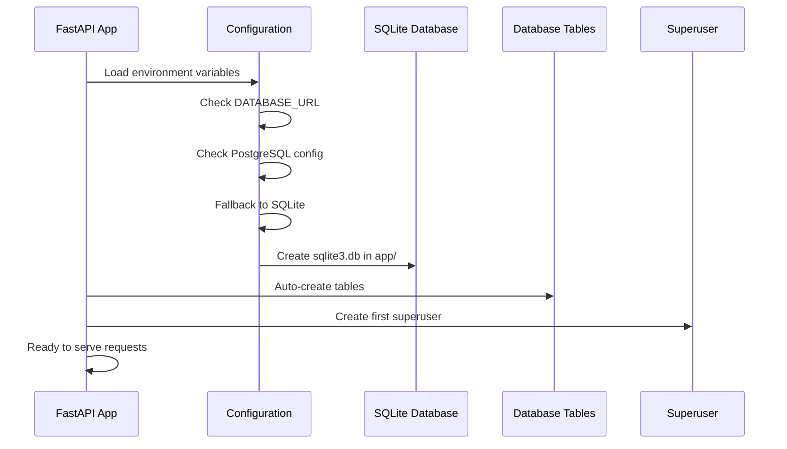

# Getting Started

This guide will help you set up and run the FastAPI CRUD application from scratch.

## 📋 Prerequisites

Before you begin, ensure you have the following installed:

- **Python 3.10+**: Check with `python --version`
- **uv**: Fast Python package installer and resolver
- **Git**: For version control

### Installing uv

```bash
# macOS/Linux
curl -sSfL https://astral.sh/uv/install.sh | sh

# Or using Homebrew (macOS)
brew install uv

# Verify installation
uv --version
```

## 🚀 Initial Setup

### 1. Project Structure Overview

This project follows a modular FastAPI structure:

```
fastapi-crud/
├── app/                    # Main application code
│   ├── core/              # Core configuration and database
│   ├── api/               # API routes and endpoints
│   ├── models.py          # Database models
│   ├── crud.py            # Database operations
│   ├── sqlite3.db         # SQLite database (auto-created)
│   └── tests/             # Test suite
├── docs/                  # Documentation
├── scripts/               # Utility scripts
├── .env                   # Environment variables
├── run_dev.sh            # Development server script
└── check_db.py           # Database configuration checker
```

### 2. Install Dependencies

```bash
# Navigate to project directory
cd /path/to/fastapi-crud

# Create virtual environment and install dependencies
uv sync

# Activate virtual environment (if needed)
source .venv/bin/activate
```

### 3. Environment Configuration

The application uses a flexible configuration system with SQLite fallback:

```bash
# Copy the example environment file (if it doesn't exist)
cp .env.example .env  # Optional

# The .env file should contain:
PROJECT_NAME="FastAPI CRUD"
ENVIRONMENT=local
FIRST_SUPERUSER=admin@example.com
FIRST_SUPERUSER_PASSWORD=changethis
SECRET_KEY=changethis
BACKEND_CORS_ORIGINS=http://localhost:3000,http://localhost:8001,http://localhost:5173
```

> **Note**: PostgreSQL configuration is optional. If not provided, the application automatically uses SQLite.

## 🏃‍♂️ Running the Application

### Quick Start (Recommended)

```bash
# Run with automatic environment loading
./run_dev.sh
```

### Manual Start

```bash
# Load environment variables
export $(grep -v '^#' .env | xargs)

# Run FastAPI application
.venv/bin/fastapi run --reload --port 8001 app/main.py
```

### Development Mode

```bash
# For development with hot reloading
.venv/bin/fastapi dev --port 8001 app/main.py
```

## 🌐 Accessing the Application

Once running, your application will be available at:

| Service | URL | Description |
|---------|-----|-------------|
| **API** | http://localhost:8001 | Main API endpoint |
| **Interactive Docs** | http://localhost:8001/docs | Swagger UI documentation |
| **Alternative Docs** | http://localhost:8001/redoc | ReDoc documentation |
| **OpenAPI Schema** | http://localhost:8001/api/v1/openapi.json | OpenAPI specification |

## 📊 Database Initialization

### Automatic Setup (SQLite)

When using SQLite (default), the database is automatically initialized:



### Manual Database Check

```bash
# Check current database configuration
python check_db.py
```

Example output:
```
🗄️  FastAPI Database Configuration
==================================================
Database URI: sqlite:////path/to/app/sqlite3.db
Database Type: SQLite
Database File: /path/to/app/sqlite3.db
File Exists: ✅
File Size: 24576 bytes

🔧 Configuration Source:
Using SQLite fallback (no DATABASE_URL or PostgreSQL config found)

Project Name: FastAPI CRUD
Environment: local
First Superuser: admin@example.com
```

### Initialize Superuser

```bash
# Create the first superuser account
export $(grep -v '^#' .env | xargs)
.venv/bin/python app/initial_data.py
```

## 🔧 Verification Steps

### 1. Health Check

Visit http://localhost:8001/docs and you should see the Swagger UI.

### 2. API Test

Test the authentication endpoint:

```bash
curl -X POST "http://localhost:8001/api/v1/login/access-token" \
     -H "Content-Type: application/x-www-form-urlencoded" \
     -d "username=admin@example.com&password=changethis"
```

### 3. Database Check

```bash
# Verify database and tables
python check_db.py
```

## 🐛 Common Issues

### Port Already in Use

```bash
# Error: [Errno 48] Address already in use
# Solution: Use a different port
.venv/bin/fastapi run --reload --port 8002 app/main.py
```

### Environment Variables Not Loading

```bash
# Verify environment file
cat .env

# Load manually
export PROJECT_NAME="FastAPI CRUD"
export FIRST_SUPERUSER="admin@example.com"
export FIRST_SUPERUSER_PASSWORD="changethis"
```

### Missing Dependencies

```bash
# Reinstall dependencies
uv sync --reinstall
```

## ✅ Success Indicators

You'll know the setup is successful when:

- ✅ No errors in terminal output
- ✅ Server starts on http://localhost:8001
- ✅ Swagger docs load at `/docs`
- ✅ Database file exists at `app/sqlite3.db`
- ✅ Can authenticate with superuser credentials

## 🚀 Next Steps

Once your application is running:

1. **Explore the API**: Visit http://localhost:8001/docs
2. **Learn about Database Configuration**: Read [Database Configuration](./database-configuration.md)
3. **Understand the Architecture**: Check [Architecture Overview](./architecture.md)
4. **Start Development**: Follow [Development Workflow](./development.md)

---

**Previous**: [Main Documentation](./README.md) | **Next**: [Database Configuration](./database-configuration.md)
